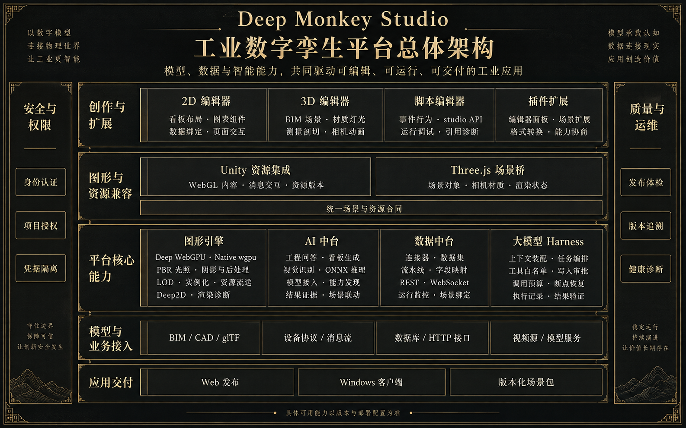

# Deep Monkey Studio

[简体中文](README.md) · [English](README.en.md)

A self-hosted industrial digital-twin platform: import BIM/CAD models, connect equipment data, build 3D scenes and dashboards in the browser, and publish them as applications. Local resources and services support private networks; external AI, video and data sources need their configured connections.

[Documentation](docs/README.md) · [Contributing](CONTRIBUTING.md) · [Roadmap](ROADMAP.md) · [Support](SUPPORT.md)



The Chinese [README.md](README.md) is the canonical product guide; this file is a shorter English summary. The project is source-available, not OSI-approved open source — see the license section below.

## Features

- **Model import** — RVT, IFC, STEP, DWG, DXF, glTF/GLB, FBX via browser loaders and server-side converters (Revit Worker, LibreDWG, occt-import-js).
- **Scene authoring** — measurement, sectioning, exploded views, walkthroughs, camera animation, lighting, weather, post-processing; scenes publish as stable snapshots.
- **Data & dashboards** — MQTT, Kafka, OPC UA, Modbus, S7, BACnet and common databases; ECharts dashboards, live video, and event scripts with direct scene access.
- **Vision AI** — bring your own ONNX models (YOLOv5–v11 included) for image inspection and live-video detection, with alerts linked back into the 3D scene.
- **AI assistant** — metadata-grounded BIM Q&A, read-only SQL, and natural-language dashboard generation.

## Quick start

Requires Node.js 24; the pnpm version is pinned by the root `packageManager` field.

```bash
git clone https://github.com/fatasia/bim-studio.git
cd bim-studio
corepack enable
corepack prepare pnpm@11.18.0 --activate
pnpm install --frozen-lockfile
pnpm studio start web
```

Open http://localhost:5173 (API on :4100), and `/docs` for the offline guides. The current development credentials are `admin` / `admin`. Preserve existing environment settings. Production deployment, PostgreSQL/MinIO, and troubleshooting are covered in [docs/native-deployment.md](docs/native-deployment.md); contributors can start with the [developer guide](docs/development.md).

## Deep Engine

Deep Engine combines a TypeScript WebGPU runtime and a Rust `wgpu` native executor. Studio retains Three.js WebGL as its authoring baseline and integrates Deep WebGPU as a selectable backend. Native is a separate delivery target with per-scene capability checks. See the [execution plan](docs/specs/deep-engine-execution-plan-2026-09-15.md).

## Contributing

Issues and pull requests are welcome — read [CONTRIBUTING.md](CONTRIBUTING.md) first. Every merge must pass `pnpm gate:repository` and the tests matching its scope. Report vulnerabilities privately through [SECURITY.md](SECURITY.md).

## License

Source-available under the custom [Deep Monkey Community Source License 1.0](LICENSE), not an OSI-approved license. Unrestricted organizations and individuals receive MIT-style permissions; any organization engaging in Covered Misconduct may not use the project at all, directly or through third parties. Publishing source or paying a fee creates no exception. See [LICENSE.zh-CN.md](LICENSE.zh-CN.md) and [LICENSING.md](LICENSING.md) for details, and [THIRD_PARTY_NOTICES.md](THIRD_PARTY_NOTICES.md) for third-party components.
