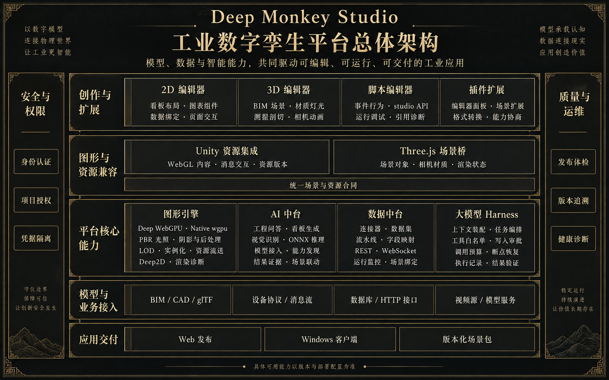

<p align="center">
  
</p>

<h1 align="center">DeepMonkey Studio</h1>

<p align="center">
  Vibe World | The foundation for an AI metaverse<br />
  The worlds you create, I will preserve
</p>

[简体中文](README.md) · [English](README.en.md)

[](https://github.com/fatasia/DeepMonkey-Studio/actions/workflows/deep-engine.yml)
[](https://github.com/fatasia/DeepMonkey-Studio/actions/workflows/studio.yml)
[](https://github.com/fatasia/DeepMonkey-Studio/actions/workflows/repository-governance.yml)
[](LICENSE)


## A note from the author

I don't see it as a digital-twin platform, or yet another system that reinvents the wheel.

Rather, it is an open-source foundation for metaverses, AI for Science, and world models.

The upper layer includes a 2D editor, 3D editor, script editor, and plugins;

the lower layer includes our own engine, data platform, and composable model adapters.

Under the hood, we have made many optimizations for WebGPU, rendering, and industrial and BIM models. The modules are independent and simple enough to use separately as an SDK.

During development and testing, I had AI gather many model assets from the web; if any of them accidentally infringes on anyone's rights, my sincere apologies — I will remove it right away.

The project uses the broadest possible MIT license so anyone can use it freely (technological progress depends on the support of industry experts), with an exception only for certain companies that disregard employees' human rights (see [LICENSE.zh-CN.md](LICENSE.zh-CN.md)).

[Documentation](docs/README.md) · [Contributing](CONTRIBUTING.md) · [Support](SUPPORT.md)

## Demo video

https://github.com/user-attachments/assets/63f8cce2-0360-4ba9-a2cb-92086a57aca3

License designation: **MIT License + Ethical Restrictions** (source-available).



## Highlights

- **AI and ontology for engineering tasks:** ontologies describe engineering objects, relationships, and available actions. The assistant uses scenes, components, data, and runtime state to answer questions and perform authorized edits, queries, and analyses. Edits can be previewed; task runs can be cancelled and traced.
- **Models, data, and simulation in one project:** combine 2D dashboards, 3D scenes, device topologies, live data, and alerts with production-line simulation, robotics workcells, and virtual commissioning.
- **Industrial model import and optimization:** import IFC, STEP, IGES, DWG, glTF, URDF, and other models, with component queries, property-based selection, mesh simplification, and texture compression. See [format support](docs/converter-plugin-and-format-support.md) for supported profiles.
- **An engine you can integrate and extend:** WebGPU, Rust native, and WASM runtimes share scene packages. Build your own applications with the engine SDK, Scene/Server SDKs, scripting APIs, plugins, and MCP.
- **Create once, deliver across platforms:** publish to Web, a read-only Viewer, Windows, WASM, or Android, with automatic checks for target capabilities, resource dependencies, and compatibility.

## Measured performance

The same layout, geometry and camera pose, six engines, median of multiple runs using each engine's sampling window (2026-10-07, RTX 4060 Laptop). Timings are in ms. *Unity and Deep Native are Windows native runtimes (Unity: Mono; Deep Native: Rust/wgpu), not directly comparable with the four browser columns, reference only; "—" means not collected or not calibrated.

| Metric | three.js WebGL | three.js WebGPU | Babylon.js WebGPU | Deep WebGPU | Unity 2022.3 native* | Deep Native* |
| --- | --- | --- | --- | --- | --- | --- |
| Idle P50 (120 / 1000 objects) | 6.9 / 6.9 | 6.9 / 6.9 | 6.9 / 10.2 | 6.9 / 6.9 | 6.94 / 6.94 | 6.94 / 6.94 |
| Idle P95 (120 / 1000 objects) | 7.1 / 7.1 | 7.1 / 7.1 | 7.4 / 15.0 | 7.1 / 7.1 | 7.27 / 7.12 | 7.55 / 7.40 |
| Dynamic P95 (1000 objects) | 7.1 | 7.1 | 13.7 | 14.0 | 7.26 | 12.82 |
| Idle max frame (120 objects) | 27.7 | 159.6 | 240.2 | **7.2** | 8.29 | 9.90 |
| First frame (1000 objects) | **72.7** | 283.2 | 876.0 | 1,623.3 | 2,575.7 | 1,459.8 |
| GPU frame time P50 (1000 objects) | 0.9 | **0.7** | 1.3 | 2.9 | — | 0.51 |
| 20 rebuild cycles (1000 objects) | **3.2** | 3.6 | 410.2 | **3.2** | 45.3 | 8.27 |
| Draw calls (1000 objects) | 1,055 | 1,056 | 2,001 | **7** | — | 9 |
| Rebuild heap growth worst (1000 objects, MiB) | **0.1** | 90.9 | 21.6 | **0.6** | 121.2 | 0.34 |

See the [benchmark program](docs/specs/render-benchmark-program-20261007.md) for reproduction, measurement scope and evidence, and [engine comparison](docs/engine-comparison.md) for capabilities.

## Complete feature list

Grouped by product subsystem. Format targets, experimental modules, and capabilities that have a contract but no product entry point are not counted as available features.

### AI can understand and act

- Projects, applications, scenes, pages, topologies, components, datasets, semantic metrics, vision events, and publication records use versioned contracts and stable IDs. AI receives addressable engineering objects and their relationships, so answers can point back to specific components, data, and evidence.
- Context is scoped to the current project, scene, selected objects, and task, and keeps provenance, versions, character budgets, and omission status. The "Request context" section of the panel lists the sources actually read for a request and how ready each one is; memory and the experiment archive live there too.
- The assistant panel has two modes: **Chat** and **Run task**. In chat, the "Question scope" selector next to the input chooses the evidence source (in the editor: Scene, Object, BIM, Simulation, Dashboard, Ask Data; on platform pages: Platform, 2D, and so on). Sessions switch from a dropdown in the title bar, and an empty session offers only a few questions you can click.
- **Run task** takes a goal and lets the industrial Agent orchestrate tool calls. Runs can be stopped and resumed from a checkpoint.
- There are three execution modes. Plan only keeps read and analyze tools; simulate, write, and control calls are rejected and audited. Confirm each (the default) asks the user to approve every high-risk capability, with approval bound to a parameter fingerprint and valid for 15 minutes. Autonomous runs within the granted authorization, with cancellation and auditing unchanged.
- The Tool Harness exposes 20 curated tools to the Agent by default: data queries, predictive maintenance and energy analysis, battery prediction, diagnostics and alert root cause, virtual commissioning and simulation studies, provenance tracing, workcell audits, and parametric validation. Each tool declares input and output schemas, permissions, execution location, timeout, and cancellation. There are no shell, file-system, or arbitrary-command tools.
- Scene edits are submitted as command transactions of up to 64 commands. A diff plan is generated first, and the editor in the browser executes it after the user confirms. Revision conflicts are rejected and failures roll back. AI-generated dashboards and scripts appear only as drafts that still need human review; nothing is saved or published automatically.
- Hypotheses, runs, verdicts, reports, and actions are written to a read-only provenance ledger with three query surfaces: replay the full decision chain from any node (broken links are reported as such), search past precedents by parameter/result fingerprint or reason code, and trace which downstream verdicts and reports a conclusion has influenced. Long-term memory writes run deterministic conflict detection first (verdict reversals, reason-code semantic reversals, and re-assertions of refuted proposals); conflicts are flagged and surfaced, never silently overwritten, and recording is not blocked.
- Responses, Chat Completions, MCP, and pluggable AI Providers share session and run records. A request shows its reading, generation, preview, and application states, and can be stopped, retried, and recovered after a disconnect.

### Projects, applications, and assets

- Manage projects, applications, scenes, pages, and topologies together. Create, duplicate, rename, delete, autosave, undo/redo, recover local drafts, browse version history, and transfer between projects.
- When you create a scene you can choose "Sample" or "Blank scene"; the default is the sample: a pedestal, a pillar, and a behavior hotspot with a click interaction, plus an overview camera view, all with explicit PBR materials. Sample objects are named with a "Sample" prefix and can be deleted like any other object.
- A unified asset library manages models, images, videos, environment maps, materials, prefabs, and robot assets. Search, classify, crop thumbnails, record provenance and licensing, drag assets into scenes, and replace existing instances.
- When an asset has a newer revision, scene models that reference an older one are flagged "stale" in the library. You can update to the latest revision in one click or choose "Keep current". The update runs a scene-side revision check and then writes back to the affected scenes.
- In the development environment, assets support hot reload: the dev server watches model and texture files inside the project and pushes changes to the running editor, hot-swapping the same asset in place. Replacement is a fail-closed transaction; on structural incompatibility, missing animation, or a fetch failure the original instance is kept and the reason is disclosed. The asset browser also offers a manual "Reload" entry. This push channel exists only in development builds; production is unaffected.
- Before an asset is deleted, the library lists the impact down to the field path, for example which scene's `models[0].assetModelId` refers to it. Limits: the backend has no endpoint for fetching a package by an older revision yet, so updates do not diff against the old package, and "Keep current" lasts only for the current session.
- The parametric workbench creates, validates, and saves parametric models, and can generate a model from a text description through Tripo3D or Tencent Hunyuan 3D (provider credentials stay on the server and are configured in system settings). Industrial prefabs support instance parameters, materials, connection points, and scene-level persistence.
- The model optimizer performs polygon reduction, Draco compression, texture compression, vertex colors, and Web lightmap baking locally in the browser. Tasks can be cancelled, and results return to the project as new assets.
- Asset-pack import first verifies `pack.manifest.json`, `catalog.json`, `audit.json`, and per-file SHA-256 hashes, then replaces the target directory atomically. Public packs are synced and verified with `pnpm assets:sync:open-packs`.

### Models and industrial formats

- Import RVT, IFC/IFCZIP, STEP/STP, IGES/IGS, DWG, DXF, glTF/GLB, FBX, OBJ, STL, 3MF, DAE, 3DS, OpenUSD (USD/USDA/USDC/USDZ), and URDF/robot ZIP, directly or through conversion.
- STEP/IGES is triangulated to GLB in the conversion queue by `occt-import-js` (Open CASCADE WASM), keeping assembly and part catalogs, names, colors, and geometry statistics, with no CAD software required. DWG is converted to DXF by LibreDWG; complex dynamic blocks, AEC/Civil proxy objects, and high-fidelity text are not guaranteed. IFC, glTF, FBX, OpenUSD, and general meshes load through their own viewing pipelines.
- RVT has native GLB and IFC paths that preserve component hierarchy and properties. Conversion is done by our own Revit Worker + Add-in, so the conversion machine needs a licensed copy of the matching Revit version; this path is not part of the built-in offline capability.
- JT 9.5/10.3 produces GLB, hierarchy, and properties from the verified LOD0 subset; 8.x is structure-inspection only. X_T tries the strict subset first, falls back to the generic text parser in `xt-reader`, and stays in inspection state if no geometry results; X_B is blocked for now. Files that cannot reliably produce geometry remain in inspection or waiting state; a file header or bounding box is never presented as a complete import.
- The conversion queue supports progress, cancellation, timeouts, lease recovery, output audits, hashes, hierarchy/property/PMI sidecars, LOD derivation, and retry after failure. See [Format support](docs/converter-plugin-and-format-support.md) for detailed boundaries.

### 3D editor

- Recursive scene tree, virtualized long lists, search and filters, multi-selection, grouping, sorting, drag and drop, locking, visibility, isolation, duplication, deletion, and selection sets. Models, internal layers, BIM components, spaces, lights, markers, and primitives share consistent object operations.
- Translation, rotation, scaling, snapping, and multi-object transforms; base color, opacity, metalness, roughness, normal/AO/emissive maps, UV, double-sided and transparency modes, multiple material slots, object effects, and IES light editing. A material can also be bound to a DeepSL custom shader: compile it, review the diagnostics and package preview, and bind it only once it passes.
- Object effects include outline, glow, X-ray, scanline, heatmap, dissolve, and edge light. An image or video can be mapped onto a model or component surface as a "model screen".
- Find components by name, stable ID, property, floor, and category. RVT rooms/MEP Spaces, IFC components, BIM properties, floor visibility, and exploded views can be located, isolated, and operated on in batches.
- Measure distance, minimum distance between components, angles, and elevation. Use clipping boxes, axis and picked-face clipping; radial, vertical, and axial explosions; BVH collision checks; and location of engineering analysis results.
- Orbit, first-person, and third-person navigation; ground following and collision; six standard views, custom camera bookmarks, camera constraints, an orientation cube, and WebXR VR/AR.
- Built-in model animation, camera and object timelines, keyframe recording, and animation state machines. Each keyframe can set its own transition (linear, smooth, ease in, ease out, step), camera paths can also use a spline, and looping, ping-pong playback, and path display are supported. Markers, spatial audio, and interaction state are saved with scenes.
- The "Root motion" switch in the model animation panel applies the animation root's translation and rotation to the model instance (rotation pivots about the instance origin), with a readout of accumulated displacement and rotation and a "Reset" button. The switch lasts only for the current session, and the pose change is saved as an ordinary edit, so reset before saving; the panel warns you about it.
- Skeleton and IK: edit bone poses, add a single-chain IK to an end-effector bone, and set the target in model coordinates, the chain length, and the iteration count.
- Fixed, dynamic, and kinematic rigid bodies with mass, friction, restitution, initial velocity, gravity, and character control. A revolute joint can connect to the world or another body, with angle limits and a velocity motor, and colliders can be shown as wireframes.
- Physics runs on Rapier and is stepped deterministically at a fixed 60 Hz: the same frame-time sequence yields the same per-tick trajectory (locked by tests from 30 to 144 fps and with jittery frame rates), and steps are dropped, and counted, only when catching up would exceed 12 steps. No render interpolation yet; behavior scripts and physics still run on separate clocks.

### Environment, effects, and rendering

- Clear, overcast, rain, snow, fog, and thunderstorm weather; skyboxes, backgrounds, grids, HDR/EXR, coordinate origins, and geolocation. Directional, ambient, hemisphere, point, spot, and area lights, shadows, reflections, and probe-grid baking.
- Volumetric fog has controls for steps, density, height scale, anisotropy, and scattering albedo (0–1, default 0.82), and can add volumetric light shafts. Deep WebGPU renders it fully; other backends degrade it or report it as unsupported through the compatibility check.
- A flame particle layer can be attached to a model or primitive. Size, opacity, and heat color each follow a curve over the particle's lifetime (up to 16 keyframes per curve, adjustable by dragging or with arrow keys), and blending can be additive or alpha; alpha sorts back to front by camera distance.
- Each emitter and the scene as a whole have a particle budget; when it is exceeded the draw range shrinks and a notice appears, rather than crashing. Limits: on the WebGPU renderer per-particle size falls back to the curve average, and the GPU particle pipeline is not yet wired into the editor.
- SMAA, FXAA, SSAO, GTAO, Bloom, outlines, depth of field, vignette, film grain, afterimages, and color correction (including temperature and tint). SSR, SSGI (screen-space global illumination, one diffuse bounce), and volumetric light shafts are Deep WebGPU capabilities. Quality levels are performance, balanced, quality, and ultra; render diagnostics, frame capture, performance settings, and backend capability status are visible.
- Ray tracing and many-light lighting are Deep WebGPU capabilities, all opt-in and off by default (enabled via URL parameters): ray-traced shadows auto-route per frame between RT occlusion and cascaded shadows, switching by quality level and link health with hysteresis, and the HUD shows the current route; ray-traced reflections run as a closest-hit frame pass with a specular-GI second-bounce slice (a single two-level TLAS-to-BLAS trace along the mirror direction at the first hit plus Lambertian relay accumulation, with miss semantics bit-identical to the single-bounce tier); many-light direct lighting uses ReSTIR resampling with a pool of up to 65,535 lights and up to 64 area lights, holding 5,000 lights at 1080p within a p95 frame time of 20 ms; winner shading carries IES factor injection (same distribution source as spot lights) and a winner-visibility ray tier (two-level occlusion, overflow fails closed to 0), and spatial reuse passes the source-pixel mask through. The native executor now ships the many-light RIS chain as a CPU-authoritative mirror with a single-source WGSL byte gate across both hosts (f64 intermediates, an 8x6x12-light x5-frame golden parity), registered honestly as harness-only: the wgpu 30 naga real-machine compile-path limitation is documented, a mitigation has landed, and real-machine re-verification is pending; native ray-traced shadows stay at a reduced tier, and native ray-traced reflections / many-light GPU dispatch are not wired into the production frame yet.
- "Physical lighting render" in the export menu produces a still image from the scene's default camera with a CPU path tracer, as a reference. Choose physical lighting, a directional-light reference, or a white-furnace reference; samples accumulate until the per-pixel noise falls below 2%, which counts as converged, and an unconverged result can still be saved as a preview. Linear HDR is exported with a receipt (sample count, noise, convergence), and a fixed seed reproduces the result.
- Any scene change clears the accumulation; a job whose estimated memory exceeds the budget is refused until you lower the resolution; realtime GI enhancement, helper grids, and screen effects are not written to the output.

### Digital twin scene building

- Smart device and point binding: paste a device catalog (a JSON array, or CSV/TSV with a header row; `deviceId` and a device name are required, tags, space, category, and coordinates are optional, up to 5 MiB). A deterministic multi-factor score suggests matching scene objects, a person confirms them, and the mapping is saved with the scene.
- Bulk device layout: place devices by rule-based arrays, or import coordinates from data or GeoJSON. Scale and offset can be aligned to an imported DXF or floor plan, and boxes and model labels sharing the same device ID are created in one pass, ready for real-time data and alert binding.
- Spatial drill-down wizard: creates "click to enter the next level" entries for buildings, floors, and devices, targeting an existing scene, a saved spatial view, or a close-up of the device. It only generates existing interaction events instead of adding another navigation runtime, and the whole batch can be undone.
- The digital twin data bridge strings together the path from connection to dataset to scene, and datasets bind directly to scene objects.
- Model version comparison review: load two versions of the same model, capture a snapshot of each, and compare them. Added, removed, and modified components are overlaid read-only in green, red, and yellow, and closing the review clears the overlay with no trace left.

### 2D dashboards and topology

- Multi-page freeform canvas, rulers/guides, grid snapping, zoom, marquee and multi-selection, layer tree, grouping, locking, sorting, copy/paste, alignment and distribution, undo/redo, page backgrounds, and adaptive layout based on 1920 pixels.
- 37 component types: text, shapes, decoration, rolling numbers, liquid level, progress, status, gauges, line, area, bar, combo, pie, scatter, radar, funnel, Sankey, sunburst, treemap, graph, map, word cloud, box plot, waterfall, polar, ranking, tables, scrolling tables, filters, forms, images, video, live monitoring, webpages, Unity, and topology.
- Charts support dimensions, series, metrics, aggregation, calculated fields, sorting, Top N, drill-down, linked filtering, conditional styling, and semantic metrics. Reports support detail, grouping, pivot tables, pagination, subtotals/totals, frozen columns, and XLSX export.
- A template library covers multiple industries and layouts. Sample data, component/page image export, printing, and report export are supported; preview and publication reuse the same document contract.
- The topology editor supports device nodes, links, spatial views, operating states, alert acknowledgement, and data product binding. Topologies can be embedded in dashboards or return to the original editing context.

### Data center and semantic layer

- 32 connection types are managed natively: PostgreSQL, MySQL, MariaDB, TiDB, Doris, StarRocks, SQL Server, Oracle, ClickHouse, TDengine, MongoDB, Elasticsearch, InfluxDB, Prometheus, CSV, and Excel; HTTP, WebSocket, MQTT, AMQP, Kafka, and CoAP; OPC UA, Modbus, BACnet, S7, EtherNet/IP, SNMP, TCP, UDP, and serial; plus built-in demo data.
- Visual data pipelines provide sources, cleaning, formulas, aggregation, field mapping, previews, debugging, retries, refresh policies, live events, and historical replay. Credentials stay on the server.
- The connection wizard has four steps, each with ready/loading/failure states; connection monitoring carries a trend strip; the data preview table distinguishes loading/empty/error states with virtualized scrolling; and field lists carry statistics badges.
- Datasets bind directly to 2D components, 3D objects, and AI capabilities. Parametric direct binding, device signal rules, record forms, permission-controlled data writeback, and execution receipts are supported.
- Semantic models manage metrics, dimensions, parameters, filters, and versions together. Dashboards bind to confirmed metric definitions; version changes do not silently alter their meaning.
- An ontology package describes object types, relation types, action types, and event types, and object properties can be bound to a dataset, pipeline, scene tree, API, or manual entry. Packages move through draft, review, published, and retired, keep their versions, and can be rolled back; a package with unconfirmed properties cannot be published. Actions carry an effect class (read, analyze, internal write, external write, control) and one of four risk levels, and a relation graph view is available.
- The ontology relation graph dual-encodes governance state in shape and color, colors edges by semantics with hover cards, supports graded highlighting of related paths, and LOD-clusters large graphs; an object card can open the AI decision-chain panel and replay the full chain related to that object. Object instance values and action parameters pass ontology constraint validation before write/execution (required, type, enum, unit format, and out-of-contract properties — five rule classes), reporting by default without blocking; the action service can refuse execution up front via a strict option.

### Scripts, interactions, and automation

- The professional script editor is built on Monaco and provides syntax highlighting, completion, type checks, diagnostics, formatting, search, dependency management, and Git-backed version history and recovery.
- Scenes, models, components, prefabs, dashboard widgets, and topologies share an event system covering load, click, double-click, right-click, hover, animation, collision, and path-node events.
- Actions include visibility, color, opacity, location, animation, prefab actions, page/scene navigation, camera switching, messages, data writes, and Unity actions. Visual workflows check real targets and parameters.
- Behavior scripts have a per-frame `onUpdate` and a fixed 1/60 s `onFixedUpdate`, with at most 5 fixed steps caught up per frame and overflow counted. Run traces can be replayed.
- The `studio.*` host API exposes scene, data, AI, network, renderer, and editor capabilities. Script permissions, lifecycle, failure logs, and publication dependencies are auditable.

### AI and vision

- The assistant answers engineering, BIM, scene, and selected-object questions, runs read-only SQL (Ask Data), generates dashboards and script drafts, and suggests scene operations. Sessions, run steps, stops, retries, evidence, and change confirmation remain traceable.
- The assistant works with real components, spaces, datasets, vision events, and the current editing context. It supports Responses and Chat Completions protocols, SSE streaming, and server-side key management; the model dropdown shows a reasoning-effort setting only when the model supports it.
- The vision center manages images, RTSP/RTMP/SRT/HLS video, ONNX models, recognition jobs, and events. It handles common YOLOv5/v7/v8/v10/v11 outputs and provides thresholds, NMS, labels, and letterbox coordinate restoration.
- Recognition events can bind to scene objects and trigger highlighting, camera location, status messages, and alert flows. Windows can use DirectML GPU inference, with presets for downloading built-in models and an entry point for user-supplied models.

### Industrial engineering and simulation

- The operations center includes predictive maintenance, virtual commissioning, battery intelligence, logistics, energy, What-if studies, and live monitoring. A Study retains inputs, model version, evidence, results, and a reproducibility fingerprint. Events can be recorded persistently: the source may be injected or simulated events, gaps are kept, saved recordings can be read back and re-verified, and a fixed frame step can be mapped on.
- Plant Lite provides discrete-event modeling for production lines and logistics, equipment and transport networks, shifts, changeovers, product mixes, personnel, energy consumption, quality, reliability, buffer strategies, bottleneck scans, timeline playback, and evidence export.
- PPR Lite manages products, processes, resources, operations, line balancing, quality control, and work instructions, and can pass plans to Plant Lite for validation.
- Robotics and workcells support URDF/asset packs, joint preview, kinematics, path editing, cycle-time budgets, trajectory playback, collision and load checks, workcell planning, ergonomics evidence, and result delivery.
- Virtual commissioning supports signal mapping, control phases, interlocks, fault injection, reset, test design, suite execution, and evidence reports. Logistics, workcell, commissioning, and What-if panels can open directly in a scene.
- Parametric modeling, manufacturing validation, industrial diagnostics, alert root-cause analysis, energy analysis, and battery models are invoked through one capability registry with permissions, timeouts, cancellation, auditing, and structured results.

### Deep WebGPU engine

- The TypeScript WebGPU kernel, Rust `wgpu` native executor, and Rust WASM runtime share scene packages, capability reports, and quality policies. Studio can switch supported backends without losing authoring state.
- The engine includes a render graph, PBR, glTF, geometry and textures, LOD/streaming, instancing and culling, material/Shader IR, caches, lighting and shadows, GI/probes, volumetric fog, post-processing, picking, animation, a physics bridge, particles (curve LUTs, budgets, and transparent sorting), retained UI, and the Deep2D chart runtime.
- The native executor ships an independent 2D engine (native deep2d, GPUI-aligned): gradient/rounded-rectangle/box-shadow are the three visual commands, evaluated per fragment with analytic SDFs; a taffy flex layout engine emits draw commands directly; and dynamic paths are auto-routed by a sliding window of change frequency to stencil-then-cover GPU filling (fill domain; strokes still expand on the CPU). All three carry real-GPU readback pixel comparisons. This path currently lives in the native engine; the web side has no deep2d render path yet.
- Three.js and Deep share one display contract, `DEFAULT_DISPLAY_CONTRACT` (`packages/contracts/src/displayContract.ts`): the `three-aces-r185` ACES operator, exposure 1.05 (dynamic exposure clamped to 0.55–1.55), sRGB output, a 2048 shadow map with its biases, the Bloom parameters, and a GI default of 0.32. The Three.js main view, the Deep product bridge, and the publication compile payload all read from it instead of keeping their own defaults.
- `pnpm gate:parity` renders the same scene in Three.js and in Deep on a real GPU and compares them pixel by pixel: 5 standard scenes (PBR matrix, IBL, directional shadow, AA + Bloom, transparency) plus 3 diagnostic scenes, graded strict, tolerant, or diagnostic by RMSE, ΔE2000, and SSIM. Right now the PBR matrix and directional shadow reach the strict tier, IBL is tolerant, and AA + Bloom and transparency are known differences held in place by a regression guard so they cannot get worse. With no hardware GPU adapter the gate fails rather than skips. Baselines were calibrated on a single machine (RTX 4060), and the gate is not in CI yet.
- Change revisions and dirty regions drive incremental compilation and partial uploads. Instance batching, LOD, HiZ/occlusion culling, compact visibility sets, indirect draws, chunked submission, and lower idle frame rates reduce CPU submission, GPU overdraw, and main-thread work.
- Scene first frames load and compile by criticality: a critical subset of shadow pipelines compiles first and the rest are created off-peak, and the cascade tier strips unreachable shader libraries (a measured −341 ms off the compile wall). Further optimization of the overall first-frame time is ongoing.
- GPU buffer suballocation, resource residency, transient texture pools, pipeline/Shader/text caches, resource prewarming, and on-demand streaming reduce repeat allocation and uploads. Workers and cancellable tasks handle model processing, baking, and heavy computation.
- Frame time, upload bytes, cache hits, visible objects, VRAM budget, quality level, device-loss recovery, and backend capabilities have explicit diagnostics. Performance validation covers whole-frame P95/P99, memory, and visual consistency; unsupported capabilities block publication or give a reason for fallback. A unified "Performance & diagnostics" panel in the tool dock (frame time / scene / resources / pipeline tabs, F9 toggle) shows per-pass GPU timings, cross-frame swimlanes, and renderer-rebuild markers, off by default and sampling only while open.
- The native executor gains a visual post-processing trio: vignette can be enabled through the color grading contract (one wire contract on both ends, opt-in and off by default); FXAA and auto-exposure are ports of the same algorithms, verified by bit-exact CPU golden comparisons and real-GPU readback on an RTX 4060 (≤2/255) — currently harness-only, with production frame-loop wiring left to a later slice and the public capability matrix stating so.
- SDF occlusion GI and virtual geometry land on both ends under the same harness discipline: the native SDF volume baking, sky cone tracing, and probe SH update chain is compared bit-for-bit against the web side (bit-level f32 words plus SHA-256; zero error on critical paths on a real RTX 4060), while the web side can enable it via the `sdfGi` switch; the virtual-geometry meshlet DAG has an offline compilation toolchain (greedy cluster partition → hierarchical cluster simplification → the `.dgc` streaming format, with CLI build/info/verify), always-on serialization golden-byte and consumer-contract gates, a closed web-side chain of page scheduling, residency, indirect-draw planning, and cluster-LOD consumption, and a wired scene-package-to-`.dgc` residency ingestion chain — geometry uploads are encoded at production quality per (geometry, material) section (bit-compared against the Rust authoritative writer), material instances bind at the section, the native side runs per-section from_dgc residency prechecks, and a CRC-corrupt section fails closed without poisoning the rest; per-section GPU main-pass draw call sites are a later slice.
- The SDK offers subpath entries including `/app`, `/webgpu`, `/scene`, `/gltf`, `/geometry`, `/textures`, `/streaming`, `/hlod`, `/shadows`, `/lighting`, `/postprocess`, `/particles`, `/physics`, `/shader*`, `/runtime-package`, `/three-bridge`, and `/host`.

### Publication, multiplatform clients, and storage

- Scenes and full applications support saving, preview, publication checks, stable snapshots, republishing, withdrawal, deletion, history restoration, and publication diffs. Asset dependencies are frozen by hash and checked for compatibility.
- Export `.scene.json`, `.bimscene` with assets, GLB, and FBX. Generate a read-only Web Scene Viewer, static site, portable ZIP, standalone Windows program, local desktop client, Android APK, Deep Native, and Rust WASM deliverables.
- The publication dialog selects render target, quality level, resource budget, and branding. Offline packages support download cancellation, integrity checks, local startup, first-run checks, and error receipts.
- Build targets come in three tiers by role: the Deep Engine SDK (engine subpath entries only), the Scene Viewer (read-only viewing), and Full Studio (the complete editor). All three share the scene contract, asset hashes, and publication manifest.
- Optional cloud-render sessions support creation, stopping, concurrency protection, and lifecycle auditing. Live media automatically converts RTSP/RTMP/SRT into browser-ready HLS/WebRTC.
- Metadata supports local JSON, SQLite, or PostgreSQL; assets support local files or MinIO. Migration preserves original data, with backup, restore, key rotation, service accounts, and production checks.

### Extensibility, SDKs, and AI Tool Harness

- Scene SDK, Server SDK, shared contracts, data runtime, plugin runtime, and Deep Engine can be built independently. The platform HTTP API, script API, AI tools, runtime packages, and examples use the same versioned contracts.
- The plugin registry hosts data queries, data connectors, model conversion, parametric modeling, manufacturing validation, virtual commissioning, workcell validation, and AI Providers. A new capability becomes discoverable by the UI, API, and AI when it declares input/output schemas, permissions, execution location, timeouts, cancellation, diagnostics, and version compatibility.
- `studio.*` lets scripts extend scenes, data, networking, renderers, and editors. Dependencies and Git versions follow the project; lifecycle and permissions enter publication checks.
- The MCP server (`bim-industrial-core`) exposes read-only query capabilities through `tools/list` and editor scene snapshots through `resources/*`. Scene writes go through `editor.scene-transaction`, which the browser editor validates and executes; the API process handles only permissions, sessions, and queuing.
- Render backends connect through a common host and capability matrix. Data sources, converters, industrial algorithms, clients, and publication targets each follow boundary contracts and can be replaced or added without duplicating project state.
- Unity Bridge supports asset versions, scene/event/data-layer declarations, dashboard embedding, and action callbacks. Asset compatibility and publication readiness are checkable.

### Documentation center

- In-app `/docs` provides offline illustrated guides covering getting started, assets and editing, data and AI, industrial tasks, delivery and operations, SDKs, and participation in the project, with Chinese and English language switching.
- The documentation center is the single source of truth. The GitHub Wiki mirror is generated by `pnpm docs:wiki:export` rather than maintained separately.
- The documentation center's "Render engine" category hosts a public engine capability matrix: the renderer-capability and model-format tables are derived read-only from the contracts single source, displayed by domain with both-end statuses (fully available, available when enabled, harness-only, degraded, planned, and so on), each row carrying its evidence path; data updates with the registries and is never hand-maintained. The physics domain has no public registry yet and shows an honest "not registered" empty state.

### System administration and governance

- Administrator, editor, and viewer roles with project-level permissions. Login sessions, user management, service health, logs, error/operation audits, cache, and performance maintenance live in the system center.
- AI Providers, MCP, cloud rendering, notification channels/recipients/routes/delivery logs, and service status are configured together. Sensitive credentials are not echoed to the browser.
- Branding covers the logo, app icon, system name, browser title, copyright, theme color, default language, new-scene environment, and maintenance mode.
- Repository release gates cover dependency licenses, third-party asset provenance, source size, type checks, unit tests, builds, browser flows, publication artifacts, and recovery verification.

## Technology stack

| Layer | Main technologies |
| --- | --- |
| Web editor | TypeScript, React 19, Vite 8, Three.js, ECharts, GridStack, Monaco Editor, three-mesh-bvh, Rapier |
| Deep Engine | `wgpu`, `winit`, Rapier, WebAssembly |
| API and real-time data | Fastify, WebSocket, MQTT, Kafka, AMQP, OPC UA, Modbus, BACnet, S7, EtherNet/IP, SNMP, serial |
| Data and object storage | SQLite, PostgreSQL, MinIO; MySQL, SQL Server, Oracle, MongoDB, ClickHouse, TDengine, and others as business data sources |
| AI and vision | MCP, ONNX Runtime, DirectML, YOLO inference, pluggable AI providers |
| Clients and delivery | Tauri 2, WebView2, Rust Native/WASM, Android, static Web Viewer, Windows NSIS/MSI |
| Engineering | pnpm workspace, TypeScript, Vitest, Node Test Runner, Cargo Test |

## Quick start

Three commands to run (Git + Node.js 24+ only; no PostgreSQL / MinIO / Docker needed):

```bash
git clone https://github.com/fatasia/DeepMonkey-Studio && cd DeepMonkey-Studio
corepack enable && corepack prepare pnpm@11.18.0 --activate && pnpm install --frozen-lockfile
pnpm run init   # initializes the sample project and starts it at http://localhost:5173 (admin/admin)
```

If startup complains about missing configuration, run `cp .env.example .env` first (PowerShell: `Copy-Item .env.example .env`). Full environment matrix, desktop client, and production deployment below.

### 1. Requirements

| Usage | Required | Optional |
| --- | --- | --- |
| Windows/Linux Web editor | Git, Node.js 24+, Corepack, pnpm 11.18.0 | PostgreSQL, MinIO |
| Windows desktop client development | Web environment, stable Rust, Visual Studio C++ Build Tools, WebView2 | Windows SDK |
| Linux native deployment | 64-bit Linux, Node.js 24+, Corepack, pnpm, bash; systemd for long-running services | PostgreSQL 16+, MinIO Server/Client, reverse proxy and TLS |
| Installed Windows client | WebView2 | Server origin when connecting to a collaboration server |

The `client` development target supports Windows only. Both Windows and Linux can run `web` or `api`. Trying the editor does not require PostgreSQL, MinIO, Python, or Docker.

### 2. Clone, install, and configure

```bash
git clone https://github.com/fatasia/DeepMonkey-Studio.git
cd DeepMonkey-Studio
corepack enable
corepack prepare pnpm@11.18.0 --activate
pnpm install --frozen-lockfile
```

Copy the environment template without overwriting an existing `.env`:

```powershell
# Windows PowerShell
Copy-Item .env.example .env
```

```bash
# Linux
cp .env.example .env
```

Start with these settings:

```dotenv
API_PORT=4100
BIM_STUDIO_WEB_HOST=0.0.0.0
BIM_STUDIO_WEB_PORT=5173
WEB_ORIGIN=http://localhost:5173
METADATA_STORE=sqlite
OBJECT_STORE=local
AI_BASE_URL=https://api.openai.com/v1
AI_API_KEY=
AI_MODEL=gpt-4.1-mini
```

In `.env.example`, `METADATA_STORE` defaults to the dependency-free `json`; `sqlite` above is the recommended single-machine value, and production should use PostgreSQL (see section 6 below).

`.env` is the main configuration file for local and bare-metal deployments. See `.env.example` for every key and its documentation. Never commit `.env`, database passwords, MinIO secrets, AI keys, certificates, or production data.

### 3. Initialize

Prepare public samples and metadata without starting services:

```bash
pnpm run init -- --prepare-only
```

Running `pnpm run init` without `--prepare-only` starts Web mode after initialization. Initialization preserves existing data by default; do not use `--force` as a routine command.

### 4. Start and access

```bash
# Windows/Linux: API + Web editor
pnpm studio start web

# Windows: API + Web + Tauri desktop development client
pnpm studio start client

# API only, for an existing frontend or client
pnpm studio start api
```

After startup:

- Web editor: `http://localhost:5173`; devices on the same network can use `http://<host-ip>:5173`.
- Admin center: `/manager`; documentation: `/docs`; branding: `/branding`.
- API: `http://localhost:4100`; health check: `http://localhost:4100/health`.
- Windows client: `pnpm studio start client` opens a Tauri window against the same production API. An installed client can work independently with its built-in SQLite database and local object directory.
- The current development administrator username and password are both `admin`.

Remote APIs, custom ports, and HTTPS:

```bash
pnpm studio start web --api-port 4200 --web-port 5200
pnpm studio start web --api-origin http://192.168.1.20:4100
pnpm studio start web --https
```

### 5. Import an asset pack

An asset pack must include published `pack.manifest.json`, `catalog.json`, and `audit.json` files plus a per-file SHA-256 manifest. The importer validates paths, hashes, directory layout, and publication status before atomically replacing the target directory:

```bash
pnpm assets:import -- /path/to/deepmonkey-assets.zip

# Choose the asset library directory
pnpm assets:import -- /path/to/deepmonkey-assets.zip --target=/data/bim-assets
```

On Windows, use a path such as `D:\Downloads\deepmonkey-assets.zip`. Check disk space and redistribution rights before syncing optional assets from public sources:

```bash
pnpm assets:sync:open-packs
pnpm assets:verify:open
```

### 6. Database and object storage

SQLite with a local object directory is recommended for single-machine development:

```dotenv
METADATA_STORE=sqlite
SQLITE_DATABASE=./data/database.sqlite
OBJECT_STORE=local
```

Use PostgreSQL and MinIO for production:

```dotenv
METADATA_STORE=postgres
POSTGRES_HOST=127.0.0.1
POSTGRES_PORT=5432
POSTGRES_DATABASE=bim_studio
POSTGRES_USER=bim_studio
POSTGRES_PASSWORD=change-me

OBJECT_STORE=minio
MINIO_ENDPOINT=http://127.0.0.1:9000
MINIO_ACCESS_KEY=change-me
MINIO_SECRET_KEY=change-me
MINIO_BUCKET=bim-studio
```

The API creates the required tables and bucket. When storage is switched for the first time, it migrates existing local data without deleting the source files. Multi-instance production deployments must use PostgreSQL and MinIO. JSON is for temporary development only; SQLite with local objects is intended for single-machine and desktop use.

### 7. Build, package, and publish

```bash
pnpm typecheck
pnpm test
pnpm build
pnpm verify:release
```

`pnpm build` creates production Web/API artifacts. `pnpm verify:release` runs the complete release gate. Build Windows installers on a Windows machine configured with Rust, MSVC, and WebView2:

```bash
pnpm desktop:bundle
pnpm desktop:verify-bundle
```

NSIS/MSI packages are written to `apps/desktop/src-tauri/target/release/bundle/`. Generate read-only Web Viewer, portable ZIP, Windows scene application, Deep Native, WASM, and Android APK targets from the scene publication dialog. Publication stops with an explicit error when a required signing setup, template, or runtime is missing.

For bare-metal Linux production deployment:

```bash
pnpm studio deploy --check
pnpm studio deploy
pnpm studio status
```

`deploy` manages Web and API through systemd. Remove the deployment with `pnpm studio undeploy`. See [Native development and deployment](docs/native-deployment.md) for production, backup, restore, HTTPS, and rollback procedures.

### 8. Start the storage infrastructure with Docker

The root `docker-compose.yml` provides only the two storage services, PostgreSQL and MinIO (pinned image versions, explicitly named persistent volumes, `pg_isready`/`mc ready` health checks, credentials injected only through `.env`). The application itself (Web, API, desktop client) has no official image yet and still runs through the `pnpm studio` entry above:

```bash
cp .env.example .env   # fill in POSTGRES_PASSWORD, MINIO_ROOT_*, and other credentials
docker compose up -d   # start PostgreSQL + MinIO
pnpm run init          # initialize system metadata and start Web/API
```

Health checks, backup/restore, upgrade cautions and the image provenance note (MinIO stopped publishing official community images; this repository pins a digest-fixed compatible snapshot) are covered in the [Deployment guide](docs/deployment.md).

### 9. Common commands

| Command | Purpose |
| --- | --- |
| `pnpm dev` | Minimal Web development startup |
| `pnpm studio start client` | Windows desktop integration development |
| `pnpm studio start web` | Windows/Linux Web + API |
| `pnpm studio start api` | API only |
| `pnpm studio stop` | Stop processes managed by the current launcher |
| `pnpm studio restart` | Restart with the previous arguments |
| `pnpm studio status` | Show processes, addresses, and health |
| `pnpm studio check` | Read-only health check; exits nonzero on failure |
| `pnpm studio help` | Show every target, option, and example |
| `pnpm gate:repository` | Check repository structure, documentation, and governance |
| `pnpm typecheck` / `pnpm test` / `pnpm build` | Type checking, tests, and production build |

### 10. Development notes

- Use the pnpm version pinned at the repository root. Do not create another lockfile with npm or Yarn; prefer `pnpm install --frozen-lockfile`.
- `pnpm run init` starts services by default; add `--prepare-only` when you only need to prepare data. If startup fails, run `pnpm studio status` and `pnpm studio check` before trying again instead of starting duplicate processes on the same ports.
- The `client` port is fixed at 5173 and currently does not accept `--https`. Use `web` mode for a custom port, remote API, or HTTPS.
- When changing shared contracts, scene formats, data migrations, or publication logic, update consumers, tests, documentation, and `CHANGELOG.md` together. Types or mock data alone do not establish a finished product capability.
- Check provenance, hashes, and redistribution terms before adding models, fonts, images, dependencies, or asset packs. Never commit customer models, production data, logs, or credentials.
- Run focused tests for affected packages before `pnpm gate:repository`. Also run the complete `pnpm verify:release` when shared contracts or the publication path change.

## Documentation

- [Vision AI quick start](docs/vision-quickstart.md) · [Format support](docs/converter-plugin-and-format-support.md)
- [Engine comparison](docs/engine-comparison.md) · [Benchmark program](docs/specs/render-benchmark-program-20261007.md)
- [Native development and deployment](docs/native-deployment.md) · [Deployment guide](docs/deployment.md) · [Scene format](docs/scene-format.md)
- [Feature inventory](docs/capabilities.md) · [Roadmap](ROADMAP.md) · [Changelog](CHANGELOG.md)
- [Documentation index](docs/README.md)

Open `/docs` in the application for the offline illustrated guides. Contributors should start with the [developer guide](docs/development.md).

## Deep Engine

Deep Engine includes a TypeScript WebGPU kernel, a Rust `wgpu` native executor, and a WASM runtime. Studio retains the Three.js WebGL authoring mode and switches to Deep WebGPU according to scene capabilities; Deep Native, WASM, and Android are separate delivery targets. Both rendering paths share one [display contract](packages/contracts/src/displayContract.ts), and `pnpm gate:parity` checks Three.js against Deep pixel by pixel; the method, thresholds, and current differences are in the [parity gate notes](docs/specs/parity-gate-20261003.md). Code entry points: [WebGPU kernel](packages/deep-engine/README.md) and [native executor](packages/deep-engine-native/README.md).

## Contributing

Issues and pull requests are welcome. Read the [contribution guide](CONTRIBUTING.md) before submitting. Every merge must pass `pnpm gate:repository` and tests appropriate to the change. Report security vulnerabilities privately according to [SECURITY.md](SECURITY.md); do not open a public Issue.

## License

Source-available under the custom [Deep Monkey Community Source License 1.0](LICENSE), not an OSI-approved license. Unrestricted organizations and individuals receive MIT-style permissions; any organization engaging in Covered Misconduct may not use the project at all, directly or through third parties. Publishing source or paying a fee creates no exception. See [LICENSE.zh-CN.md](LICENSE.zh-CN.md) and [LICENSING.md](LICENSING.md) for details, and [THIRD_PARTY_NOTICES.md](THIRD_PARTY_NOTICES.md) for third-party components.

## Acknowledgements

Thanks to the maintainers and contributors of every project we depend on, especially [Three.js](https://github.com/mrdoob/three.js), [Orillusion](https://github.com/Orillusion/orillusion), and [Unity](https://github.com/Unity-Technologies). This project benefits from the open-source community's work on rendering, engine architecture, and editor interaction.

## Contact me

Email 15184552744@163.com or open an Issue — I check in now and then.

