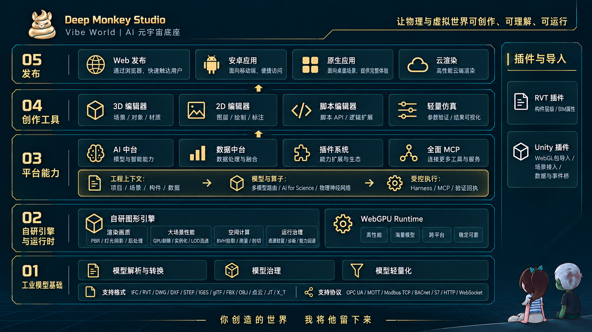

<p align="center">
  
</p>

<h1 align="center">DeepMonkey Studio</h1>

<p align="center">
  Vibe World | AI 元宇宙底座<br />
  你创造的世界 我将他留下来<!--  -->
</p>

[简体中文](README.md) · [English](README.en.md)

[](https://github.com/fatasia/DeepMonkey-Studio/actions/workflows/deep-engine.yml)
[](https://github.com/fatasia/DeepMonkey-Studio/actions/workflows/studio.yml)
[](https://github.com/fatasia/DeepMonkey-Studio/actions/workflows/repository-governance.yml)
[](LICENSE)


## 作者的话

一开始俺只想完善一下 3D 编辑器，搞着搞着就弄成了完整的平台引擎。

对他的定位不仅是数字孪生和 3D 工作台，而是未来元宇宙、AI4S、世界模型的承接层（毕竟 GPT-6、Fable 5 都已经很夯了）。
上层包括：2D 编辑器、3D 编辑器、脚本编辑器和插件；
底层包括：自研引擎、数据中台、AI 中台和大模型 Harness。

底层对 WebGPU、渲染、工业与 BIM 模型做了很多优化，模块独立简洁，可以单独作为一个 SDK 使用。

在开发测试过程中，AI 在网上下了很多工业模型，若无意侵权，万分抱歉，我会直接从项目中删除。

项目使用最宽泛的 MIT 协议，任何人都可以随意使用（技术的发展离不开行业专家大拿的支持），仅对忽视员工人权的特定企业例外（详见 [LICENSE.zh-CN.md](LICENSE.zh-CN.md)）。

[文档](docs/README.md) · [贡献指南](CONTRIBUTING.md) · [支持](SUPPORT.md)



## 系统介绍 · 从 Vibe Coding 到 Vibe World

[](https://fatasia.github.io/DeepMonkey-Studio/video.html)

[▶ 直接打开视频](https://fatasia.github.io/DeepMonkey-Studio/deepmonkey-studio-intro.mp4) · 3 分 22 秒 · [字幕](docs/assets/system-intro/zh-CN.srt)

从模型接入、轻量化与数据连接，到 AI 工作流、自研引擎和多端交付。

## 功能亮点

- **为 AI 构建的工业工作空间**：场景、构件、数据、语义、脚本和运行状态都有稳定合同，AI 能理解当前项目，也能通过受控工具执行修改、运行分析、验证结果并交付，而不是只做聊天问答。
- **高性能自研图形引擎**：增量场景更新、变化驱动渲染、GPU 驱动剔除与间接绘制、LOD/流送、实例化、资源驻留和瞬态复用共同控制 CPU、GPU 与内存成本，质量档和降级原因可观测。
- **从脚本到引擎后端都可扩展**：Scene/Server SDK、版本化 contracts、插件能力注册表、`studio.*` 脚本 API、MCP、Unity Bridge 和渲染后端适配层允许独立扩展，不必修改整个平台。
- **工业创作、数据与仿真一体**：统一制作 2D 看板、3D 场景、设备拓扑和交互，连接现场数据与视觉 AI，并直接运行 Plant Lite、PPR Lite、机器人、虚拟调试和运营研究。
- **一次制作，多端交付**：Three WebView、Deep WebGPU、Deep Native 和 Rust WASM 共用发布合同，输出 Web、Windows、WASM 与 Android 运行包，并在交付前检查能力、资源和兼容性。

## 完整功能列表

### AI 能理解，也能执行

- 项目、应用、场景、页面、拓扑、构件、数据集、语义指标、视觉事件和发布记录使用版本化结构合同与稳定 ID；AI 获得的是可定位的工程对象和关系，不是只有截图或一段无结构文本。
- 上下文投递按当前项目、场景、选择对象和任务裁剪，保留来源、版本、字符预算与省略状态；回答和生成结果能回到实际构件、数据、证据和诊断。
- AI 可通过统一 Tool Harness 查询数据、生成看板和脚本草案、编辑场景、调用参数化/仿真/运维能力、截图检查并触发发布验证；工具声明输入输出 schema、权限、执行位置、超时、取消和证据。
- 写操作进入同一命令与事务系统，支持 dry-run、差异预览、用户确认、修订号并发保护、撤销/重做、保存恢复和审计；失败不会留下半套状态。
- Responses、Chat Completions、MCP 和可插拔 AI Provider 共用会话与运行记录；过程显示读取、生成、预览、应用和验证状态，可停止、重试和断线恢复。

### 项目、应用与资源

- 项目、应用、场景、页面和拓扑统一管理；支持新建、复制、重命名、删除、自动保存、撤销/重做、本地草稿恢复、版本历史和项目间转移。
- 统一资源库管理模型、图片、视频、环境贴图、材质、预制体和机器人资源；支持搜索、分类、缩略图裁剪、来源与授权信息、拖放入场景及替换既有实例。
- 参数化工作台可创建、校验和保存参数化模型；工业预制体支持实例参数、材质、连接点和场景级持久化。
- 模型优化器在浏览器本地完成减面、Draco、贴图压缩、顶点色及 Web 光照贴图烘焙；任务可取消，结果作为新资源回到项目。

### 模型与工业格式

- 直接或转换导入 RVT、IFC/IFCZIP、STEP/STP、IGES/IGS、DWG、DXF、glTF/GLB、FBX、OBJ、STL、3MF、DAE、3DS、OpenUSD（USD/USDA/USDC/USDZ）以及 URDF/机器人 ZIP。
- RVT 支持原生 GLB 与 IFC 两条链路并保留构件层级和属性；STEP/IGES 使用内置 OCCT WASM；DWG 使用 LibreDWG 转为 DXF；IFC、glTF、FBX、OpenUSD 和通用网格按各自查看管线加载。
- JT 与 X_T 提供内置结构检查和已验证子集预览。
- 转换队列支持进度、取消、超时、租约恢复、输出审计、哈希、层级/属性/PMI sidecar、LOD 派生和失败复转；详细边界见[格式支持说明](docs/converter-plugin-and-format-support.md)。

### 3D 编辑器

- 递归场景树、窗口化大列表、搜索与筛选、多选、编组、排序、拖放、锁定、显隐、隔离、复制、删除和选择集；模型、内部图层、BIM 构件、空间、灯光、标记和基础体共享一致的对象操作。
- 位移、旋转、缩放、吸附和多对象变换；基础色、透明度、金属度、粗糙度、法线/AO/自发光贴图、UV、双面与透明模式、多材质槽，以及对象效果和 IES 灯光编辑。
- 按名称、稳定 ID、属性、楼层和类别检索构件；RVT 房间/MEP Space、IFC 构件、BIM 属性、楼层显隐与分解视图均可定位、隔离和批量操作。
- 距离、构件最小距离、角度和标高测量；剖切盒、轴向与拾取面剖切；径向、垂直和轴向爆炸；BVH 碰撞检查和工程分析结果定位。
- 轨道、第一人称和第三人称导航，地面跟随与碰撞，六个标准视角、自定义相机书签、相机约束、方向立方体以及 WebXR VR/AR。
- 模型动画、相机与对象时间线、关键帧录制、动画状态机、线性/平滑/曲线插值、循环/往返和路径显示；标记、空间音频和交互状态随场景保存。
- 固定/动态/运动学刚体、碰撞体、质量、摩擦、弹性、重力、角色控制和旋转关节；物理状态参与保存、预览和发布能力检查。
- 晴、阴、雨、雪、雾、雷暴、天空盒、背景、网格、HDR/EXR、坐标原点和地理定位；方向光、环境光、半球光、点光、聚光、区域光、阴影、反射与探针网格烘焙。
- SMAA、FXAA、SSAO、GTAO、SSR、体积雾、Bloom、轮廓、景深、暗角、胶片颗粒、残像和色彩校正；渲染诊断、帧捕获、性能设置与后端能力状态可见。

### 2D 看板与拓扑

- 多页自由画布、标尺/参考线、网格吸附、缩放、框选、多选、图层树、编组、锁定、排序、复制粘贴、对齐分布、撤销重做、页面级背景和 1920 基准自适应。
- 文字、形状、装饰、数值翻牌、液位、进度、状态、仪表、折线、面积、柱状、组合、饼图、散点、雷达、漏斗、桑基、旭日、矩形树图、关系图、地图、词云、箱线、瀑布、极坐标、排名、表格、滚动表、筛选、填报、图片、视频、实时监控、网页、Unity 和拓扑组件。
- 图表支持维度/系列/指标、聚合、计算字段、排序、Top N、钻取、联动筛选、条件样式和语义指标；报表支持明细、分组、交叉表、分页、小计/总计、冻结列和 XLSX 导出。
- 模板库覆盖多种行业与布局；支持样例数据、组件/页面图片导出、打印和报告导出，预览态与发布态复用同一文档合同。
- 拓扑编辑器支持设备节点、连线、空间视图、运行状态、告警确认、数据产品绑定，并可嵌入看板或返回原编辑上下文。

### 数据中心与语义层

- 原生管理 HTTP、WebSocket、MQTT、AMQP、Kafka、CoAP、PostgreSQL、MySQL、SQL Server、MongoDB、Oracle、TDengine、OPC UA、Modbus TCP、BACnet、S7、EtherNet/IP、SNMP、TCP、UDP 和串口连接。
- 可视化数据管线提供数据源、清洗、公式、聚合、字段映射、预览、调试、重试、刷新策略、实时事件和历史回放；凭据只留在服务端。
- 数据集可直接绑定 2D 组件、3D 对象和 AI 能力；支持参数化直接绑定、设备信号规则、记录表单、受权限控制的数据回写和执行回执。
- 语义模型统一管理指标、维度、参数、过滤和版本；看板绑定确认后的语义口径，版本变化不会静默漂移。

### 脚本、交互与自动化

- 专业脚本编辑器提供语法高亮、补全、类型检查、诊断、格式化、搜索、依赖管理、Git 版本记录与恢复。
- 场景、模型、构件、预制体、看板组件和拓扑共用事件系统，覆盖加载、点击、双击、右键、悬停、动画、碰撞和路径节点事件。
- 交互动作包括显隐、颜色、透明度、定位、动画、预制体动作、页面/场景导航、相机切换、消息、数据写入和 Unity 动作；可视化流程检查实际目标与参数。
- `studio.*` 宿主 API 提供场景、数据、AI、网络、渲染器和编辑器能力；脚本权限、生命周期、失败日志和发布依赖均可审计。

### AI 与视觉

- AI 助手支持工程/BIM/场景/选中对象问答、只读 SQL、看板生成、脚本草案和场景操作建议；会话、运行步骤、停止、重试、证据和变更确认保持可追踪。
- 助手基于真实构件、空间、数据集、视觉事件和当前编辑上下文工作；支持 Responses 与 Chat Completions 协议、SSE 流式输出和服务端密钥管理。
- 视觉中心管理图片、RTSP/RTMP/SRT/HLS 视频、ONNX 模型、识别任务和事件；兼容 YOLOv5/v7/v8/v10/v11 常见输出，并提供阈值、NMS、标签和 letterbox 坐标还原。
- 识别事件可绑定场景对象，触发高亮、相机定位、状态消息和告警流；Windows 可使用 DirectML GPU 推理，并提供内置模型下载预设与自带模型入口。

### 工业工程与仿真

- 运营中心包含预测维护、虚拟调试、电池智能、物流、能源、What-if 和实时监控；Study 保留输入、模型版本、证据、结果和可复现指纹。
- Plant Lite 提供产线/物流离散事件建模、设备与运输网络、班次、换型、产品混流、人员、能耗、质量、可靠性、缓冲策略、瓶颈扫描、时间轴播放和证据导出。
- PPR Lite 管理产品、工艺、资源、工序、线平衡、质量控制和作业指导书，并可把方案交给 Plant Lite 验证。
- 机器人与工位支持 URDF/资源包、关节预览、运动学、路径编辑、节拍预算、轨迹播放、碰撞与负载检查、工位规划、人体工效证据和结果交付。
- 虚拟调试支持信号映射、控制阶段、联锁、故障注入、复位、测试设计、套件执行和证据报告；场景内可直接打开物流、工位、调试和 What-if 面板。
- 参数化建模、制造验证、工业诊断、告警根因分析、能源分析和电池模型通过统一能力注册表调用，支持权限、超时、取消、审计和结构化结果。

### Deep WebGPU 引擎

- TypeScript WebGPU 内核、Rust `wgpu` 原生执行器和 Rust WASM 运行时共享场景包、能力报告与质量策略；Studio 可在作者状态不丢失的前提下切换可用后端。
- 引擎包含渲染图、PBR、glTF、几何与纹理、LOD/流送、实例与剔除、材质/Shader IR、缓存、灯光与阴影、GI/探针、后处理、拾取、动画、物理桥、保留式 UI 和 Deep2D 图表运行时。
- 变化 revision 和脏域驱动增量编译与局部上传；实例合批、LOD、HiZ/遮挡剔除、紧凑可见集、间接绘制、分块提交与静止降频减少 CPU 提交、GPU 过绘和主线程工作。
- GPU 缓冲子分配、资源驻留、瞬态纹理池、管线/Shader/文字缓存、资源预热和按需流送减少重复分配与上传；Worker 和可取消任务承接模型处理、烘焙及重型计算。
- 帧时间、上传字节、缓存命中、可见对象、显存预算、质量档、设备丢失恢复和后端能力均有显式诊断；性能验证关注整帧 P95/P99、内存和画质一致性，不支持项会阻止发布或给出降级原因。
- SDK 提供 `/app`、`/webgpu`、`/gltf`、`/geometry`、`/textures`、`/streaming`、`/shadows`、`/lighting`、`/postprocess`、`/shader*`、`/runtime-package`、`/three-bridge` 和 `/host` 等子路径入口。

### 发布、多端客户端与存储

- 场景与完整应用支持保存、预览、发布体检、稳定快照、重新发布、撤回、删除、历史恢复和发布差异；资源依赖按哈希冻结并校验兼容性。
- 导出 `.scene.json`、含资源的 `.bimscene`、GLB 和 FBX；生成只读 Web Scene Viewer、静态站点、便携 ZIP、Windows 独立程序、桌面本地客户端、Android APK、Deep Native 与 Rust WASM 交付物。
- 发布对话框选择渲染目标、质量档、资源预算与品牌；离线包支持下载取消、完整性校验、本地启动、首次运行预检和错误回执。
- 可选云渲染会话具备创建、停止、并发保护和生命周期审计；实时媒体自动把 RTSP/RTMP/SRT 转为浏览器可用的 HLS/WebRTC。
- 元数据支持本地 JSON、SQLite 或 PostgreSQL，资源支持本地文件或 MinIO；迁移保留原数据，提供备份、恢复、密钥轮换、服务账号和生产预检。

### 扩展性、SDK 与 AI Tool Harness

- 场景 SDK、服务端 SDK、共享 contracts、数据运行时、插件运行时和 Deep Engine 可独立构建；平台 HTTP API、脚本 API、AI 工具、运行包和示例使用同一版本化合同。
- 插件注册表统一承载数据查询、数据连接器、模型转换、参数化、制造验证、虚拟调试、工位验证和 AI Provider；新能力声明输入/输出 schema、权限、执行位置、超时、取消、诊断和版本兼容性即可被 UI、API 与 AI 发现。
- `studio.*` 允许脚本扩展场景、数据、网络、渲染器和编辑器；依赖与 Git 版本跟随项目，生命周期和权限进入发布检查。
- MCP 与编辑器资源桥允许 AI 受控读取场景快照、运行诊断和提交事务；写操作经过项目权限、修订号、差异确认与审计检查。
- 渲染后端通过统一 host/能力矩阵接入；数据源、转换器、工业算法、客户端和发布目标各自遵守边界合同，可以替换或追加而不复制项目状态。
- Unity Bridge 支持资源版本、场景/事件/数据层声明、看板嵌入和动作回传；资源兼容性与发布就绪状态可检查。

### 文档中心

- 应用内 `/docs` 提供离线图文指南，覆盖快速开始、资源与编辑、数据与 AI、工业任务、交付与运维、SDK 和参与项目，中英文可切换。
- 文档中心是唯一文档事实源；GitHub Wiki 镜像由 `pnpm docs:wiki:export` 生成，不单独维护第二套内容。

### 系统管理与治理

- 管理员、编辑者、浏览者三角色和项目级授权；登录会话、用户管理、服务健康、日志、错误/操作审计、缓存与性能维护集中在系统中心。
- AI Provider、MCP、云渲染、通知渠道/收件人/路由/投递日志和服务状态统一配置；敏感凭据不回显到浏览器。
- 品牌设置覆盖 Logo、应用 Icon、系统名、浏览器标题、版权、主题色、默认语言、登录入口、新场景默认环境和维护模式。
- 仓库发布门禁覆盖依赖许可、第三方素材来源、源码体量、类型检查、单元测试、构建、浏览器流程、发布产物和恢复验证。

## 技术栈

| 层 | 主要技术 |
| --- | --- |
| Web 编辑器 | TypeScript、React 19、Vite 8、Three.js、ECharts、GridStack、Monaco Editor、bvh、Rapier |
| Deep Engine | `wgpu`、`winit`、Rapier、WebAssembly |
| API 与实时数据 | Fastify、WebSocket、MQTT、Kafka、AMQP、OPC UA、Modbus、BACnet、S7、EtherNet/IP、SNMP、串口 |
| 数据与对象存储 | SQLite、PostgreSQL、MinIO；MySQL、SQL Server、MongoDB、Oracle、TDengine 可作为业务数据源 |
| AI 与视觉 | MCP、ONNX Runtime、DirectML、YOLO 推理与可插拔 AI Provider |
| 客户端与交付 | Tauri 2、WebView2、Rust Native/WASM、Android、静态 Web Viewer、Windows NSIS/MSI |
| 工程工具 | pnpm workspace、TypeScript、Vitest、Node Test Runner、Cargo Test|

## 快速开始

### 1. 环境依赖

| 使用方式 | 必需环境 | 可选环境 |
| --- | --- | --- |
| Windows / Linux Web 编辑器 | Git、Node.js 24+、Corepack、pnpm 11.18.0 | PostgreSQL、MinIO|
| Windows 桌面客户端开发 | Web 环境、Rust stable、Visual Studio C++ Build Tools、WebView2 | Windows SDK|
| Linux 原生部署 | 64 位 Linux、Node.js 24+、Corepack、pnpm、bash；长期运行需要 systemd | PostgreSQL 16+、MinIO Server/Client、反向代理与 TLS |
| 已安装的 Windows 客户端 | WebView2 | 连接协作服务器时需要服务器 Origin |

`client` 开发模式只支持 Windows；Windows 和 Linux 都能运行 `web` 或 `api`。只体验编辑器不需要 PostgreSQL、MinIO、Python 或 Docker。

### 2. 克隆、安装和配置

```bash
git clone https://github.com/fatasia/DeepMonkey-Studio.git
cd DeepMonkey-Studio
corepack enable
corepack prepare pnpm@11.18.0 --activate
pnpm install --frozen-lockfile
```

复制环境模板。已有 `.env` 时不要覆盖：

```powershell
# Windows PowerShell
Copy-Item .env.example .env
```

```bash
# Linux
cp .env.example .env
```

最少需要关注这些配置：

```dotenv
API_PORT=4100
BIM_STUDIO_WEB_HOST=0.0.0.0
BIM_STUDIO_WEB_PORT=5173
WEB_ORIGIN=http://localhost:5173
METADATA_STORE=sqlite
OBJECT_STORE=local
AI_BASE_URL=https://api.openai.com/v1
AI_API_KEY=
AI_MODEL=gpt-4.1-mini
```

`.env` 是本地与裸机部署的主配置文件；完整键和注释以 `.env.example` 为准。不要提交 `.env`、数据库密码、MinIO Secret、AI Key、证书或生产数据。

### 3. 初始化

初始化公开示例和元数据，但暂不启动服务：

```bash
pnpm run init -- --prepare-only
```

直接执行 `pnpm run init` 会在初始化完成后启动 Web 模式。初始化默认不覆盖已有数据；不要把 `--force` 当作日常命令。

### 4. 启动与访问

```bash
# Windows / Linux：API + Web 编辑器
pnpm studio start web

# Windows：API + Web + Tauri 桌面开发客户端
pnpm studio start client

# 仅启动 API，供现有前端或客户端连接
pnpm studio start api
```

启动后使用：

- Web 编辑器：`http://localhost:5173`，局域网设备可用 `http://<主机IP>:5173`。
- 管理中心：`/manager`；文档中心：`/docs`；品牌设置：`/branding`。
- API：`http://localhost:4100`；健康检查：`http://localhost:4100/health`。
- Windows 客户端：运行 `pnpm studio start client` 后由 Tauri 窗口访问同一套正式 API；已安装客户端可使用内置 SQLite + 本地对象目录独立工作。
- 当前开发环境管理员账号和密码均为 `admin`。

远程 API、自定义端口和 HTTPS：

```bash
pnpm studio start web --api-port 4200 --web-port 5200
pnpm studio start web --api-origin http://192.168.1.20:4100
pnpm studio start web --https
```

### 5. 导入素材包

素材包必须包含已发布的 `pack.manifest.json`、`catalog.json`、`audit.json` 和逐文件 SHA-256 清单。导入器会先检查路径、哈希、目录结构和发布状态，再原子替换目标目录：

```bash
pnpm assets:import -- /path/to/deepmonkey-assets.zip

# 指定素材库目录
pnpm assets:import -- /path/to/deepmonkey-assets.zip --target=/data/bim-assets
```

Windows 可把路径换成 `D:\\Downloads\\deepmonkey-assets.zip`。从公开来源同步可选素材前，先确认磁盘空间和素材授权：

```bash
pnpm assets:sync:open-packs
pnpm assets:verify:open
```

### 6. 数据库与对象存储

单机开发推荐 SQLite + 本地对象目录：

```dotenv
METADATA_STORE=sqlite
SQLITE_DATABASE=./data/database.sqlite
OBJECT_STORE=local
```

生产部署使用 PostgreSQL + MinIO：

```dotenv
METADATA_STORE=postgres
POSTGRES_HOST=127.0.0.1
POSTGRES_PORT=5432
POSTGRES_DATABASE=bim_studio
POSTGRES_USER=bim_studio
POSTGRES_PASSWORD=change-me

OBJECT_STORE=minio
MINIO_ENDPOINT=http://127.0.0.1:9000
MINIO_ACCESS_KEY=change-me
MINIO_SECRET_KEY=change-me
MINIO_BUCKET=bim-studio
```

API 会创建所需表和 Bucket，并在首次切换时迁移已有本地数据而不删除源文件。多实例生产必须使用 PostgreSQL + MinIO；JSON 只适合临时开发，SQLite + local 适合单机和桌面客户端。

### 7. 构建、打包与发布

```bash
pnpm typecheck
pnpm test
pnpm build
pnpm verify:release
```

`pnpm build` 生成 Web/API 正式产物，`pnpm verify:release` 执行完整发布门禁。Windows 安装包必须在配置了 Rust、MSVC 和 WebView2 的 Windows 构建机生成：

```bash
pnpm desktop:bundle
pnpm desktop:verify-bundle
```

NSIS/MSI 输出位于 `apps/desktop/src-tauri/target/release/bundle/`。只读 Web Viewer、便携 ZIP、Windows 场景程序、Deep Native、WASM 与 Android APK 从场景发布对话框按目标能力生成；签名、模板或运行时缺失时发布会明确阻断。

Linux 裸机生产部署：

```bash
pnpm studio deploy --check
pnpm studio deploy
pnpm studio status
```

`deploy` 使用 systemd 托管 Web/API；停止部署使用 `pnpm studio undeploy`。完整生产、备份、恢复、HTTPS 和回滚步骤见[从零开发与原生部署](docs/native-deployment.md)。

### 8. Docker 一键部署（已支持）

现在已支持一键 Docker 部署：仓库根的 `docker-compose.yml` 交付 PostgreSQL + MinIO 存储基础设施（固定镜像版本、显式命名持久卷、`pg_isready`/`mc ready` 健康检查、凭据仅经 `.env` 注入）。应用本体仍按上面的 `pnpm studio` 裸机入口运行：

```bash
cp .env.example .env   # 填好 POSTGRES_PASSWORD 与 MINIO_ROOT_* 等凭据
docker compose up -d   # 启动 PostgreSQL + MinIO
pnpm run init          # 初始化系统元数据并启动 Web/API
```

健康检查、备份恢复、升级注意与镜像来源说明（MinIO 官方社区镜像已停止发布，本仓库使用 digest 固定的兼容快照）见[部署指南](docs/deployment.md)。

### 9. 常用命令

| 命令 | 用途 |
| --- | --- |
| `pnpm dev` | 精简 Web 开发启动 |
| `pnpm studio start client` | Windows 桌面联调 |
| `pnpm studio start web` | Windows/Linux Web + API |
| `pnpm studio start api` | 仅 API |
| `pnpm studio stop` | 停止当前启动器管理的进程 |
| `pnpm studio restart` | 按上次参数重启 |
| `pnpm studio status` | 查看进程、地址和健康状态 |
| `pnpm studio check` | 只读健康检查，失败返回非零退出码 |
| `pnpm studio help` | 查看全部目标、参数和示例 |
| `pnpm gate:repository` | 仓库结构、文档和治理检查 |
| `pnpm typecheck` / `pnpm test` / `pnpm build` | 类型、测试和正式构建 |

### 10. 开发注意

- 使用根目录锁定的 pnpm，不要用 npm/yarn 生成第二份锁文件；安装依赖始终优先 `pnpm install --frozen-lockfile`。
- `pnpm run init` 默认会启动服务；只准备数据时加 `--prepare-only`。启动失败先执行 `pnpm studio status` 和 `pnpm studio check`，不要反复启动抢占端口。
- `client` 端口固定为 5173，当前不接受 `--https`；需要自定义端口、远程 API 或 HTTPS 时使用 `web` 模式。
- 修改公共 contracts、场景格式、数据迁移或发布逻辑时同步更新消费者、测试、文档和 `CHANGELOG.md`；不要用只有类型或假数据的实现声明产品能力完成。
- 引入模型、字体、图片、依赖或素材包前检查来源、哈希和再分发许可；客户模型、生产数据、日志和凭据不得提交。
- 提交前先跑受影响包的聚焦测试，再跑 `pnpm gate:repository`；触及公共合同或发布链时继续运行完整 `pnpm verify:release`。

## 文档

- [视觉 AI 上手](docs/vision-quickstart.md) · [格式支持说明](docs/converter-plugin-and-format-support.md)
- [从零开发与原生部署](docs/native-deployment.md) · [场景文件格式](docs/scene-format.md)
- [文档索引](docs/README.md)

应用内打开 `/docs` 可阅读离线图文指南；开发者从[开发者上手](docs/development.md)开始。

## Deep Engine

Deep Engine 包含 TypeScript WebGPU 内核、Rust `wgpu` 原生执行器与 WASM 运行时。Studio 保留 Three.js WebGL 作者模式，并按场景能力切换 Deep WebGPU；Deep Native、WASM 和 Android 是独立交付目标。代码入口见 [WebGPU 内核](packages/deep-engine/README.md)与[原生执行器](packages/deep-engine-native/README.md)。

## 参与贡献

欢迎 Issue 和 Pull Request，提交前请读[贡献指南](CONTRIBUTING.md)。所有合并都要求通过 `pnpm gate:repository` 以及与改动范围相符的测试。安全漏洞请按 [SECURITY.md](SECURITY.md) 私下报告，不要开公开 Issue。

## 许可

对于非受限企业与个人为 MIT 协议。但任何企业只要存在许可证所列的劳动、薪酬、个人信息或用户权益问题，即属受限组织，不得以任何方式使用本项目，也不得通过关联公司、承包商等第三方间接使用；公开源码或付费都不构成例外[LICENSE.zh-CN.md](LICENSE.zh-CN.md) 。

## 鸣谢

感谢所有依赖项目的维护者和贡献者，特别是 [Three.js](https://github.com/mrdoob/three.js)、[Orillusion](https://github.com/Orillusion/orillusion) 和 [Unity](https://github.com/Unity-Technologies)——本项目在渲染、引擎架构和编辑器交互上从它们身上学到了很多。也感谢 [OpenAI](https://github.com/openai) 和[智谱 GLM](https://github.com/zai-org) 活动期间提供的 Token 支持。


