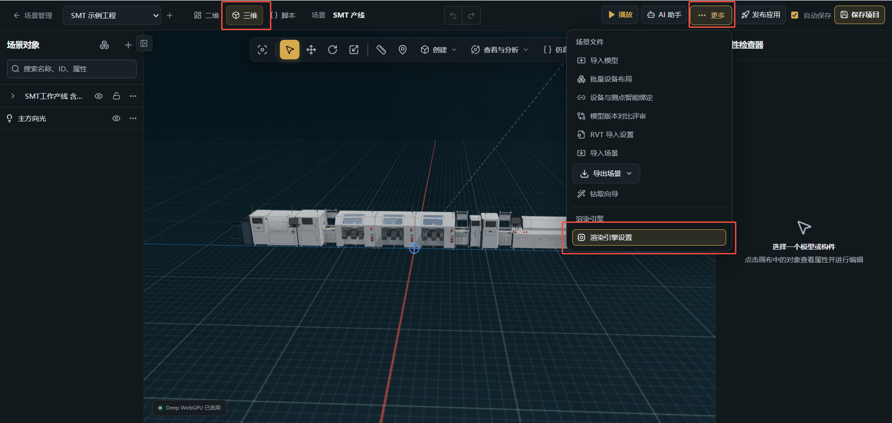
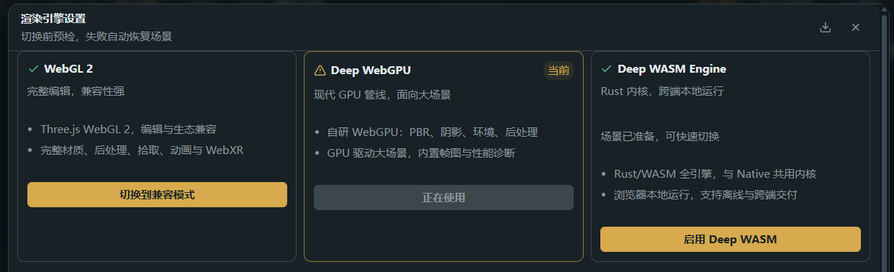

<p align="center">
  
</p>

<h1 align="center">DeepMonkey Studio</h1>

<p align="center">
  Vibe World | AI 元宇宙底座<br />
  你创造的世界 我将他留下来<!--  -->
</p>

[简体中文](README.md) · [English](README.en.md)

从 Vibe Coding 到 Vibe World：AI原生的可编程三维世界，面向元宇宙、Science、世界模型的开源底座。

[](https://github.com/fatasia/DeepMonkey-Studio/actions/workflows/deep-engine.yml)
[](https://github.com/fatasia/DeepMonkey-Studio/actions/workflows/studio.yml)
[](https://github.com/fatasia/DeepMonkey-Studio/actions/workflows/repository-governance.yml)
[](LICENSE)


## 作者的话

我对他的定位不是一个 数字孪生 平台，或重复造轮子的系统。

而是面向元宇宙、AI for Science、世界模型的开源底座。

上层包括：2D 编辑器、3D 编辑器、脚本编辑器和插件；

底层包括：自研引擎、数据平台和可组合的模型适配能力。

底层对 WebGPU、渲染、工业与 BIM 模型做了很多优化，模块独立简洁，可以单独作为一个 SDK 使用。

开发测试中让AI网上找了很多模型素材；若不小心侵权，万分抱歉，我直接删掉。

项目使用最宽泛的 MIT 协议，任何人都可以随意使用（技术的发展离不开行业专家大拿的支持），仅对忽视员工人权的特定企业例外（详见 [LICENSE.zh-CN.md](LICENSE.zh-CN.md)）。

[文档](docs/README.md) · [贡献指南](CONTRIBUTING.md) · [支持](SUPPORT.md)


## 系统介绍 · 从 Vibe Coding 到 Vibe World

## 演示视频

https://github.com/user-attachments/assets/b6059d6a-04c1-4fe1-b11e-9a46a42184d2

从模型接入、轻量化与数据连接，到 AI 工作流、自研引擎和多端交付。

### 系统核心功能录屏

https://github.com/user-attachments/assets/d562bbec-f85a-4d75-890c-1aaa7f561105

## 在线体验与下载

[在线体验工作台](https://fatasia.github.io/DeepMonkey-Studio/) · [下载 0.2.0](https://github.com/fatasia/DeepMonkey-Studio/releases/tag/v0.2.0) · [Docker 一键部署](docs/docker-application.md) · [Codex / Claude：Skill、MCP 与 SDK](docs/ai-development.md)

> 演示地址仅供部分功能体验，**不包含全部功能**。完整体验请下载 Windows 编辑器或使用 Docker / Docker Compose 部署。

在线版内置 SMT 产线、275 项模型与环境材质、30 行示例数据，无需登录。编辑保存在当前浏览器；完整素材库通过 [素材包 Release](https://github.com/fatasia/DeepMonkey-Studio/releases/tag/asset-library-v1) 下载。

Pages 无需账号或密码。源码开发默认 `admin / admin`；Docker 账号为 `admin`，密码按[部署说明](docs/docker-application.md)获取。

### 切换渲染引擎

打开场景，进入「三维」→「更多」→「渲染引擎设置」，选择 WebGL 2、Deep WebGPU 或 Deep WASM。





## 功能亮点

- **AI 与本体，理解工程并执行任务**：本体描述工程对象、关系与可执行动作；AI 结合场景、构件、数据和运行状态回答问题，按授权修改对象、查询数据、运行分析。修改可预览，执行可取消、追溯。
- **模型、数据与仿真在同一个工程里**：组合 2D 看板、3D 场景、设备拓扑、实时数据和告警，并接入产线仿真、机器人工作站与虚拟调试。
- **工业模型接入与轻量化**：导入 IFC、STEP、IGES、DWG、glTF、URDF 等模型，支持构件查询、属性定位、减面和贴图压缩；格式范围见[支持说明](docs/converter-plugin-and-format-support.md)。
- **自研引擎，可独立集成和扩展**：WebGPU、Rust 原生与 WASM 共享场景包；通过引擎 SDK、Scene/Server SDK、脚本 API、插件和 MCP 接入自己的应用。
- **一次制作，多端交付**：发布为 Web、只读 Viewer、Windows、WASM 或 Android，自动检查目标端能力、资源依赖与兼容性。

## 性能实测

同一布局、几何和机位,六个引擎按各自采样窗口跑多轮取中位(2026-10-07,RTX 4060 Laptop)。时间单位为 ms。*Unity 与 Deep Native 是 Windows 原生运行时(Unity 为 Mono,Deep Native 为 Rust/wgpu),与浏览器四列不可直接对比,仅供参考;"—"为未采集或未校准项。

| 指标 | three.js WebGL | three.js WebGPU | Babylon.js WebGPU | Deep WebGPU | Unity 2022.3 原生* | Deep Native 原生* |
| --- | --- | --- | --- | --- | --- | --- |
| 静置 P50(120 / 1000 物体) | 6.9 / 6.9 | 6.9 / 6.9 | 6.9 / 10.2 | 6.9 / 6.9 | 6.94 / 6.94 | 6.94 / 6.94 |
| 静置 P95(120 / 1000 物体) | 7.1 / 7.1 | 7.1 / 7.1 | 7.4 / 15.0 | 7.1 / 7.1 | 7.27 / 7.12 | 7.55 / 7.40 |
| 动态 P95(1000 物体) | 7.1 | 7.1 | 13.7 | 14.0 | 7.26 | 12.82 |
| 静置最大帧(120 物体) | 27.7 | 159.6 | 240.2 | **7.2** | 8.29 | 9.90 |
| 首帧(1000 物体) | **72.7** | 283.2 | 876.0 | 1,623.3 | 2,575.7 | 1,459.8 |
| GPU 帧时 P50(1000 物体) | 0.9 | **0.7** | 1.3 | 2.9 | — | 0.51 |
| 20 轮重建(1000 物体) | **3.2** | 3.6 | 410.2 | **3.2** | 45.3 | 8.27 |
| Draw Calls(1000 物体) | 1,055 | 1,056 | 2,001 | **7** | — | 9 |
| 重建堆增最差(1000 物体,MiB) | **0.1** | 90.9 | 21.6 | **0.6** | 121.2 | 0.34 |

复现方法、采样口径与完整证据见[基准程序](docs/specs/render-benchmark-program-20261007.md)；功能对照见[引擎能力对照](docs/engine-comparison.md)。

## 完整功能列表

### 项目、应用与资源

- 项目、应用、场景、页面和拓扑管理，自动保存、撤销重做、版本历史与项目间转移。
- 模型、图片、视频、环境、材质、预制体与机器人资源库，支持搜索、拖放、替换、修订更新和素材包导入。
- 参数化建模、文字生成模型，以及浏览器内减面、Draco、贴图压缩和光照贴图烘焙。

### 模型与 3D 编辑

- 支持 IFC、STEP、IGES、DWG、DXF、glTF/GLB、FBX、OBJ、STL、3MF、DAE、3DS、OpenUSD、URDF 等；RVT、JT、X_T 等格式的转换条件与支持范围见[格式说明](docs/converter-plugin-and-format-support.md)。
- 场景树、BIM 属性与构件检索，多选、编组、变换、吸附、材质、灯光、选择集与模型屏幕。
- 测量、剖切、爆炸、碰撞检查；轨道、第一/第三人称、相机书签与 WebXR。
- 动画、时间线、关键帧、骨骼与 IK、刚体与关节、空间音频和交互事件。

### 渲染与数字孪生

- WebGL 2、Deep WebGPU、Deep WASM 引擎切换；PBR、环境贴图、阴影、反射、雾、天气、粒子与后处理，具体支持见文档中心能力矩阵。
- Deep WebGPU 提供 GI、光追与万灯等可选能力；支持物理光照静帧出图、质量档和帧时间、显存、上传与缓存诊断。
- 设备与测点绑定、批量布局、空间钻取、数据驱动的状态与告警，以及模型版本对比。

### 2D 看板、拓扑与脚本

- 多页画布、图层、参考线、对齐分布和自适应；图表、地图、表格、指标、筛选与填报组件。
- 拓扑节点、连线、分组、布局和数据绑定；看板、拓扑与三维场景联动。
- Monaco 脚本编辑、类型检查、依赖管理与版本恢复；事件、行为脚本及 `studio.*` 场景、数据、AI 和编辑器 API。

### 数据中心与本体

- 数据库、文件、HTTP、消息队列及工业协议连接；可视化管线支持清洗、公式、聚合、映射、调试和历史回放。
- 数据集绑定 2D 组件、3D 对象与 AI；支持参数、设备信号、表单和授权数据回写。
- 语义指标、维度与版本管理；本体对象、关系、动作、事件、图谱、评审、发布与回滚。

### AI、视觉与工业仿真

- 上下文问答、问数据、看板与脚本草案、场景操作；任务支持计划、确认、自主执行、停止和恢复。
- Responses、Chat Completions、MCP 与可插拔 Provider；会话、工具调用、证据和变更记录可追踪。
- 图片与视频接入、ONNX 识别、视觉事件和场景告警联动。
- 预测维护、能源、电池、物流、What-if、虚拟调试；Plant Lite 产线仿真、PPR Lite 工艺规划、机器人运动与工位验证。

### 发布、开发与管理

- Web 发布、离线交付、多端客户端及 Docker 部署；数据库、对象存储、备份与恢复。
- TypeScript SDK、Rust 内核、独立 Deep2D、Skill 与 MCP，支持 AI 编程和场景制作。
- 角色与项目权限、用户、品牌、主题、服务配置、日志与审计；内置中英文文档中心。

## 技术栈

| 层 | 主要技术 |
| --- | --- |
| Web 编辑器 | TypeScript、React 19、Vite 8、Three.js、ECharts、GridStack、Monaco Editor、three-mesh-bvh、Rapier |
| Deep Engine | `wgpu`、`winit`、Rapier、WebAssembly |
| API 与实时数据 | Fastify、WebSocket、MQTT、Kafka、AMQP、OPC UA、Modbus、BACnet、S7、EtherNet/IP、SNMP、串口 |
| 数据与对象存储 | SQLite、PostgreSQL、MinIO；MySQL、SQL Server、Oracle、MongoDB、ClickHouse、TDengine 等可作为业务数据源 |
| AI 与视觉 | MCP、ONNX Runtime、DirectML、YOLO 推理与可插拔 AI Provider |
| 客户端与交付 | Tauri 2、WebView2、Rust Native/WASM、Android、静态 Web Viewer、Windows NSIS/MSI |
| 工程工具 | pnpm workspace、TypeScript、Vitest、Node Test Runner、Cargo Test |

## 使用 AI

### 用 Skill 基于 SDK 开发

Deep Engine SDK 可独立嵌入自己的 TypeScript / Web 项目。`npm i deepmonkey` 安装 SDK；以下命令创建项目、安装依赖并启动预览，随项目提供类型声明、八个模板和 Codex / Claude Skill：

```sh
npx create-deepmonkey my-world
```

从生成的项目或源码仓库启动 Codex / Claude Code。Skill 位于 `.agents/skills/` 和 `.claude/skills/`。给 Codex 这段提示词：

```text
$deep-engine-3d 用 Deep Engine SDK 开发一个独立的三维车间网页。
从 02-factory-floor 模板起步，加入设备状态灯、相机环绕和动画。
使用真实 SDK 导出，给出源码与运行命令，完成类型检查和浏览器画面验证。
```

Claude Code 把首行的 `$deep-engine-3d` 换成 `/deep-engine-3d`。在自己的项目使用 Skill，可从源码仓库执行以下命令，并把 `templates/deep-engine-3d/` 复制到目标项目同一路径：

```sh
node templates/deep-engine-3d/scripts/distribute-skill.mjs --root /absolute/path/to/my-project
```

### 用 MCP 制作 Studio 场景

连接运行中的 Studio：先按[接入教程](docs/ai-development.md#3-连接-studio-mcp)登录并设置 `DEEPMONKEY_TOKEN`，然后配置 MCP。

```sh
codex mcp add deepmonkey --url http://127.0.0.1:4100/api/mcp --bearer-token-env-var DEEPMONKEY_TOKEN
```

Claude Code 在项目 `.mcp.json` 中添加以下配置，再用 `/mcp` 检查连接：

```json
{"mcpServers":{"deepmonkey":{"type":"http","url":"http://127.0.0.1:4100/api/mcp","headers":{"Authorization":"Bearer ${DEEPMONKEY_TOKEN}"}}}}
```

在 Studio 中新建或打开一个场景，使用同一账号登录并保持编辑器在线，然后让 Codex / Claude：

> 读取 deepmonkey 的工具和当前场景，使用真实 sessionId、对象 ID 和 revision。创建地面和六台设备，排列成两条产线，调整材质和相机。通过 editor.scene-transaction 提交修改，检查回执并读回场景确认结果。

修改会进入正在打开的编辑器，完成后点击「保存项目」。SDK API、模板和 MCP 认证步骤见 [完整接入教程](docs/ai-development.md)。

## 快速开始


**直接启动编辑器**（Node.js 24+）：

```sh
npx deepmonkey
```

首次下载并校验 Studio 运行包，随后打开 `http://localhost:4100`（占用时顺延端口）；以后复用缓存。Windows x64 已带齐依赖，其他平台首次安装服务端依赖。账号 `admin`，密码见终端提示的 `standalone-credentials.json` 中 `adminPassword`。项目数据独立保存；可加 `--port 4200`、`--data-dir ./studio-data`。也可使用 `npx deepmonkey-studio`。

源码启动按下文第 1–4 节操作；开发账号 `admin/admin`。Rust 原生播放器：`cargo install deepmonkey-native --version 0.2.0 --locked`，运行 `deepmonkey-native --package runtime-package.json`。独立二维库：`cargo add deepmonkey-2d`。[npm / Cargo 使用说明](docs/registry-install.md)。

### 1. 环境依赖

| 使用方式 | 必需环境 | 可选环境 |
| --- | --- | --- |
| Windows / Linux Web 编辑器 | Git、Node.js 24+、Corepack、pnpm 11.18.0 | PostgreSQL、MinIO|
| Windows 桌面客户端开发 | Web 环境、Rust stable、Visual Studio C++ Build Tools、WebView2 | Windows SDK|
| Linux 原生部署 | 64 位 Linux、Node.js 24+、Corepack、pnpm、bash；长期运行需要 systemd | PostgreSQL 16+、MinIO Server/Client、反向代理与 TLS |
| 已安装的 Windows 客户端 | WebView2 | 连接协作服务器时需要服务器 Origin |

`client` 开发模式只支持 Windows；Windows 和 Linux 都能运行 `web` 或 `api`。只体验编辑器不需要 PostgreSQL、MinIO、Python 或 Docker。

### 2. 克隆、安装和配置

```bash
git clone https://github.com/fatasia/DeepMonkey-Studio.git
cd DeepMonkey-Studio
corepack enable
corepack prepare pnpm@11.18.0 --activate
pnpm install --frozen-lockfile
```

复制环境模板。已有 `.env` 时不要覆盖：

```powershell
# Windows PowerShell
Copy-Item .env.example .env
```

```bash
# Linux
cp .env.example .env
```

最少需要关注这些配置：

```dotenv
API_PORT=4100
BIM_STUDIO_WEB_HOST=0.0.0.0
BIM_STUDIO_WEB_PORT=5173
WEB_ORIGIN=http://localhost:5173
METADATA_STORE=sqlite
OBJECT_STORE=local
AI_BASE_URL=https://api.openai.com/v1
AI_API_KEY=
AI_MODEL=gpt-4.1-mini
```

`.env.example` 里的 `METADATA_STORE` 默认是零依赖的 `json`；上面写 `sqlite` 是单机推荐值，生产改用 PostgreSQL，见下文第 6 节。

`.env` 是本地与裸机部署的主配置文件；完整键和注释以 `.env.example` 为准。不要提交 `.env`、数据库密码、MinIO Secret、AI Key、证书或生产数据。

### 3. 初始化

只初始化公开示例和元数据：

```bash
pnpm run init -- --prepare-only
```

`pnpm run init` 初始化后直接启动 Web；默认保留已有数据。

### 4. 启动与访问

```bash
# Windows / Linux：API + Web 编辑器
pnpm studio start web

# Windows：API + Web + Tauri 桌面开发客户端
pnpm studio start client

# 仅启动 API，供现有前端或客户端连接
pnpm studio start api
```

启动后使用：

- Web 编辑器：`http://localhost:5173`，局域网设备可用 `http://<主机IP>:5173`。
- 管理中心：`/manager`；文档中心：`/docs`；品牌设置：`/branding`。
- API：`http://localhost:4100`；健康检查：`http://localhost:4100/health`。
- Windows 客户端：运行 `pnpm studio start client` 后由 Tauri 窗口访问同一套正式 API；已安装客户端可使用内置 SQLite + 本地对象目录独立工作。
- 当前开发环境管理员账号和密码均为 `admin`。

远程 API、自定义端口和 HTTPS：

```bash
pnpm studio start web --api-port 4200 --web-port 5200
pnpm studio start web --api-origin http://192.168.1.20:4100
pnpm studio start web --https
```

### 5. 导入素材包

素材包必须包含已发布的 `pack.manifest.json`、`catalog.json`、`audit.json` 和逐文件 SHA-256 清单。导入器会先检查路径、哈希、目录结构和发布状态，再原子替换目标目录：

```bash
pnpm assets:import -- /path/to/deepmonkey-assets.zip

# 指定素材库目录
pnpm assets:import -- /path/to/deepmonkey-assets.zip --target=/data/bim-assets
```

Windows 可把路径换成 `D:\\Downloads\\deepmonkey-assets.zip`。从公开来源同步可选素材前，先确认磁盘空间和素材授权：

```bash
pnpm assets:sync:open-packs
pnpm assets:verify:open
```

### 6. 数据库与对象存储

单机开发推荐 SQLite + 本地对象目录：

```dotenv
METADATA_STORE=sqlite
SQLITE_DATABASE=./data/database.sqlite
OBJECT_STORE=local
```

生产部署使用 PostgreSQL + MinIO：

```dotenv
METADATA_STORE=postgres
POSTGRES_HOST=127.0.0.1
POSTGRES_PORT=5432
POSTGRES_DATABASE=bim_studio
POSTGRES_USER=bim_studio
POSTGRES_PASSWORD=change-me

OBJECT_STORE=minio
MINIO_ENDPOINT=http://127.0.0.1:9000
MINIO_ACCESS_KEY=change-me
MINIO_SECRET_KEY=change-me
MINIO_BUCKET=bim-studio
```

API 会创建所需表和 Bucket，并在首次切换时迁移已有本地数据而不删除源文件。多实例生产必须使用 PostgreSQL + MinIO；JSON 只适合临时开发，SQLite + local 适合单机和桌面客户端。

### 7. 构建、打包与发布

```bash
pnpm typecheck
pnpm test
pnpm build
pnpm verify:release
```

`pnpm build` 生成 Web/API 正式产物，`pnpm verify:release` 执行完整发布门禁。Windows 安装包必须在配置了 Rust、MSVC 和 WebView2 的 Windows 构建机生成：

```bash
pnpm desktop:bundle
pnpm desktop:verify-bundle
```

NSIS/MSI 输出位于 `apps/desktop/src-tauri/target/release/bundle/`。只读 Web Viewer、便携 ZIP、Windows 场景程序、Deep Native、WASM 与 Android APK 从场景发布对话框按目标能力生成；签名、模板或运行时缺失时发布会明确阻断。

Linux 裸机生产部署：

```bash
pnpm studio deploy --check
pnpm studio deploy
pnpm studio status
```

`deploy` 使用 systemd 托管 Web/API；停止部署使用 `pnpm studio undeploy`。完整生产、备份、恢复、HTTPS 和回滚步骤见[从零开发与原生部署](docs/native-deployment.md)。

### 8. 用 Docker 一键部署

从 [0.2.0 Release](https://github.com/fatasia/DeepMonkey-Studio/releases/tag/v0.2.0) 下载 Docker 镜像归档和 deployment ZIP，解压到同一目录。启动脚本核对镜像哈希、导入镜像、生成本地凭据，并启动 Web/API、PostgreSQL 与 MinIO：

```bash
# Windows
powershell -File ./start.ps1
# Linux / macOS
sh ./start.sh
```

打开 `http://localhost:4100`；账号 `admin`，密码见生成的 `.env` 中 `BIM_STUDIO_ADMIN_PASSWORD`。已有配置和数据卷在重启时保留。

快速试用也可单独启动应用镜像，工程保存在本地持久卷：

```bash
docker run -d --name deepmonkey-studio --restart unless-stopped -p 4100:4100 -v deepmonkey-studio-data:/var/lib/studio -e BIM_STUDIO_STORAGE_MODE=standalone deep-monkey-studio:0.2.0
```

完整 Compose 命令、单容器登录和素材库挂载见 [Docker 应用部署](docs/docker-application.md)。仓库根 `docker-compose.yml` 单独运行只启动存储，源码开发配合 `pnpm studio`；加上 `docker-compose.app.yml` 才是完整应用部署。备份与升级见[部署指南](docs/deployment.md)。

### 9. 常用命令

| 命令 | 用途 |
| --- | --- |
| `pnpm dev` | 精简 Web 开发启动 |
| `pnpm studio start client` | Windows 桌面联调 |
| `pnpm studio start web` | Windows/Linux Web + API |
| `pnpm studio start api` | 仅 API |
| `pnpm studio stop` | 停止当前启动器管理的进程 |
| `pnpm studio restart` | 按上次参数重启 |
| `pnpm studio status` | 查看进程、地址和健康状态 |
| `pnpm studio check` | 只读健康检查，失败返回非零退出码 |
| `pnpm studio help` | 查看全部目标、参数和示例 |
| `pnpm gate:repository` | 仓库结构、文档和治理检查 |
| `pnpm typecheck` / `pnpm test` / `pnpm build` | 类型、测试和正式构建 |

### 10. 开发注意

- 使用根目录锁定的 pnpm，不要用 npm/yarn 生成第二份锁文件；安装依赖始终优先 `pnpm install --frozen-lockfile`。
- `pnpm run init` 默认会启动服务；只准备数据时加 `--prepare-only`。启动失败先执行 `pnpm studio status` 和 `pnpm studio check`，不要反复启动抢占端口。
- `client` 端口固定为 5173，当前不接受 `--https`；需要自定义端口、远程 API 或 HTTPS 时使用 `web` 模式。
- 修改公共 contracts、场景格式、数据迁移或发布逻辑时同步更新消费者、测试、文档和 `CHANGELOG.md`；不要用只有类型或假数据的实现声明产品能力完成。
- 引入模型、字体、图片、依赖或素材包前检查来源、哈希和再分发许可；客户模型、生产数据、日志和凭据不得提交。
- 提交前先跑受影响包的聚焦测试，再跑 `pnpm gate:repository`；触及公共合同或发布链时继续运行完整 `pnpm verify:release`。

## 文档

- [视觉 AI 上手](docs/vision-quickstart.md) · [格式支持说明](docs/converter-plugin-and-format-support.md)
- [引擎能力对照](docs/engine-comparison.md) · [渲染基准程序](docs/specs/render-benchmark-program-20261007.md)
- [从零开发与原生部署](docs/native-deployment.md) · [部署指南](docs/deployment.md) · [场景文件格式](docs/scene-format.md)
- [功能清单](docs/capabilities.md) · [路线图](ROADMAP.md) · [更新记录](CHANGELOG.md)
- [文档索引](docs/README.md)

应用内打开 `/docs` 可阅读离线图文指南；开发者从[开发者上手](docs/development.md)开始。

## Deep Engine

Deep Engine 包含 TypeScript WebGPU 内核、Rust `wgpu` 原生执行器与 WASM 运行时。Studio 保留 Three.js WebGL 作者模式，并按场景能力切换 Deep WebGPU；Deep Native、WASM 和 Android 是独立交付目标。两种渲染路径共用同一份[显示合约](packages/contracts/src/displayContract.ts)，three↔Deep 的像素一致性由 `pnpm gate:parity` 检查，方法、阈值和当前差异见[对拍门说明](docs/specs/parity-gate-20261003.md)。代码入口见 [WebGPU 内核](packages/deep-engine/README.md)与[原生执行器](packages/deep-engine-native/README.md)。

## 参与贡献

欢迎 Issue 和 Pull Request，提交前请读[贡献指南](CONTRIBUTING.md)。所有合并都要求通过 `pnpm gate:repository` 以及与改动范围相符的测试。安全漏洞请按 [SECURITY.md](SECURITY.md) 私下报告，不要开公开 Issue。

## 许可

对于非受限企业与个人为 MIT 协议。但任何企业只要存在许可证所列的劳动、薪酬、个人信息或用户权益问题，即属受限组织，不得以任何方式使用本项目，也不得通过关联公司、承包商等第三方间接使用；公开源码或付费都不构成例外[LICENSE.zh-CN.md](LICENSE.zh-CN.md) 。

## 鸣谢

感谢所有依赖项目的维护者和贡献者，特别是 [Three.js](https://github.com/mrdoob/three.js)、[Orillusion](https://github.com/Orillusion/orillusion) 和 [Unity](https://github.com/Unity-Technologies)。本项目在渲染、引擎架构和编辑器交互上受益于开源社区的长期积累。

## 联系我

邮箱 15184552744@163.com 或提交issues，有时会看一下。
