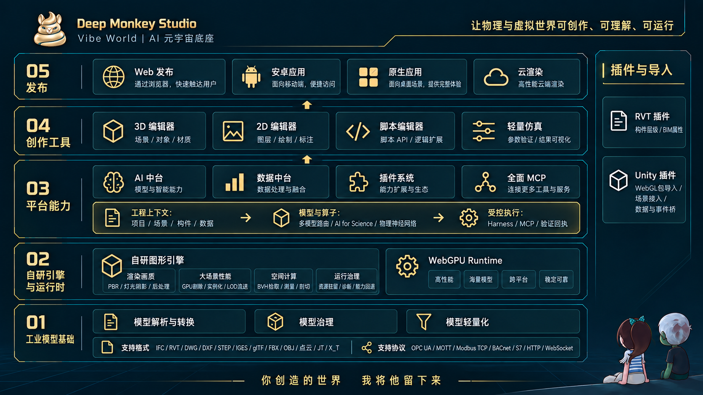

<p align="center">
  
</p>

<h1 align="center">DeepMonkey Studio</h1>

<p align="center">
  Vibe World | AI 元宇宙底座<br />
  你创造的世界 我将他留下来<!--  -->
</p>

[简体中文](README.md) · [English](README.en.md)

从 Vibe Coding 到 Vibe World：AI原生的可编程三维世界，面向元宇宙、Science、世界模型的开源底座。

[](https://github.com/fatasia/DeepMonkey-Studio/actions/workflows/deep-engine.yml)
[](https://github.com/fatasia/DeepMonkey-Studio/actions/workflows/studio.yml)
[](https://github.com/fatasia/DeepMonkey-Studio/actions/workflows/repository-governance.yml)
[](LICENSE)


## 作者的话

我对他的定位不是一个 数字孪生 平台，或重复造轮子的系统。

而是面向元宇宙、AI for Science、世界模型的开源底座。

上层包括：2D 编辑器、3D 编辑器、脚本编辑器和插件；

底层包括：自研引擎、数据平台和可组合的模型适配能力。

底层对 WebGPU、渲染、工业与 BIM 模型做了很多优化，模块独立简洁，可以单独作为一个 SDK 使用。

开发测试中让AI网上找了很多模型素材；若不小心侵权，万分抱歉，我直接删掉。

项目使用最宽泛的 MIT 协议，任何人都可以随意使用（技术的发展离不开行业专家大拿的支持），仅对忽视员工人权的特定企业例外（详见 [LICENSE.zh-CN.md](LICENSE.zh-CN.md)）。

[文档](docs/README.md) · [贡献指南](CONTRIBUTING.md) · [支持](SUPPORT.md)



## 系统介绍 · 从 Vibe Coding 到 Vibe World

## 演示视频

https://github.com/user-attachments/assets/b6059d6a-04c1-4fe1-b11e-9a46a42184d2

从模型接入、轻量化与数据连接，到 AI 工作流、自研引擎和多端交付。

### 系统核心功能录屏

https://github.com/user-attachments/assets/d562bbec-f85a-4d75-890c-1aaa7f561105

## 在线体验与下载

[在线体验工作台](https://fatasia.github.io/DeepMonkey-Studio/) · [下载 0.2.0](https://github.com/fatasia/DeepMonkey-Studio/releases/tag/v0.2.0) · [Docker 一键部署](docs/docker-application.md) · [Codex / Claude：Skill、MCP 与 SDK](docs/ai-development.md)

> 演示地址仅供部分功能体验，**不包含全部功能**。完整体验请下载 Windows 编辑器或使用 Docker / Docker Compose 部署。

在线版内置 SMT 产线、275 项模型与环境材质、30 行示例数据，无需登录。编辑保存在当前浏览器；完整素材库通过 [素材包 Release](https://github.com/fatasia/DeepMonkey-Studio/releases/tag/asset-library-v1) 下载。

Pages 无需账号或密码。源码开发默认 `admin / admin`；Docker 账号为 `admin`，密码按[部署说明](docs/docker-application.md)获取。

## Codex / Claude 接入

克隆仓库后，从仓库目录启动 Codex 或 Claude Code。Skill 已分别放在 `.agents/skills/` 和 `.claude/skills/`，可直接调用：

- Codex：`$deep-engine-3d 做一个三维车间`
- Claude Code：`/deep-engine-3d 做一个三维车间`

连接运行中的 Studio：先按[接入教程](docs/ai-development.md#3-连接-studio-mcp)登录并设置 `DEEPMONKEY_TOKEN`，然后配置 MCP。

```sh
codex mcp add deepmonkey --url http://127.0.0.1:4100/api/mcp --bearer-token-env-var DEEPMONKEY_TOKEN
```

Claude Code 在项目 `.mcp.json` 中添加以下配置，再用 `/mcp` 检查连接：

```json
{"mcpServers":{"deepmonkey":{"type":"http","url":"http://127.0.0.1:4100/api/mcp","headers":{"Authorization":"Bearer ${DEEPMONKEY_TOKEN}"}}}}
```

独立开发项目可使用引擎 SDK 和八个示例模板，见 [Skill、MCP 与 SDK 教程](docs/ai-development.md)。

## 功能亮点

- **AI 与本体，理解工程并执行任务**：本体描述工程对象、关系与可执行动作；AI 结合场景、构件、数据和运行状态回答问题，按授权修改对象、查询数据、运行分析。修改可预览，执行可取消、追溯。
- **模型、数据与仿真在同一个工程里**：组合 2D 看板、3D 场景、设备拓扑、实时数据和告警，并接入产线仿真、机器人工作站与虚拟调试。
- **工业模型接入与轻量化**：导入 IFC、STEP、IGES、DWG、glTF、URDF 等模型，支持构件查询、属性定位、减面和贴图压缩；格式范围见[支持说明](docs/converter-plugin-and-format-support.md)。
- **自研引擎，可独立集成和扩展**：WebGPU、Rust 原生与 WASM 共享场景包；通过引擎 SDK、Scene/Server SDK、脚本 API、插件和 MCP 接入自己的应用。
- **一次制作，多端交付**：发布为 Web、只读 Viewer、Windows、WASM 或 Android，自动检查目标端能力、资源依赖与兼容性。

## 性能实测

同一布局、几何和机位,六个引擎按各自采样窗口跑多轮取中位(2026-10-07,RTX 4060 Laptop)。时间单位为 ms。*Unity 与 Deep Native 是 Windows 原生运行时(Unity 为 Mono,Deep Native 为 Rust/wgpu),与浏览器四列不可直接对比,仅供参考;"—"为未采集或未校准项。

| 指标 | three.js WebGL | three.js WebGPU | Babylon.js WebGPU | Deep WebGPU | Unity 2022.3 原生* | Deep Native 原生* |
| --- | --- | --- | --- | --- | --- | --- |
| 静置 P50(120 / 1000 物体) | 6.9 / 6.9 | 6.9 / 6.9 | 6.9 / 10.2 | 6.9 / 6.9 | 6.94 / 6.94 | 6.94 / 6.94 |
| 静置 P95(120 / 1000 物体) | 7.1 / 7.1 | 7.1 / 7.1 | 7.4 / 15.0 | 7.1 / 7.1 | 7.27 / 7.12 | 7.55 / 7.40 |
| 动态 P95(1000 物体) | 7.1 | 7.1 | 13.7 | 14.0 | 7.26 | 12.82 |
| 静置最大帧(120 物体) | 27.7 | 159.6 | 240.2 | **7.2** | 8.29 | 9.90 |
| 首帧(1000 物体) | **72.7** | 283.2 | 876.0 | 1,623.3 | 2,575.7 | 1,459.8 |
| GPU 帧时 P50(1000 物体) | 0.9 | **0.7** | 1.3 | 2.9 | — | 0.51 |
| 20 轮重建(1000 物体) | **3.2** | 3.6 | 410.2 | **3.2** | 45.3 | 8.27 |
| Draw Calls(1000 物体) | 1,055 | 1,056 | 2,001 | **7** | — | 9 |
| 重建堆增最差(1000 物体,MiB) | **0.1** | 90.9 | 21.6 | **0.6** | 121.2 | 0.34 |

复现方法、采样口径与完整证据见[基准程序](docs/specs/render-benchmark-program-20261007.md)；功能对照见[引擎能力对照](docs/engine-comparison.md)。

## 完整功能列表

### AI 能理解，也能执行

- 项目、应用、场景、页面、拓扑、构件、数据集、语义指标、视觉事件和发布记录使用版本化合同与稳定 ID。AI 拿到的是可定位的工程对象及其关系，回答能回到具体构件、数据和证据。
- 上下文按当前项目、场景、选中对象和任务裁剪，保留来源、版本、字符预算与省略状态。面板里的“本次上下文”折叠区列出这次实际读取的来源和就绪情况，记忆与实验档案也收在这里。
- 助手面板有两种用法：**对话**与**执行任务**。对话时用输入框旁的“提问范围”选择证据来源（编辑器内为场景、选中对象、BIM、仿真运营、看板、问数据；平台页为全平台、二维等），会话在标题栏的下拉里切换，空会话只给几条可直接点击的问题。
- **执行任务**输入一个目标，由工业 Agent 编排工具调用；运行可以停止，也能从检查点恢复。
- 执行方式分三档：只出计划（仅保留读取与分析工具，仿真、写入和控制调用会被拒绝并记入审计）；逐次确认（默认，高风险能力每次由用户确认，审批绑定参数指纹，15 分钟内有效）；自主执行（在授权范围内自动执行，取消与审计照常生效）。
- Tool Harness 默认向 Agent 开放 20 个精选工具，涵盖数据查询、预测维护与能源分析、电池预测、诊断与告警根因、虚拟调试和仿真研究、溯源追踪、工位审计、参数化校验。每个工具声明输入输出 schema、权限、执行位置、超时和取消方式；没有 shell、文件系统或任意命令类工具。
- 场景修改以命令事务提交：一次最多 64 条命令，先生成差异计划，用户确认后由浏览器里的编辑器执行；修订号冲突会被拒绝，失败可回滚。AI 生成的看板和脚本只作为草稿呈现，确认后仍需人工检查，不会自动保存或发布。
- AI 的假设、运行、判定、报告与行动写入只读溯源账本：可从任一节点回放完整决策链（断链如实标注）、按参数或结果指纹/理由码检索历史先例、反查某结论影响了哪些下游判定与报告；助手长期记忆写入前做确定性冲突检测（判定翻供、理由码语义反转、被否方案的再主张），冲突只标记并呈现，不静默覆盖、不阻断记录。
- Responses、Chat Completions、MCP 和可插拔 AI Provider 共用会话与运行记录；请求过程显示读取、生成、预览、应用等状态，可停止、重试，断线后可恢复。

### 项目、应用与资源

- 项目、应用、场景、页面和拓扑统一管理；支持新建、复制、重命名、删除、自动保存、撤销/重做、本地草稿恢复、版本历史和项目间转移。
- 新建场景时可选“示例本体”或“空白场景”，默认前者：底座、立柱和一个带点击交互的行为热点，外加一个概览视角，材质使用显式 PBR 参数。示例对象的名称带“示例”前缀，按普通对象删除即可。
- 统一资源库管理模型、图片、视频、环境贴图、材质、预制体和机器人资源；支持搜索、分类、缩略图裁剪、来源与授权信息、拖放入场景及替换既有实例。
- 资源有新修订时，引用旧修订的场景模型会在资源库里标出“已陈旧”，可一键更新到最新版本，也可选“保持当前”。更新先做场景侧的修订校验，再写回受影响场景。
- 开发环境支持资产热重载：dev 服务器监听项目内模型与纹理文件变更并推送到运行中的编辑器，同资产原位热换；替换走 fail-closed 事务，结构不兼容、动画缺失或取数失败时保留原实例并如实披露，资源浮窗另有手动“重新加载”入口。该推送通道只在开发构建中存在，生产不受影响。
- 删除资源前会列出字段路径级的影响范围，例如哪个场景的 `models[0].assetModelId` 在引用它。边界：后端还没有按旧修订取包的接口，更新时不做旧包差异比对，“保持当前”也只在本次会话内有效。
- 参数化工作台创建、校验和保存参数化模型，也可通过 Tripo3D 或腾讯混元 3D 从文字描述生成模型（服务商凭据只保存在服务端，需在系统设置中配置）；工业预制体支持实例参数、材质、连接点和场景级持久化。
- 模型优化器在浏览器本地完成减面、Draco、贴图压缩、顶点色及 Web 光照贴图烘焙；任务可取消，结果作为新资源回到项目。
- 素材包导入前先校验 `pack.manifest.json`、`catalog.json`、`audit.json` 和逐文件 SHA-256，通过后原子替换目标目录；公开素材用 `pnpm assets:sync:open-packs` 同步并校验。

### 模型与工业格式

- 直接或转换导入 RVT、IFC/IFCZIP、STEP/STP、IGES/IGS、DWG、DXF、glTF/GLB、FBX、OBJ、STL、3MF、DAE、3DS、OpenUSD（USD/USDA/USDC/USDZ）以及 URDF/机器人 ZIP。
- STEP/IGES 由 `occt-import-js`（Open CASCADE WASM）在转换队列中三角化为 GLB，保留装配与零件目录、名称、颜色和几何统计，不需要安装 CAD 软件。DWG 经 LibreDWG 转为 DXF，复杂动态块、AEC/Civil 代理对象和高保真文字不在保证范围内。IFC、glTF、FBX、OpenUSD 和通用网格各自走查看管线加载。
- RVT 提供原生 GLB 与 IFC 两条链路，保留构件层级和属性；转换由自研 Revit Worker + Add-in 完成，转换机需要安装并授权对应版本的 Revit，这条链路不属于内置离线能力。
- JT 9.5/10.3 已验证的 LOD0 子集可输出 GLB、层级和属性，8.x 目前只做结构检查。X_T 先走严格子集，未命中时回退到 `xt-reader` 的通用文本解析，仍没有几何则保持检查态；X_B 暂时阻断。无法可靠产出几何的文件停留在检查或等待状态，不会拿文件头或包围盒冒充完整导入。
- 转换队列支持进度、取消、超时、租约恢复、输出审计、哈希、层级/属性/PMI sidecar、LOD 派生和失败复转；详细边界见[格式支持说明](docs/converter-plugin-and-format-support.md)。

### 3D 编辑器

- 递归场景树、窗口化大列表、搜索与筛选、多选、编组、排序、拖放、锁定、显隐、隔离、复制、删除和选择集；模型、内部图层、BIM 构件、空间、灯光、标记和基础体共享一致的对象操作。
- 位移、旋转、缩放、吸附和多对象变换；基础色、透明度、金属度、粗糙度、法线/AO/自发光贴图、UV、双面与透明模式、多材质槽，以及对象效果和 IES 灯光编辑。材质还可以绑定 DeepSL 自定义着色器：先编译并查看诊断和包预览，通过后才能绑定。
- 对象效果包括轮廓、发光、X 光、扫描线、热力、溶解和边缘光；图片或视频可以映射到模型或构件表面作为“模型屏幕”。
- 按名称、稳定 ID、属性、楼层和类别检索构件；RVT 房间/MEP Space、IFC 构件、BIM 属性、楼层显隐与分解视图均可定位、隔离和批量操作。
- 距离、构件最小距离、角度和标高测量；剖切盒、轴向与拾取面剖切；径向、垂直和轴向爆炸；BVH 碰撞检查和工程分析结果定位。
- 轨道、第一人称和第三人称导航，地面跟随与碰撞，六个标准视角、自定义相机书签、相机约束、方向立方体以及 WebXR VR/AR。
- 模型内置动画、相机与对象时间线、关键帧录制、动画状态机，每个关键帧可单独设置过渡（线性、平滑、缓入、缓出、阶跃），相机轨迹另可选曲线路径，并支持循环/往返和路径显示；标记、空间音频和交互状态随场景保存。
- 模型动画面板里的“根运动”开关会把动画根节点的位移和旋转应用到模型实例上（旋转以实例原点为枢轴），带累计位移/转角读数和“复位”按钮。开关只在当前会话有效，姿态改动会按普通编辑保存，保存前建议先复位，界面有提示。
- 骨骼与 IK：编辑骨骼姿态，为效应骨添加单链 IK，设置模型坐标下的目标、链长和迭代次数。
- 固定、动态和运动学刚体，质量、摩擦、弹性、初速度、重力和角色控制；旋转关节可连接世界或另一刚体，带角度限位和速度马达；碰撞体可线框显示。
- 物理基于 Rapier，以 60 Hz 固定步长确定性推进：同一段帧时间序列得到同一条逐 tick 轨迹（30–144 fps 与抖动帧率有单测锁定），追赶超过 12 步才丢弃并计数。暂无渲染插值，行为脚本与物理仍是两条时钟。

### 环境、效果与出图

- 晴、阴、雨、雪、雾、雷暴，天空盒、背景、网格、HDR/EXR、坐标原点和地理定位；方向光、环境光、半球光、点光、聚光、区域光，阴影、反射与探针网格烘焙。
- 体积雾可调步数、密度、高度尺度、各向异性和散射反照率（0–1，默认 0.82），并可叠加体积光。它由 Deep WebGPU 完整渲染，其它后端按兼容性检查降级或提示不支持。
- 火焰粒子图层可挂在模型或基础体上：尺寸、不透明度和热度颜色各有一条随生命周期变化的曲线（每条最多 16 个关键帧，可拖拽或用方向键调整），混合方式可选加色或透明，透明时按相机距离从远到近排序。
- 单发射器和整个场景都有粒子预算，超限时缩减绘制范围并提示，不会崩溃。边界：WebGPU 渲染器下逐粒子尺寸退化为曲线均值，GPU 粒子管线尚未接入编辑器。
- SMAA、FXAA、SSAO、GTAO、Bloom、轮廓、景深、暗角、胶片颗粒、残像和色彩校正（含色温与色调）；SSR、SSGI（屏空间全局光照，漫射一次反弹）与体积光属于 Deep WebGPU 能力。质量档分 performance、balanced、quality、ultra 四级；渲染诊断、帧捕获、性能设置与后端能力状态可见。
- 光追与万灯属 Deep WebGPU 能力，均为 opt-in 默认关（URL 参数开启）：光追阴影按帧自动选路，在 RT 遮挡与级联阴影间切换，按质量档与链路健康度带滞回回退，HUD 显示当前选路；光追反射为 closest-hit 帧通道，并带 specular GI 二反弹切片(首命中沿镜面方向单跳两级 TLAS→BLAS 追踪 + Lambert 中继累加，与一次反弹档逐位一致的 miss 语义)；万灯直接光用 ReSTIR 随机采样，灯池上限 65535、面积光上限 64，5000 灯 1080p 帧时 p95≤20ms，超预算按 fail-closed 拒绝；胜者着色带 IES 因子注入(与射灯分布同源)与胜者可见性射线档(两级遮挡,溢出 fail-closed 0)，空间复用按源像素 mask 传递。原生执行器已入库万灯 RIS 链的 CPU 权威镜像与 WGSL 单源双端字节门(f64 中间量、黄金 8×6×12 灯×5 帧对拍)，登记为 harness 档：wgpu 30 naga 真机编译路径限制如实记录，规避刀已落待真机复验；原生光追阴影为减配档，原生光追反射/万灯 GPU dispatch 未接生产帧。
- 导出菜单里的“物理光照出图”用 CPU 路径追踪生成场景默认视角的静帧，作为参考图：可选物理光照、方向光参考和白炉参考三种照明，逐像素噪声低于 2% 才算收敛，未收敛时可保存预览；导出线性 HDR 并附回执（样本数、噪声、是否收敛），固定种子下可复现。
- 场景一旦修改，累积即清空；预估内存超出预算时拒绝启动，需降低分辨率；实时 GI 增强、辅助网格和屏幕效果不写入结果。

### 数字孪生场景搭建

- 设备与测点智能绑定：粘贴设备目录（JSON 数组，或带表头的 CSV/TSV；`deviceId` 与设备名称必填，标签、空间、类别和坐标可选，目录上限 5 MiB），按确定性的多因素评分给出与场景对象的匹配建议，由人确认后写入，映射随场景保存。
- 批量设备布局：按规则阵列，或从数据/GeoJSON 导入坐标，可用比例与偏移对齐已导入的 DXF/平面图，一次创建方盒和同 ID 的模型标签，之后可继续绑定实时数据和告警。
- 空间钻取向导：为楼栋、楼层和设备生成“点击进入下一级”的入口，目标可以是已有场景、保存的空间视角或设备近景。它只生成现有的交互事件，不另起一套导航运行时，可整体撤销。
- 数字孪生数据桥把“连接 → 数据集 → 场景”串成一条路径，数据集直接绑定到场景对象。
- 模型版本对比评审：载入同一模型的两个版本，分别捕获快照后对比，新增、删除、修改的构件以绿、红、黄只读叠加显示，关闭评审即清除，不留痕迹。

### 2D 看板与拓扑

- 多页自由画布、标尺/参考线、网格吸附、缩放、框选、多选、图层树、编组、锁定、排序、复制粘贴、对齐分布、撤销重做、页面级背景和 1920 基准自适应。
- 37 类组件：文字、形状、装饰、数值翻牌、液位、进度、状态、仪表、折线、面积、柱状、组合、饼图、散点、雷达、漏斗、桑基、旭日、矩形树图、关系图、地图、词云、箱线、瀑布、极坐标、排名、表格、滚动表、筛选、填报、图片、视频、实时监控、网页、Unity 和拓扑。
- 图表支持维度/系列/指标、聚合、计算字段、排序、Top N、钻取、联动筛选、条件样式和语义指标；报表支持明细、分组、交叉表、分页、小计/总计、冻结列和 XLSX 导出。
- 模板库覆盖多种行业与布局；支持样例数据、组件/页面图片导出、打印和报告导出，预览态与发布态复用同一文档合同。
- 拓扑编辑器支持设备节点、连线、空间视图、运行状态、告警确认、数据产品绑定，并可嵌入看板或返回原编辑上下文。

### 数据中心与语义层

- 原生管理 32 类连接：PostgreSQL、MySQL、MariaDB、TiDB、Doris、StarRocks、SQL Server、Oracle、ClickHouse、TDengine、MongoDB、Elasticsearch、InfluxDB、Prometheus、CSV、Excel，HTTP、WebSocket、MQTT、AMQP、Kafka、CoAP，OPC UA、Modbus、BACnet、S7、EtherNet/IP、SNMP、TCP、UDP、串口，以及内置演示数据。
- 可视化数据管线提供数据源、清洗、公式、聚合、字段映射、预览、调试、重试、刷新策略、实时事件和历史回放；凭据只留在服务端。
- 连接向导分四步，每步有就绪/加载/失败三态；连接监控带趋势条；数据预览表区分加载/空/错误三态并虚拟滚动；字段列表附统计徽章。
- 数据集可直接绑定 2D 组件、3D 对象和 AI 能力；支持参数化直接绑定、设备信号规则、记录表单、受权限控制的数据回写和执行回执。
- 语义模型统一管理指标、维度、参数、过滤和版本；看板绑定确认后的语义口径，版本变化不会静默漂移。
- 本体包描述对象类型、关系类型、动作类型和事件类型，对象属性可绑定数据集、管线、场景树、API 或手工录入。本体包按草稿、评审、发布、退役流转，保留版本并支持回滚；存在未确认的属性时不能发布。动作带效果类别（读取、分析、内部写入、外部写入、控制）和四级风险，并可查看关系图。
- 本体关系图按治理态做形色双编码，边按语义着色并带悬停卡，支持关联链路分级高亮与大图 LOD 聚簇；对象卡可直接打开 AI 决策链面板，回放与该对象相关的完整决策链。对象实例值与动作参数在写入/执行前经本体约束校验（必填、类型、枚举、单位格式、合同外属性五类规则），默认只报告不阻断，行动服务可按 strict 选项在执行前拒绝。

### 脚本、交互与自动化

- 专业脚本编辑器基于 Monaco，提供语法高亮、补全、类型检查、诊断、格式化、搜索、依赖管理、Git 版本记录与恢复。
- 场景、模型、构件、预制体、看板组件和拓扑共用事件系统，覆盖加载、点击、双击、右键、悬停、动画、碰撞和路径节点事件。
- 交互动作包括显隐、颜色、透明度、定位、动画、预制体动作、页面/场景导航、相机切换、消息、数据写入和 Unity 动作；可视化流程检查实际目标与参数。
- 行为脚本有每帧的 `onUpdate` 和固定 1/60 s 的 `onFixedUpdate`，每帧最多补 5 个固定步，溢出会计数；运行轨迹可以回放。
- `studio.*` 宿主 API 提供场景、数据、AI、网络、渲染器和编辑器能力；脚本权限、生命周期、失败日志和发布依赖均可审计。

### AI 与视觉

- 助手支持工程、BIM、场景和选中对象问答，只读 SQL（问数据）、看板生成、脚本草案和场景操作建议；会话、运行步骤、停止、重试、证据和变更确认都可追踪。
- 助手基于真实构件、空间、数据集、视觉事件和当前编辑上下文工作；支持 Responses 与 Chat Completions 协议、SSE 流式输出和服务端密钥管理；模型下拉里只有模型支持时才出现思考档位。
- 视觉中心管理图片、RTSP/RTMP/SRT/HLS 视频、ONNX 模型、识别任务和事件；兼容 YOLOv5/v7/v8/v10/v11 常见输出，并提供阈值、NMS、标签和 letterbox 坐标还原。
- 识别事件可绑定场景对象，触发高亮、相机定位、状态消息和告警流；Windows 可使用 DirectML GPU 推理，并提供内置模型下载预设与自带模型入口。

### 工业工程与仿真

- 运营中心包含预测维护、虚拟调试、电池智能、物流、能源、What-if 和实时监控；Study 保留输入、模型版本、证据、结果和可复现指纹。事件可以持久录制：来源可以是注入或仿真事件，缺口会被保留，历史录制可读取并重读核对，也可按固定帧步长映射。
- Plant Lite 提供产线/物流离散事件建模、设备与运输网络、班次、换型、产品混流、人员、能耗、质量、可靠性、缓冲策略、瓶颈扫描、时间轴播放和证据导出。
- PPR Lite 管理产品、工艺、资源、工序、线平衡、质量控制和作业指导书，并可把方案交给 Plant Lite 验证。
- 机器人与工位支持 URDF/资源包、关节预览、运动学、路径编辑、节拍预算、轨迹播放、碰撞与负载检查、工位规划、人体工效证据和结果交付。
- 虚拟调试支持信号映射、控制阶段、联锁、故障注入、复位、测试设计、套件执行和证据报告；场景内可直接打开物流、工位、调试和 What-if 面板。
- 参数化建模、制造验证、工业诊断、告警根因分析、能源分析和电池模型通过统一能力注册表调用，支持权限、超时、取消、审计和结构化结果。

### Deep WebGPU 引擎

- TypeScript WebGPU 内核、Rust `wgpu` 原生执行器和 Rust WASM 运行时共享场景包、能力报告与质量策略；Studio 可在作者状态不丢失的前提下切换可用后端。
- 引擎包含渲染图、PBR、glTF、几何与纹理、LOD/流送、实例与剔除、材质/Shader IR、缓存、灯光与阴影、GI/探针、体积雾、后处理、拾取、动画、物理桥、粒子（曲线 LUT、预算与透明排序）、保留式 UI 和 Deep2D 图表运行时。
- 原生执行器内置独立的 2D 引擎（native deep2d，GPUI 对齐路线）：渐变/圆角矩形/箱阴影三个视觉命令按解析 SDF 在片段级求值，taffy flex 组件布局直接产出绘制命令，动态路径按滑窗变更频次自动分路到 stencil-then-cover GPU 填充（fill 域，描边仍走 CPU 展开）；三件均有真 GPU readback 逐像素对拍。该通路目前在原生引擎内，web 端暂无 deep2d 渲染通路。
- three 与 Deep 共用一份显示合约 `DEFAULT_DISPLAY_CONTRACT`（`packages/contracts/src/displayContract.ts`）：ACES 算子 `three-aces-r185`、曝光 1.05（动态曝光限制在 0.55–1.55）、sRGB 输出、2048 阴影贴图及 bias、Bloom 参数和 GI 缺省值 0.32。three 主视图、Deep 产品桥和发布编译载荷都从它取值，不再各写各的默认。
- `pnpm gate:parity` 在真实 GPU 上让同一份场景在 three 与 Deep 里各渲染一遍并逐像素比较：5 个标准场景（PBR 矩阵、IBL、方向光阴影、AA+Bloom、透明）加 3 个诊断场景，用 RMSE、ΔE2000 和 SSIM 分严格、容许、诊断三档。目前 PBR 矩阵和方向光阴影达到严格档，IBL 为容许档，AA+Bloom 与透明仍是已知差异，由回归守卫锁住不让变差。没有 GPU 硬件适配器时直接失败而不是跳过；基线在单一机器（RTX 4060）上标定，尚未接入 CI。
- 变化 revision 和脏域驱动增量编译与局部上传；实例合批、LOD、HiZ/遮挡剔除、紧凑可见集、间接绘制、分块提交与静止降频减少 CPU 提交、GPU 过绘和主线程工作。
- 场景首帧按关键度分级加载与编译：关键阴影管线子集先行、其余管线错峰创建，级联档剥离不可达着色器库（实测编译墙 −341ms）；整体首帧时长的进一步优化仍在进行。
- GPU 缓冲子分配、资源驻留、瞬态纹理池、管线/Shader/文字缓存、资源预热和按需流送减少重复分配与上传；Worker 和可取消任务承接模型处理、烘焙及重型计算。
- 帧时间、上传字节、缓存命中、可见对象、显存预算、质量档、设备丢失恢复和后端能力均有显式诊断；性能验证关注整帧 P95/P99、内存和画质一致性，不支持项会阻止发布或给出降级原因。工具坞的「性能与诊断」统一面板(帧时/场景/资源/管线四分区,F9 可开关)以泳道展示逐 pass GPU 计时、跨帧时序与渲染器重建标记,默认关、面板关闭时不采样。
- 原生执行器补齐视觉后处理三件：vignette 暗角随色彩分级合约可选启用（双端同一 wire 合同，opt-in 默认关）；FXAA 与自动曝光按同一算法移植，经 CPU 逐位 golden 与真机 GPU readback（RTX 4060，≤2/255）对拍，当前为“验收通路”级——生产帧循环接线属后续切片，文档中心能力矩阵如实标注。
- SDF 遮蔽 GI 与虚拟几何按“验收通路”纪律双端入库：SDF 体积烘焙、天光圆锥追踪与探针 SH 更新链的原生实现与 web 侧逐位对拍（位级 f32 词加 SHA-256，真机 RTX 4060 关键路径零误差），web 侧可经 `sdfGi` 开关启用；虚拟几何 meshlet DAG 有离线编译工具链（贪心簇划分→层级聚类简化→`.dgc` 流式格式，CLI build/info/verify），序列化字节黄金钉版与消费合同门常开，web 侧页调度/驻留/indirect 计划与簇 LOD 消费链已闭环；场景包→`.dgc` 驻留摄入链已接通——几何上传即按 (geometry, material) 分节生产编码(与 Rust 权威写端逐位对拍)、材质实例绑定在节、native 逐节 from_dgc 驻留预检、损坏节 CRC 咬人回退不毒化，GPU 主 pass 逐节 draw 调用点属后续切片。
- SDK 提供 `/app`、`/webgpu`、`/scene`、`/gltf`、`/geometry`、`/textures`、`/streaming`、`/hlod`、`/shadows`、`/lighting`、`/postprocess`、`/particles`、`/physics`、`/shader*`、`/runtime-package`、`/three-bridge` 和 `/host` 等子路径入口。

### 发布、多端客户端与存储

- 场景与完整应用支持保存、预览、发布体检、稳定快照、重新发布、撤回、删除、历史恢复和发布差异；资源依赖按哈希冻结并校验兼容性。
- 导出 `.scene.json`、含资源的 `.bimscene`、GLB 和 FBX；生成只读 Web Scene Viewer、静态站点、便携 ZIP、Windows 独立程序、桌面本地客户端、Android APK、Deep Native 与 Rust WASM 交付物。
- 发布对话框选择渲染目标、质量档、资源预算与品牌；离线包支持下载取消、完整性校验、本地启动、首次运行预检和错误回执。
- 构建目标按角色分三档：Deep Engine SDK（只含引擎子入口）、Scene Viewer（只读查看）和 Full Studio（完整编辑器）；三档共享场景合同、资源哈希和发布清单。
- 可选云渲染会话具备创建、停止、并发保护和生命周期审计；实时媒体自动把 RTSP/RTMP/SRT 转为浏览器可用的 HLS/WebRTC。
- 元数据支持本地 JSON、SQLite 或 PostgreSQL，资源支持本地文件或 MinIO；迁移保留原数据，提供备份、恢复、密钥轮换、服务账号和生产预检。

### 扩展性、SDK 与 AI Tool Harness

- 场景 SDK、服务端 SDK、共享 contracts、数据运行时、插件运行时和 Deep Engine 可独立构建；平台 HTTP API、脚本 API、AI 工具、运行包和示例使用同一版本化合同。
- 插件注册表统一承载数据查询、数据连接器、模型转换、参数化、制造验证、虚拟调试、工位验证和 AI Provider；新能力声明输入/输出 schema、权限、执行位置、超时、取消、诊断和版本兼容性即可被 UI、API 与 AI 发现。
- `studio.*` 允许脚本扩展场景、数据、网络、渲染器和编辑器；依赖与 Git 版本跟随项目，生命周期和权限进入发布检查。
- MCP 服务端（`bim-industrial-core`）通过 `tools/list` 暴露只读的查询类能力，通过 `resources/*` 提供编辑器场景快照；场景写入走 `editor.scene-transaction`，由浏览器编辑器校验并执行，API 进程只负责权限、会话与排队。
- 渲染后端通过统一 host/能力矩阵接入；数据源、转换器、工业算法、客户端和发布目标各自遵守边界合同，可以替换或追加而不复制项目状态。
- Unity Bridge 支持资源版本、场景/事件/数据层声明、看板嵌入和动作回传；资源兼容性与发布就绪状态可检查。

### 文档中心

- 应用内 `/docs` 提供离线图文指南，覆盖快速开始、资源与编辑、数据与 AI、工业任务、交付与运维、SDK 和参与项目，中英文可切换。
- 文档中心是唯一文档事实源；GitHub Wiki 镜像由 `pnpm docs:wiki:export` 生成，不单独维护第二套内容。
- 文档中心“渲染引擎”分类提供公开引擎能力矩阵页：渲染能力与模型格式两张登记表只读派生自 contracts 单源，按双端状态（完整可用、可用·需开启、验收通路、降级、规划中等）分域展示，每行附证据路径，数据随登记表即时更新、不做手工维护；物理域尚无公开登记表，以“未登记”空态如实呈现。

### 系统管理与治理

- 管理员、编辑者、浏览者三角色和项目级授权；登录会话、用户管理、服务健康、日志、错误/操作审计、缓存与性能维护集中在系统中心。
- AI Provider、MCP、云渲染、通知渠道/收件人/路由/投递日志和服务状态统一配置；敏感凭据不回显到浏览器。
- 品牌设置覆盖 Logo、应用 Icon、系统名、浏览器标题、版权、主题色、默认语言、登录入口、新场景默认环境和维护模式。
- 仓库发布门禁覆盖依赖许可、第三方素材来源、源码体量、类型检查、单元测试、构建、浏览器流程、发布产物和恢复验证。

## 技术栈

| 层 | 主要技术 |
| --- | --- |
| Web 编辑器 | TypeScript、React 19、Vite 8、Three.js、ECharts、GridStack、Monaco Editor、three-mesh-bvh、Rapier |
| Deep Engine | `wgpu`、`winit`、Rapier、WebAssembly |
| API 与实时数据 | Fastify、WebSocket、MQTT、Kafka、AMQP、OPC UA、Modbus、BACnet、S7、EtherNet/IP、SNMP、串口 |
| 数据与对象存储 | SQLite、PostgreSQL、MinIO；MySQL、SQL Server、Oracle、MongoDB、ClickHouse、TDengine 等可作为业务数据源 |
| AI 与视觉 | MCP、ONNX Runtime、DirectML、YOLO 推理与可插拔 AI Provider |
| 客户端与交付 | Tauri 2、WebView2、Rust Native/WASM、Android、静态 Web Viewer、Windows NSIS/MSI |
| 工程工具 | pnpm workspace、TypeScript、Vitest、Node Test Runner、Cargo Test |

## 快速开始


三条命令跑起来（只需 Git + Node.js 24+，不需要 PostgreSQL / MinIO / Docker）：

```bash
git clone https://github.com/fatasia/DeepMonkey-Studio && cd DeepMonkey-Studio
corepack enable && corepack prepare pnpm@11.18.0 --activate && pnpm install --frozen-lockfile
pnpm run init   # 初始化示例工程并启动,浏览器打开 http://localhost:5173(默认账号 admin/admin)
```

启动缺配置时先 `cp .env.example .env`（Windows PowerShell：`Copy-Item .env.example .env`）。完整环境矩阵、桌面客户端与生产部署见下文。

### 1. 环境依赖

| 使用方式 | 必需环境 | 可选环境 |
| --- | --- | --- |
| Windows / Linux Web 编辑器 | Git、Node.js 24+、Corepack、pnpm 11.18.0 | PostgreSQL、MinIO|
| Windows 桌面客户端开发 | Web 环境、Rust stable、Visual Studio C++ Build Tools、WebView2 | Windows SDK|
| Linux 原生部署 | 64 位 Linux、Node.js 24+、Corepack、pnpm、bash；长期运行需要 systemd | PostgreSQL 16+、MinIO Server/Client、反向代理与 TLS |
| 已安装的 Windows 客户端 | WebView2 | 连接协作服务器时需要服务器 Origin |

`client` 开发模式只支持 Windows；Windows 和 Linux 都能运行 `web` 或 `api`。只体验编辑器不需要 PostgreSQL、MinIO、Python 或 Docker。

### 2. 克隆、安装和配置

```bash
git clone https://github.com/fatasia/DeepMonkey-Studio.git
cd DeepMonkey-Studio
corepack enable
corepack prepare pnpm@11.18.0 --activate
pnpm install --frozen-lockfile
```

复制环境模板。已有 `.env` 时不要覆盖：

```powershell
# Windows PowerShell
Copy-Item .env.example .env
```

```bash
# Linux
cp .env.example .env
```

最少需要关注这些配置：

```dotenv
API_PORT=4100
BIM_STUDIO_WEB_HOST=0.0.0.0
BIM_STUDIO_WEB_PORT=5173
WEB_ORIGIN=http://localhost:5173
METADATA_STORE=sqlite
OBJECT_STORE=local
AI_BASE_URL=https://api.openai.com/v1
AI_API_KEY=
AI_MODEL=gpt-4.1-mini
```

`.env.example` 里的 `METADATA_STORE` 默认是零依赖的 `json`；上面写 `sqlite` 是单机推荐值，生产改用 PostgreSQL，见下文第 6 节。

`.env` 是本地与裸机部署的主配置文件；完整键和注释以 `.env.example` 为准。不要提交 `.env`、数据库密码、MinIO Secret、AI Key、证书或生产数据。

### 3. 初始化

初始化公开示例和元数据，但暂不启动服务：

```bash
pnpm run init -- --prepare-only
```

直接执行 `pnpm run init` 会在初始化完成后启动 Web 模式。初始化默认不覆盖已有数据；不要把 `--force` 当作日常命令。

### 4. 启动与访问

```bash
# Windows / Linux：API + Web 编辑器
pnpm studio start web

# Windows：API + Web + Tauri 桌面开发客户端
pnpm studio start client

# 仅启动 API，供现有前端或客户端连接
pnpm studio start api
```

启动后使用：

- Web 编辑器：`http://localhost:5173`，局域网设备可用 `http://<主机IP>:5173`。
- 管理中心：`/manager`；文档中心：`/docs`；品牌设置：`/branding`。
- API：`http://localhost:4100`；健康检查：`http://localhost:4100/health`。
- Windows 客户端：运行 `pnpm studio start client` 后由 Tauri 窗口访问同一套正式 API；已安装客户端可使用内置 SQLite + 本地对象目录独立工作。
- 当前开发环境管理员账号和密码均为 `admin`。

远程 API、自定义端口和 HTTPS：

```bash
pnpm studio start web --api-port 4200 --web-port 5200
pnpm studio start web --api-origin http://192.168.1.20:4100
pnpm studio start web --https
```

### 5. 导入素材包

素材包必须包含已发布的 `pack.manifest.json`、`catalog.json`、`audit.json` 和逐文件 SHA-256 清单。导入器会先检查路径、哈希、目录结构和发布状态，再原子替换目标目录：

```bash
pnpm assets:import -- /path/to/deepmonkey-assets.zip

# 指定素材库目录
pnpm assets:import -- /path/to/deepmonkey-assets.zip --target=/data/bim-assets
```

Windows 可把路径换成 `D:\\Downloads\\deepmonkey-assets.zip`。从公开来源同步可选素材前，先确认磁盘空间和素材授权：

```bash
pnpm assets:sync:open-packs
pnpm assets:verify:open
```

### 6. 数据库与对象存储

单机开发推荐 SQLite + 本地对象目录：

```dotenv
METADATA_STORE=sqlite
SQLITE_DATABASE=./data/database.sqlite
OBJECT_STORE=local
```

生产部署使用 PostgreSQL + MinIO：

```dotenv
METADATA_STORE=postgres
POSTGRES_HOST=127.0.0.1
POSTGRES_PORT=5432
POSTGRES_DATABASE=bim_studio
POSTGRES_USER=bim_studio
POSTGRES_PASSWORD=change-me

OBJECT_STORE=minio
MINIO_ENDPOINT=http://127.0.0.1:9000
MINIO_ACCESS_KEY=change-me
MINIO_SECRET_KEY=change-me
MINIO_BUCKET=bim-studio
```

API 会创建所需表和 Bucket，并在首次切换时迁移已有本地数据而不删除源文件。多实例生产必须使用 PostgreSQL + MinIO；JSON 只适合临时开发，SQLite + local 适合单机和桌面客户端。

### 7. 构建、打包与发布

```bash
pnpm typecheck
pnpm test
pnpm build
pnpm verify:release
```

`pnpm build` 生成 Web/API 正式产物，`pnpm verify:release` 执行完整发布门禁。Windows 安装包必须在配置了 Rust、MSVC 和 WebView2 的 Windows 构建机生成：

```bash
pnpm desktop:bundle
pnpm desktop:verify-bundle
```

NSIS/MSI 输出位于 `apps/desktop/src-tauri/target/release/bundle/`。只读 Web Viewer、便携 ZIP、Windows 场景程序、Deep Native、WASM 与 Android APK 从场景发布对话框按目标能力生成；签名、模板或运行时缺失时发布会明确阻断。

Linux 裸机生产部署：

```bash
pnpm studio deploy --check
pnpm studio deploy
pnpm studio status
```

`deploy` 使用 systemd 托管 Web/API；停止部署使用 `pnpm studio undeploy`。完整生产、备份、恢复、HTTPS 和回滚步骤见[从零开发与原生部署](docs/native-deployment.md)。

### 8. 用 Docker 一键部署

从 [0.2.0 Release](https://github.com/fatasia/DeepMonkey-Studio/releases/tag/v0.2.0) 下载 Docker 镜像归档和 deployment ZIP，解压到同一目录。启动脚本核对镜像哈希、导入镜像、生成本地凭据，并启动 Web/API、PostgreSQL 与 MinIO：

```bash
# Windows
powershell -File ./start.ps1
# Linux / macOS
sh ./start.sh
```

打开 `http://localhost:4100`；账号 `admin`，密码见生成的 `.env` 中 `BIM_STUDIO_ADMIN_PASSWORD`。已有配置和数据卷在重启时保留。

快速试用也可单独启动应用镜像，工程保存在本地持久卷：

```bash
docker run -d --name deepmonkey-studio --restart unless-stopped -p 4100:4100 -v deepmonkey-studio-data:/var/lib/studio -e BIM_STUDIO_STORAGE_MODE=standalone deep-monkey-studio:0.2.0
```

完整 Compose 命令、单容器登录和素材库挂载见 [Docker 应用部署](docs/docker-application.md)。仓库根 `docker-compose.yml` 单独运行只启动存储，源码开发配合 `pnpm studio`；加上 `docker-compose.app.yml` 才是完整应用部署。备份与升级见[部署指南](docs/deployment.md)。

### 9. 常用命令

| 命令 | 用途 |
| --- | --- |
| `pnpm dev` | 精简 Web 开发启动 |
| `pnpm studio start client` | Windows 桌面联调 |
| `pnpm studio start web` | Windows/Linux Web + API |
| `pnpm studio start api` | 仅 API |
| `pnpm studio stop` | 停止当前启动器管理的进程 |
| `pnpm studio restart` | 按上次参数重启 |
| `pnpm studio status` | 查看进程、地址和健康状态 |
| `pnpm studio check` | 只读健康检查，失败返回非零退出码 |
| `pnpm studio help` | 查看全部目标、参数和示例 |
| `pnpm gate:repository` | 仓库结构、文档和治理检查 |
| `pnpm typecheck` / `pnpm test` / `pnpm build` | 类型、测试和正式构建 |

### 10. 开发注意

- 使用根目录锁定的 pnpm，不要用 npm/yarn 生成第二份锁文件；安装依赖始终优先 `pnpm install --frozen-lockfile`。
- `pnpm run init` 默认会启动服务；只准备数据时加 `--prepare-only`。启动失败先执行 `pnpm studio status` 和 `pnpm studio check`，不要反复启动抢占端口。
- `client` 端口固定为 5173，当前不接受 `--https`；需要自定义端口、远程 API 或 HTTPS 时使用 `web` 模式。
- 修改公共 contracts、场景格式、数据迁移或发布逻辑时同步更新消费者、测试、文档和 `CHANGELOG.md`；不要用只有类型或假数据的实现声明产品能力完成。
- 引入模型、字体、图片、依赖或素材包前检查来源、哈希和再分发许可；客户模型、生产数据、日志和凭据不得提交。
- 提交前先跑受影响包的聚焦测试，再跑 `pnpm gate:repository`；触及公共合同或发布链时继续运行完整 `pnpm verify:release`。

## 文档

- [视觉 AI 上手](docs/vision-quickstart.md) · [格式支持说明](docs/converter-plugin-and-format-support.md)
- [引擎能力对照](docs/engine-comparison.md) · [渲染基准程序](docs/specs/render-benchmark-program-20261007.md)
- [从零开发与原生部署](docs/native-deployment.md) · [部署指南](docs/deployment.md) · [场景文件格式](docs/scene-format.md)
- [功能清单](docs/capabilities.md) · [路线图](ROADMAP.md) · [更新记录](CHANGELOG.md)
- [文档索引](docs/README.md)

应用内打开 `/docs` 可阅读离线图文指南；开发者从[开发者上手](docs/development.md)开始。

## Deep Engine

Deep Engine 包含 TypeScript WebGPU 内核、Rust `wgpu` 原生执行器与 WASM 运行时。Studio 保留 Three.js WebGL 作者模式，并按场景能力切换 Deep WebGPU；Deep Native、WASM 和 Android 是独立交付目标。两种渲染路径共用同一份[显示合约](packages/contracts/src/displayContract.ts)，three↔Deep 的像素一致性由 `pnpm gate:parity` 检查，方法、阈值和当前差异见[对拍门说明](docs/specs/parity-gate-20261003.md)。代码入口见 [WebGPU 内核](packages/deep-engine/README.md)与[原生执行器](packages/deep-engine-native/README.md)。

## 参与贡献

欢迎 Issue 和 Pull Request，提交前请读[贡献指南](CONTRIBUTING.md)。所有合并都要求通过 `pnpm gate:repository` 以及与改动范围相符的测试。安全漏洞请按 [SECURITY.md](SECURITY.md) 私下报告，不要开公开 Issue。

## 许可

对于非受限企业与个人为 MIT 协议。但任何企业只要存在许可证所列的劳动、薪酬、个人信息或用户权益问题，即属受限组织，不得以任何方式使用本项目，也不得通过关联公司、承包商等第三方间接使用；公开源码或付费都不构成例外[LICENSE.zh-CN.md](LICENSE.zh-CN.md) 。

## 鸣谢

感谢所有依赖项目的维护者和贡献者，特别是 [Three.js](https://github.com/mrdoob/three.js)、[Orillusion](https://github.com/Orillusion/orillusion) 和 [Unity](https://github.com/Unity-Technologies)。本项目在渲染、引擎架构和编辑器交互上受益于开源社区的长期积累。

## 联系我

邮箱 15184552744@163.com 或提交issues，有时会看一下。
