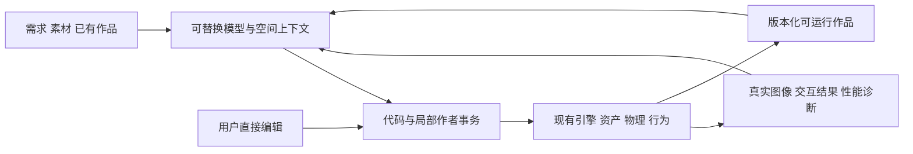

# AI 原生 3D 升级方案

给 Deep Monkey Studio、独立引擎 SDK 与外部 AI 客户端使用：把需求、素材和已有场景变成可编辑、可编程、可持续修改的三维体验。

日期：2026-10-01。状态：用户已批准并入后续任务，尚未实施。采用通用 3D 创作与交互世界方向；工业格式继续按已支持范围有界验收。当前优先 C/J/I、C8、I23、F6、原生作者 API、Three 高频迁移和 T22，61 项口径保持不变。

## 后续任务归属

2026-10-01 用户将“AI 原生的可编程三维世界”并入后续任务。沿用[剩余任务表](remaining-tasks-estimates-20260930.md)的 H-C7-P1–P4：P1 提供客户端真实观察与操作，P2 提供可运行作品模板，P3 提供同源作者与事务，P4 提供 Three 迁移和连续编辑基准。持续空间上下文、人工编辑冲突处理与世界模型资产桥接按依赖追加在该链后；具体支持域和投入在开工核查时锁定，不重复计入 61 项。

当前先交付上述优先任务。已通过且源未变的证据直接复用；仅对实际改动跑相关回归和原验收门，不扩大样本、重复验证或继续扩写研究。

## 方向选择

推荐做**AI 能持续参与创作的可编程三维世界**。用户描述一个世界，AI 创建场景和交互；用户拖动物体、修改结构或插入素材后，AI 仍理解对象身份、空间关系和行为依赖，完成局部修正。代码、编辑器操作和对话应能共同维护同一个作品。

第一版作品是小型可交互世界、展厅或产品体验；它必须能继续编辑、保存重开、播放行为，并以实际支持范围运行于 Web/Native。先把“生成后继续做作品”做好，再逐步吸收世界模型的重建与生成能力。

值得投入的长期跃迁是：从一次性生成的 3D 内容，走向人和 AI 长期共同维护、会响应动作的空间软件。是否有跨时代意义，要由跨场景成功率、修改成本和创作者使用验证；目前是一项路线假设。

## 最新竞争事实

截至 2026-10-01；版本与访问范围按官方资料，演示不作为本仓能力证明。

| 对象 | 已披露方向 | 我们应吸收与实测的点 |
|---|---|---|
| GPT/Codex | GPT-6.1 Sol 09-29 发布，Astra 09-03 发布；Astra 官方案例使用 Blender API 创建可编辑房屋、检查图像并修改，探索 UE5 漫游 | 模型可以作为真正的 3D 作者。提供好用 API、真实反馈和短修改路径；不能只依靠“能写 3D 代码”区分。[变更记录](https://developers.openai.com/api/docs/changelog)、[建筑案例](https://developers.openai.com/blog/architectural-visualization-with-astra) |
| Claude | Opus 5.5 09-22、Sonnet 5.5 09-28 发布，继续增强编程、视觉和长任务；07-09 机器人研究显示接口/空间工具影响表现，该研究不代表 5.5 的测试结果 | 实测结构化空间上下文与图像的组合；不根据模型名保证空间能力。[Opus](https://www.anthropic.com/claude-opus-5-5)、[Sonnet](https://www.anthropic.com/claude-sonnet-5-5)、[研究](https://www.anthropic.com/research/claude-plays-robotics) |
| World Labs / AMD | Atlas 09-01 披露原生多模态空间上下文、重建、相机控制与时空模拟，目前 select-partner early access；AMD 09-28 签约收购 World Labs，预计年底交割，尚未完成 | 将显式空间输出和生成结果作为资产来源；逐项核导出、身份、尺度、编辑与行为能力，不能直接视为完整场景程序。[Atlas](https://www.worldlabs.ai/blog/atlas)、[AMD](https://ir.amd.com/news-events/press-releases/detail/1299/amd-to-acquire-world-labs-to-advance-the-future-of-ai-compute) |
| Unity AI | 官方当前页仍为 beta；09-09 Claude Code 插件提供 29 个 skills、CLI 与编辑器控制，09-16 Codex 插件提供 31 个 skills 和 CLI，官方说明 Codex skills 包不是 MCP；Inference 2.6.1 对应 Editor 6000.7 Beta 文档 | 学习项目上下文、真实工具操作与运行时推理。按插件实际连接能力比较完整创作流程。[AI](https://unity.com/features/ai)、[Claude 插件](https://discussions.unity.com/t/unity-s-plugin-is-now-available-in-claude-code/1736143)、[Codex 插件](https://discussions.unity.com/t/the-official-unity-plugin-for-codex/1736730)、[Inference](https://docs.unity.com/en-us/engine/6000.7/manual/packages-list/packages-all/pack-safe/com-unity-ai-inference) |
| Cocos | 官方 10-01 更新包括 OpenPaaS/跨平台发布，AI Native 发布入口拟 11 月陆续开放；商店第三方 AI 助手与第一方发布状态分开 | 学习轻量创作与快速运行，后续跟进真实可用版本。[官方更新](https://www.cocos.com/post/FyUT7cIaBQNFfu6DPFOsNsjWMoeHtwgt) |
| Genie / Cosmos | Genie/Project Genie 展示可交互生成方向，原型有时长、物理及控制边界；Cosmos 3 有空间理解/生成/动作相关模型，运行条件按变体区分 | 作为世界生成/理解适配研究。先查权重、导出和机器预算，不承诺普通终端运行所有模型。[Project Genie](https://blog.google/innovation-and-ai/models-and-research/google-deepmind/project-genie/)、[Cosmos 模型](https://docs.nvidia.com/cosmos/latest/cosmos3/model_reference.html) |

这些产品已覆盖生成、代理、空间理解或仿真。我们的可竞争假设是**持续可编辑、可运行、跨模型和轻量分发的完整创作链**；并非宣称这些竞品没有相应研究或功能。

## 现状核查

1. 搜索 packages/apps 的作者、场景事务、agent/MCP、physics、ONNX、viewport、资产、时间线与未跟踪叶；现有渲染和 AI 基础继续使用，C8/J3/I23 在途修改独立。
2. 阅读 scene-sdk/protocol、SceneMutationGateway、contracts 的 scene/application、能力 manifest 和 Study 契约。作者状态、稳定 ID、revision 和事务已有；完整创建/删除等入口归 H-C7-P3，不再新增第二套场景树。
3. 核查 package/Cargo 依赖。已有 React、Three 桥接、wgpu/Rapier、API ONNX 与 MCP 适配；模型可替换。模型权重与 EP 仍需逐模型验证，不把 ONNX 存在等同于通用世界模型已接入。
4. 定位真实消费：SceneViewportPreview、viewerEngine、compileSceneRuntimePackage、IndustrialAgentToolGateway、MCP bridge、SceneBehaviorHost、Plant Lite 端口。通用创作接入沿 H-C7/H-C6；固定工业工具目录不能当作完整自由作者能力。
5. 核查事务/MCP/脚本生命周期/实际 SDK 消费门与本日 C8/J5 等证据。已有测试只证明原范围；没有执行本文的 AI 创作基准或模型训练。
6. 对照 09-27 核心能力计划、09-30 AI 框架、61 项剩余表、Drei 全目录报告与本日官方调研；工业任务优先草案已撤回。本文是上述作者链的升级方向，不重复建设 Harness、缓存、物理、时间系统。

**已有（不重建）**：引擎、材质与后处理、资产/实例/空间查询、时间线/脚本、稳定对象、事务/恢复、能力注册、MCP/Harness、ONNX、产品视口和按需渲染。

**真实缺口**：完整原生作者 API 与客户端消费、长期空间上下文的选择与失效、生成代码和人工编辑的冲突处理、交互后真实验证、可移植作品的支持声明、世界模型资产的语义适配。

## 三个突破点，一套底座

### 1. 场景生成升级为可执行作品

一次请求生成对象、材质、灯光、动画、交互和行为，而非只有画面或 mesh。对象可被选中和修改，行为有明确触发与目标，运行数据与作者状态分离，保存后可复现。

实现复用原生作者 API、SceneCommandTransaction、脚本/时间线、RuntimePackage 和能力 manifest。AI 可以写普通 JS/TS；模板与声明配置只是便利入口，不限制专业创作自由度。

首个样例：生成一个可探索小世界，有门、可拾取物、移动平台、相机和光照；修改一面墙后，只修正受影响的路线和交互，保留用户摆放的物品和风格。首期不承诺 MMO、任意复杂游戏或完整物理世界模型。

### 2. 持续空间理解与局部共同编辑

给模型对象身份、层级、单位/坐标、空间关系、可见性、作者锁定与 revision；按任务查询附近对象和相关行为，不把整个世界或所有历史每轮塞进上下文。需要视觉时按需抓图、多视角查询或深度/拾取反馈。

研究重点是“当前任务需要哪些空间证据”。模型可以请求下一个有用视角/查询；缓存必须随对象、相机和场景 revision 失效。空间记忆由现有持久化状态投影，不另立 AI 真值数据库。

AI 输出局部 changeset；用户已编辑对象、其他代理变化或旧上下文导致冲突时，重新读当前状态、保留意图再修正。视觉一致、行为正确与作者意图保持分别验收，不能用好看的截图替代后两者。

### 3. 世界模型与引擎之间的可编辑桥

输入可以逐步扩展为照片、视频、草图、生成资产和现有 Three 场景；输出统一进入已支持的资产/作者合同。来源、模型版本、尺度、推定部分、支持的几何和动作保留可追溯信息。

第一步做真实可得的显式输出适配及 Three 高频子集迁移。Splat/mesh 是资产，不自动等于对象分离、拓扑、碰撞、骨骼或脚本；逐项补充交互化所需数据。模型未开放、许可不符或输出不兼容时不成为基础运行依赖。

长期研究可选择一个问题：把生成空间分解成可编辑对象，并将用户局部修改保持到后续生成；或者从少量视角恢复可定位的对象与关系。先与原始模型和经典几何方法比较，再决定是否训练专用组件。

## 共用架构

模型层只提案与编写；执行层复用原生作者、CLI/MCP、事务和宿主。每个作品声明依赖、版本和真实支持域；Web/Native 未支持的行为明确降级或拒绝，不把成功解析当作成功运行。

Drei 对齐服务作者便利、所有权、有限更新和多视口；[正式方案](drei-alignment-plan-20261001.md) 已完成目录核查。保留独立引擎方向，当前不引入 Drei/Fiber 运行依赖。

## 升级顺序

| 阶段 | 最小交付 | 归属与准入 |
|---|---|---|
| 当前优先 | C8/J3/I23 严格数值与真实管线；F6 碰撞/顶点流实际消费 | 按原任务完成，不放宽画质与物理门 |
| 作者底座 | 创建/删除/层级/材质/相机/批量事务；客户端看图、修改、保存重开；8 个真模板 | H-C7-P1–P3/H-C6 原范围，复用合同，不重复计工时 |
| 生态迁移 | Three 高频几何/对象/材质/灯光/GLTF 子集映射，运行样例与未映射诊断 | H-C7-P4；不承诺任意 addon、GLSL 或 onBeforeCompile 自动兼容 |
| 创作实验 | 20 题真实生成基准增加连续修改、人工编辑保持和交互验证；两个模型同预算对照 | 先做基准后设计空间上下文优化；结果决定是否扩成产品 |
| 世界模型桥 | 选一个可取得且许可适用的显式输出，资产适配、对象化与编辑保持实验 | 新研究范围独立估时，不自动加入 61 项 |
| 专用学习 | 只针对已定位失败的数据选择修复排序/空间检索/对象分离组件 | 提示/工具/经典方法基线不足才训练，不先训练通用大基模 |

原生作者 API 与 Three 高频迁移已有分别 24–48 净工时的历史估计；实际按新优先级核查缺口后再校准，不能相加当墙钟承诺。研究阶段采用独立预算，逐阶段决定继续。

## 90 天可证伪研究窗口

从作者基础实际可用、实验资源安排后起算；不改变当前工程完成时间。

- **1–15 天**：固定 20 个作品任务与资产/模型/预算，跑现有普通工具代理和 Three 基线。生成、运行、修改、重开都录入结果。
- **16–35 天**：完成局部修改/空间上下文实验；每个作品至少 5 次连续修改，包含人工拖动、重命名、层级变化、素材替换和过期 revision。
- **36–60 天**：留出新作品类型、测试模型替换和 Web/Native 支持子集；比较截图上下文、结构化空间查询、二者结合，以及无学习的现有方法。
- **61–90 天**：只保留实测有收益的路线；若模型资产接口可用，跑一项对象化/编辑保持实验，否则先完善可运行作品与迁移链。

预登记继续目标（尚未达到）：最强同预算基线之上完整任务成功率提高至少 15 个百分点，或人工有效修正时间减少至少 30%；同时保存重开、已编辑对象保持与交互正确率不退化。报告样本量、置信区间、拒绝/失败和 P95 成本，不只展示成功作品。

连续编辑的关键门：AI 只改本次允许对象；不破坏用户保留内容；取消后保留最后有效作品；重开后目标对象/行为仍一致。发生冲突不能偷偷覆盖旧值。独立复核交互结果，避免生成器和评测器使用同一个错误假设。

性能门按已锁定设备/场景声明：正常帧不额外强制 readback；静止场景遵守 demand；查询与推理有显式预算。生命周期测试至少 20 次同宿主循环，记录自有资源与观察不到的驱动指标，不能用估算内存冒充实测。

UI 实施后按 design-taste-digitaltwin 的深色 1920×1080、至少两轮真实截图、同族排查验收；目前方案不声称视觉达标。

## 数据、模型与长期资产

先积累合法的真实创作/修改轨迹、错误定位和人工修正；按作品族拆训练与留出，不仅随机拆同一模板变体。版本化对象、动作、输入、结果与模型成本均可复现。

模型调用不绑定单一厂商。云模型是可选创作客户端；离线基础编辑、渲染与作品运行保持本地。本地生成/理解模型按权重许可证、算子、实际显存/主存与延迟逐项验证，不能承诺最新闭源模型离线部署。

长期资产优先为：优秀的原生作者 API、真实连续编辑基准、空间/行为上下文选择、跨引擎迁移映射、可运行作品与可复用组件。只有这些比同一模型加普通工具明显更有效，差异化才成立。

当前具体动作：先完成用户优先的引擎与作者基础，再在原 20 题基准上验证“一次生成之后，连续五次真实修改还能保持可用”。
