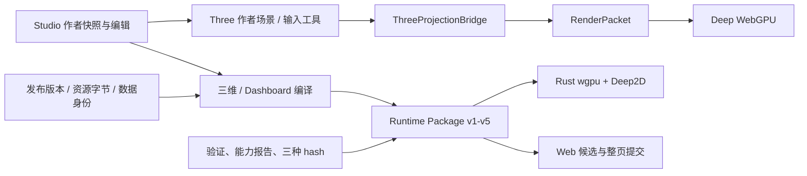

# Deep Engine 全面复核与五平台超越执行方案

日期：2026-09-16，第二次全面分析。面向 Deep Monkey Studio 的引擎、产品与质量团队。

**目标：在渲染效率、画质、资产处理、复杂场景、动画仿真、二维三维交互、开发工具和交付可靠性上，分别超过 Three.js、Babylon.js、Unity、Unreal Engine、Godot，并最终形成综合平台优势。**

这份方案按当前源码重新核对，替代[上一份策略](deep-engine-surpass-strategy-2026-09-16.md)作为本任务的分析入口。它不覆盖现有开发总账，不重复新建已完成模块；具体状态以执行时源码和证据为准。

## 交付导航

| 文件 | 内容 |
| --- | --- |
| 本文 | 当前架构、能力差距、竞争路线、优先级、资源与关键路径 |
| [基础与核心任务](deep-engine-tasks-foundation-2026-09-16.md) | A–D，32卡：基准、运行内核、资产材质、空间交互 |
| [产品与能力任务](deep-engine-tasks-product-2026-09-16.md) | E–I，40卡：画质、动画物理、二维数据、工具交付、通用创作 |
| [验证与范围差距](deep-engine-tasks-validation-2026-09-16.md) | V/X，10卡：5项项目验收、5项现交付线排除领域的专项研究 |
| [机器可读清单](deep-engine-execution-tasks-2026-09-16.json) | 82张卡的依赖、角色、估算、代码入口、标准与旧任务映射，可转Issue或看板 |

共 **72张开发/接线/证据建设卡＋5张项目级后验收卡＋5张范围研究卡**。每张有代码入口、实施产物、验收、失败路径、依赖和验证方法。卡片描述后续工作，不代表本轮已经实施。

任务命名空间为 `DE26`：本文A01、D01等均是本计划简称，派工/Issue使用 `DE26/A01`、`DE26/D01`，避免与原三维D01–D28重名。JSON提供qualifiedId与qualifiedDependsOn；legacy字段只用于映射旧任务。

## 1. 结论

### 1.1 目前最强的基础

Deep 已有真实的WebGPU与Rust wgpu渲染路径，支持版本化RenderPacket/Runtime Package、材质与Shader ABI、GPU变形/剔除/LOD、资源驻留、候选验证/回退、原生二维与多图表运行。

最近新增的Dashboard组合、冻结字体/数据、整页原子提交、权威发布身份和三hash证据，比上一份分析时更完整。文本编辑/IME事务已修过实际反例，不能继续把这些工作写成从零待建。

这些基础支持继续做独立引擎。**尚无可信证据证明当前已经超过任一对手的综合平台能力。**

### 1.2 最大问题

1. **能力交付深度不一致**：有些功能完成模块/GPU探针，却还未从作者配置走到正式发布和离线运行。
2. **高频兼容仍会阻断普通项目**：材质桥明确拒绝顶点色、flat shading和非中性Physical扩展等输入；三维正式编译仍是静态子集。
3. **作者状态、GPU调度与跨端运行未完全统一**：Studio以Three作者对象为中心，RenderGraph规划未直接驱动所有实际资源分配，两端特性覆盖不同。
4. **大型场景正确性与尾延迟缺全面证据**：算法已存在，但Native线性三角拾取、动态更新、连续原点转换、混合透明/剖切/变形仍需做深。
5. **工具与生态不足**：独立SDK、完整Inspector/Profiler、外部开发者任务、平台导出与扩展兼容需要实际可用证据。

### 1.3 超越路线

- 第一阶段赢高频工业任务：真实模型、工程精度、大场景交互、持续数据变化和可靠离线交付。
- 第二阶段扩大到引擎性能和画质：资源复用、增量调度、GI/反射/软阴影、时序稳定与高级动画。
- 第三阶段赢开发者生产力与综合覆盖：Prefab、插件、创作工具、媒体、平台、复杂场景和外部生态。

每阶段公开领先/持平/落后/未验证项。工业任务先行是研发顺序，不把综合超越缩减成“只要某个BIM场景快一点”。

## 2. 本次复核基线与证据

### 2.1 源码时间边界

开始HEAD：`f677b78ea9a86d2f92656ddb7ae660e6824f0f0c`；持续复核到 `678d2715fab6df21087ac112441a0ffb73ba847b`（19:09）。工作树仍有大量并行修改。

检查期间新增了真实artifact合同、Dashboard候选服务和离线归档合同，已纳入G03–G05的复用基础。归档字节模块还在并行施工，执行前必须再查；不要依据本文件重复建service/serializer。

本报告是该时间窗口的源码与证据分析，不是冻结发布版的全量认证。未逐行审计全仓，没有新跑五平台真机比赛。

### 2.2 本轮实际运行

| 检查 | 结果 |
| --- | --- |
| Deep Engine类型检查 | src与Lab均通过 |
| 引擎专项 | 5文件37项：Dashboard/Chart包、Three投影、RenderGraph、基准合同 |
| Web专项 | 5文件85项：内容/栅格/图表编译、三维运行包、Studio Deep桥 |
| API权威发布专项 | 3文件38项：authority adapter、freeze、capability |
| API候选/归档专项 | 3文件10项：candidate service、artifact compiler、offline archive |
| 合计 | **16文件170项通过**；非全量产品测试 |
| 计划结构校验 | 82个唯一ID、代码入口、543个本地链接与任务锚点、状态/工量/依赖无环检查通过 |
| 仓库治理 | `pnpm gate:repository`通过 |

具体命令见[验证手册](deep-engine-tasks-validation-2026-09-16.md#commands)。本轮不把历史GPU/Native全量数字记作新跑结果，不给未实测画面评分。

继续应用工作区的design-taste-digitaltwin标准。此轮产出是分析与任务文档，未修改UI；两轮截图与十维≥9作为实施卡的交付门禁，不能用本文代替。

## 3. 架构复核：要在已有基础上改什么

这是当前路径示意，不表示所有作者语义都已贯通。

### 3.1 权威语义与作者场景

[SceneTransformGraph](../../packages/deep-engine/src/scene/SceneTransformGraph.ts)已有层级、变换、dirty flush；contracts/studio-core也已有场景/发布基础。建议扩展现有结构，统一ID、revision、单位、坐标、对象状态和命令。

[StudioDeepWebGpuBridge](../../apps/web/src/viewer/StudioDeepWebGpuBridge.ts)保留Three作者Viewer，Deep接投影与单独画布。短期保留兼容入口；中期将选择、测量、动画、物理和数据命令从Three实例依赖中迁出。仅当实测证明桥接成本时优化，不能把移除Three本身当性能收益。

**对应**：B01/B02、D07、F01/F04、H05。

### 3.2 真实GPU执行与资源管理

[RenderGraph](../../packages/deep-engine/src/renderGraph.ts)已有资源寿命与transientSlot；[PbrFrameGraph](../../packages/deep-engine/src/webgpu/pbrFrameGraph.ts)已有逻辑pass图。当前检索未发现生产分配器消费这些slot；[PbrRenderer](../../packages/deep-engine/src/webgpu/pbrRenderer.ts)与[renderTargets](../../packages/deep-engine/src/webgpu/renderTargets.ts)仍显式组织实际工作。

因此先把一段后处理链接图执行和纹理池，再扩大范围。WebGPU可做受约束GPUTexture复用，不能把它夸大成任意驱动级内存别名。

资源预算需要覆盖geometry/texture之外的history、shadow、staging与候选峰值；已有latest-wins/驻留取消规则应复用。

**对应**：B03–B08、H03。

### 3.3 资产语义链

[Three材质桥](../../packages/deep-engine/src/threeBridge/materials.ts)明确拒绝多种普通材质输入；[glTF材质扩展](../../packages/deep-engine/src/gltf/materialExtensions.ts)支持面也窄于成熟loader。纹理扩展在其他模块，不把材质扩展子表当作整个glTF支持表。

应逐项贯通“导入→IR/ABI→shader→交互→编辑→发布”，不只把校验器的unsupported删掉。压缩解码、字体、物理优先复用已有可靠实现，自研投入放在统一合同、调度、增量和工具。

**对应**：C01–C08、E01。

### 3.4 正式三维与Dashboard交付

[三维编译器](../../apps/web/src/delivery/compileSceneRuntimePackage.ts)仍声明static-render-packet，未消费字段经[sceneInactiveFields](../../apps/web/src/delivery/sceneInactiveFields.ts)继续阻断。这保护正确性，也暴露普通场景支持面不足。

Dashboard已有v5多页组合、Native/Web原子候选、冻结字体/图片/KPI/表格/图表。C3/C4/C5新增服务基础已可复用，剩余重点是正式HTTP依赖注入、持久候选、下载字节、launcher和完整用户链。已存在动态Chart包，不能再写“from_package的chart仍为空”。

**对应**：E02、G01–G07、H06/H07。

## 4. 当前能力与差距矩阵

“已有”只说明列出的证据层级；表中没有用文件数或测试数换算完成百分比。

| 领域 | 已核实基础 | 主要不足与风险 | 任务 |
| --- | --- | --- | --- |
| GPU渲染 | PBR/IBL/CSM、集群灯光、GTAO/TAA/OIT、GPU变形等Web路径 | 双端特性不一致；时序/多设备画质证据不足 | E01–E08 |
| GPU资源 | 驻留、LOD、meshlet、Hi-Z、缓存与取消基础 | 图规划未等于实际复用；混合负载峰值预算与P99 | B03–B08/D06 |
| 场景状态 | SceneTransformGraph、stable ID、snapshot | 作者工具依赖Three；统一changeset与运行命令未完整 | B01/B02/D07 |
| 材质资产 | glTF核心、纹理、动画解码及Three桥 | 顶点色/flat/Physical/透明状态等兼容阻断 | C01–C07 |
| 工业格式 | JT等已有子集，七方向计划与语料另在推进 | 各格式几何/语义/版本profile分别验证，不能通用承诺 | C08/I03/I04 |
| 世界与精度 | 局部原点、f64世界拾取/测量、固定GPU验证 | 连续重基点、内部顶点精度、标注/物理/阴影统一 | D04/D08 |
| 拾取编辑 | Web成熟工具复用，Native基础拾取测量 | Native逐三角遍历；剖切/多选/撤销/跨端保真 | D01–D03/D07 |
| 大场景管理 | chunk、octree、GPU LOD/剔除已有调用 | 语义预取、加载尾延迟、复杂几何层级与真实项目收益 | D05/D06/I08 |
| 动画 | host-neutral mixer、layer/blend、GPU skin/morph | Native正式包消费、状态机、事件、IK/重定向与工具深度 | F01–F03/I05/I06 |
| 物理/仿真 | Web Rapier固定步进；工业仿真插件存在 | 跨端服务、约束/碰撞体、导航、可回放与工程校准 | F04–F06 |
| 二维与文字 | 动态Chart、组合页、真实字体、Unicode事务修复 | 完整作者组件/筛选/页面外观、产品IME与字体交付矩阵 | G01/G02/G07 |
| 数据与行为 | 数据消息、sim、epoch、原生行为总线 | 实际HTTP/订阅、二维三维同revision、插件生命周期 | G06/G08/H05 |
| 媒体/XR | Web音频/XR模块存在 | Deep/Native设备、编解码与session完整覆盖未验证 | F08/I06 |
| SDK与工具 | scene-sdk、DeepSL、Lab、诊断已有 | 外部消费体验、Inspector/Profiler、Prefab/协作的完整链 | H01–H05/I01/I02 |
| 发布可靠性 | 内容冻结、hash、窗口验证、ZIP/LKG | 普通项目和动态Dashboard完整用户链、安装更新、故障恢复 | G03–G05/H06/H07/V03 |
| 生态与平台 | 已有Windows主线和多后端crate/CI配置 | 配置不是平台产品；第三方生态、通用域差距不能隐藏 | X01–X05/V05 |

### 4.1 必须更新的旧结论

- 动态Chart入包、Dashboard组合宿主已经实现；剩余是正式完整交付与支持矩阵。
- 文本字素/undo/redo缺陷已经有修复与反例，不重复安排旧bug修复；真实IME宿主仍需验证。
- 行统计缓存、系列共享、失效记账已有；部分arena/ring/atlas细粒度改造被实测收益否决，不强行重新做。
- 工业七格式已有独立计划；本方案仅消费其规范化产物并补Deep接线。
- 有GPU/窗口回归，不等于有五平台公平性能结果。
- 有Unity benchmark脚本，但其计时字段是cpu-frame-interval、夹具是synthetic-cubes-v1，不是GPU计时或真实BIM胜出证据。

## 5. 五个平台分别如何超过

### Three.js

官方WebGPURenderer已支持WebGPU与WebGL2回退；glTF loader覆盖压缩、材质和纹理扩展。[WebGPURenderer](https://threejs.org/docs/pages/WebGPURenderer.html)、[GLTFLoader](https://threejs.org/docs/pages/GLTFLoader.html)

**必须补齐**：高频资产保真、可靠API/资源释放、场景工具。**胜出点**：同质量真实模型的加载、内存、变化处理与交互尾延迟，以及独立SDK更少的集成工作。基准包含bridge真实成本，不只量shader时间。

### Babylon.js

官方列有集群光照、体积光、Frame Graph、Inspector、材质/粒子/渲染图工具；物理可通过Havok插件接入。[能力与工具](https://www.babylonjs.com/featureDemos/)、[物理接入](https://github.com/BabylonJS/Documentation/blob/master/content/features/featuresDeepDive/physics/v2/usingPhysicsEngine.md)

**必须补齐**：资产、动画、物理、诊断、交互的产品深度。**胜出点**：高异构BIM、持续遥测和选择/剖切并发时，仍有更好的预算控制与任务体验。完整创作工具差距进入H/I/X卡，不从比较表删掉。

### Unity

GPU Resident Drawer利用GPU实例化处理兼容对象，效果取决于场景；GPU occlusion与工具配置也有要求。必须用合理配置的发布版比较。[GPU Resident Drawer](https://docs.unity3d.com/6000.0/Documentation/Manual/urp/gpu-resident-drawer.html)、[GPU剔除](https://docs.unity3d.com/cn/6000.0/Manual/urp/gpu-culling.html)

**必须补齐**：动画物理、Prefab、资源构建、Profiler和导出更新。**胜出点**：同质量原生帧时/资源，以及工业项目创建、修改发布和现场恢复的总成本。URP公共子集与高质量管线分开锁定，不能混算。

### Unreal Engine

Nanite是层级几何、压缩和细粒度流式体系；Lumen与世界管理是另一组完整能力。其不同几何、透明和平台路径也有适用限制，实测时应使用相应标准路径。[Nanite](https://dev.epicgames.com/documentation/en-us/unreal-engine/nanite-virtualized-geometry-in-unreal-engine)、[Lumen](https://dev.epicgames.com/documentation/unreal-engine/lumen-global-illumination-and-reflections-in-unreal-engine)、[World Partition](https://dev.epicgames.com/documentation/en-us/unreal-engine/world-partition-in-unreal-engine)

**必须补齐**：几何层级、光照/反射、复杂场景工具与内容生产深度。**首批胜出点**：大BIM可编辑性、构件精度、交互、数据联动与轻量交付。**高端图形目标保留**：I08和X01/X02单列差距；任何Lite组件都不能直接认定对等或领先。

### Godot

Godot提供不同渲染器、二维三维、文字、物理、脚本和导出体系；AnimationTree有状态机/混合树能力。[功能列表](https://docs.godotengine.org/en/stable/about/list_of_features.html)、[渲染器](https://docs.godotengine.org/en/stable/tutorials/rendering/renderers.html)、[动画树](https://docs.godotengine.org/en/stable/tutorials/animation/animation_tree.html)

**必须补齐**：完整SDK、文字/GUI/输入、插件、动画、跨端运行和可分发产物。**胜出点**：工业对象语义、数据联动、一致发布和真实复杂场景效率。开源生态规模与平台广度单列；项目继续使用source-available称谓，不因竞争目标修改许可证。

官方页面用于核实能力，不作为FPS或画质胜负证据。页面与当前稳定发行版可能不同，A01要锁准确版本与文档快照；UE页面显示的版本不能直接当成本机安装版本。

## 6. 什么才算“超过”

### 6.1 三层结论分别验收

| 层级 | 必须满足 |
| --- | --- |
| 单项领先 | 一个冻结任务/质量/设备条件下有成对数据、置信区间和正确性证据 |
| 领域领先 | 全部关键case通过；主要case有稳定优势，其他关键项不明显回退 |
| 综合领先 | 五个对手分别验收，所有关键域通过；性能、质量、工具、交付与目标平台无被隐藏的硬缺口 |

旧合同“90%覆盖”不能升级命名为“全面超过”。总体均分不能抵消资产不能导入、数据错版本、无法离线或关键平台不支持。

### 6.2 建议目标（均未证明达成）

- 同画质主要负载P95帧时间比对手降低 **至少20%**；全部关键case回退不超过 **5%**。
- 大场景峰值GPU资源同口径降低 **至少25%**；不能拿逻辑payload估算与对手驱动用量比较。
- 同资产/缓存/存储条件，可交互加载时间降低 **至少30%**。
- 同功能工业任务的搭建→修改→发布→离线运行耗时降低 **至少30%**。
- 1%对象变化应只传播到依赖子图；相对自身全量路径的收益与相对竞品优势分别报告。
- 工程误差、输入延迟、可靠性设硬门；坐标/测量沿用现有预冻结预算后扩展真实样本，不在失败后放宽。

这些是初始研发门槛。A01/A02冻结具体硬件/质量/样本规模和可测性；若目标不适合某域，应在测试前修订协议并保留历史，不能看结果挑有利阈值。

### 6.3 三条预算线

1. **低配可用线**：集显/低显存下保留输入、选择、最粗几何和读图信息；效果按能力降级。
2. **主流交付线**：Windows独显、1080p固定DPR；真实BIM与动态图表一起运行，关注P95/P99。
3. **高质量挑战线**：高端效果全开，与竞品等质量比较；不能借低配线关效果赢此线。

初次矩阵至少包含集显、主流独显、高端独显三个设备档。尚未获得的设备保持未验证，不承诺全设备FPS。

## 7. 可执行路线与第一批任务

### 第一批：能立即领取的顺序

| 顺序 | 任务 | 交付物 |
| --- | --- | --- |
| 1 | A01 | 五对手矩阵、必选域与版本规则 |
| 2 | A02/A03/B01 | 真实项目manifest、统一采样、变化集合同 |
| 3 | C01/B03 | 真实资产失败频次；后处理图实际执行首片 |
| 4 | D01/D02/B02 | Native空间/BVH查询；投影增量证据 |
| 5 | C02/C03/E01 | 顶点色/flat/透明和双端色彩基础 |
| 6 | G01/G03 | 补多图表完整宿主矩阵；复用发布权威适配 |
| 7 | E02/G02/G04 | 普通三维环境灯光；筛选内容；正式候选接线 |
| 8 | B04/B05/A04 | 实际资源复用、上传预算、Web公平对比 |
| 9 | H06/G05 | 分发运行包与真实Dashboard下载离线链 |
| 10 | V01初次评估 | 发布第一份有失败项的Web对标报告，未完成依赖不关闭V01 |

这是依赖顺序，不是要求串行做完一行才能阅读下一行。独立角色可以并行准备；共享ABI、发布存储和GPU测试需要串行协调。当前其他任务正在实现G03–G05部分内容，领取前只认最新剩余量。

### 路线检查点

| 检查点 | 内容 | 退出条件 |
| --- | --- | --- |
| M0 可信基线 | A01–A03/C01；核对最新发布切片 | 三个真实项目、五对手能力分母、失败频次和测量口径冻结 |
| M1 普通项目可用 | C02/C03/E02/G01–G05/H06，结合D11/D12既有工作 | 带真实材质/光照/数据的项目可编辑、发布、下载并离线运行 |
| M2 核心效率领先 | B/D、A04–A07、V01首轮 | 同质量指定case领先；所有关键负载的失败与退化均可见 |
| M3 功能与画质深度 | E/F/G剩余/H/I | 动画、物理、文本、工具和复杂创作任务均有正式路径 |
| M4 综合验收 | V01–V05；X范围决策独立登记 | 五份结果、用户任务、故障恢复、视觉和设备矩阵完整 |

主线关键路径之一：A01→A02→G01→G03→G04→G05（另需G02/H06）。
性能关键路径：A01→A03→B03→B04→A04/V01。
空间关键路径：A01→B01→D01→D02→D03→D04。
动画关键路径：E02→F01→F02→E06/D06/I05。

依赖图只列真实实现前置。现有模块是复用基础，不要求重复执行历史任务。某上游结果已由其他任务通过验收时，可挂接它的证据满足依赖。

## 8. 工期、人员与工作分界

72张建设卡加5张验收卡的初估合计 **346–574工程人日**；5张X研究卡另计15–25人日。估算为任务包级粗估，包含实现/专项验证，不包含等待资产、设备、签名/平台环境，也不包含X研究后可能产生的大型实现工程。

- 由图形/原生、Web产品、资产几何、数据API、工具SDK和独立QA覆盖；同一个人可兼角色，但不能把多人工作量当成单人的日历时间。
- 6–8名有效投入人员，考虑集成、评审、回归和依赖后，可先用约 **4–8个月** 作为首轮资源讨论区间；前两周基线后重新估算。它不是完成综合超越的保证日期。
- 只有1–2人或主要靠Agent时，用前两周实际完成卡片的速度推算；禁止把并发窗口数等同于工程师产能。
- I08等超过5人日或跨公共ABI的卡，执行前分合同/运行/集成子PR。任务估算并不允许单次堆成大文件。
- X域仍未确定实现量，综合引擎全域超过的日期目前无法可靠估计。

### 文件与并发纪律

- RenderPacket/Shader ABI/Runtime Package变化由单一合同责任人合并；双端消费者同卡评审。
- Dashboard C3–C5与场景发布共用存储/验证路径，不能各自新增平行authority或下载协议。
- GPU基准、Native EXE构建、签名/安装测试独占相关环境，记录产物hash。
- 每次只暂存本任务已验证文件，不把混合工作树整批提交。文档只标真实已验证范围。

## 9. 原计划如何合并

| 原计划 | 本次关系 |
| --- | --- |
| D01–D10 | 保留已完模块；E02/D04/G05补剩余普通场景、坐标和真实用户交付证据 |
| D11–D19 | 映射D交互、F动画物理、G数据；不把原生探针重建为新功能 |
| D20–D23 | H06/H07复用portable/launcher，补安装更新与干净机器 |
| D24–D28 | A与V明确拆出对手runner、指标、视觉、故障和综合判定 |
| Deep2D P0/C1–C5 | G01–G05；动态Chart/组合/冻结字体等已实现作为输入 |
| Deep2D P1 | G06–G08/H05，已修文本/统计缓存不重做；按剩余宿主接线验收 |
| Deep2D P2/P3 | 原兼容实验、热同步、签名扩展条件继续保留；H05只消费必要合同，不声称覆盖所有旧任务 |
| 七方向格式PLAN | C08/I03/I04消费规范化输出；各格式解码工作留在原计划，不重复计工 |
| 既有明确排除项 | X01–X05保留综合差距与研究入口，实施范围不被这份分析静默改写 |

本次82张卡是“超越路线”执行分解，**不替代已有84个上层编号或Deep2D全部剩余清单**。旧计划里未被本卡明确覆盖的要求仍有效；汇总项目工期时按实际交集去重，不能把两份卡数量相加当完成率。

原计划入口：[三维任务](deep-engine-next-development-tasks-2026-09-15.md)、[Deep2D剩余](deep2d-remaining-tasks-2026-09-16.md)、[接手复核](codex-takeover-audit-and-plan-2026-09-16.md)、[Dashboard切片](codex-dashboard-delivery-slices-2026-09-16.md)、[工业格式计划](industrial-3d-format-work-plan-2026-09-16.md)。

## 10. 风险与必要的设计选择

| 风险 | 处理 |
| --- | --- |
| 有组件却无正式消费 | 每卡要求作者输入→运行→保存/发布或回放，不能仅以export或单元测试关闭 |
| Three迁出变成大重写 | 复用SceneTransformGraph与变化集；按选择/测量/物理逐个迁，保留旧后端回退 |
| 双端重复实现长期漂移 | 版本化ABI、同源golden、帧与状态对照；共享语义优先于强求相同底层代码 |
| 优化收益不可测 | 先A03剖析，小图/全量/冷启动均测；已被数据否决的arena等不重新强推 |
| 精度与高帧率冲突 | 权威几何/世界坐标与显示LOD分离，明确源精度和误差预算 |
| 支持表过度保守或放水 | 对已实现能力补证据接线再放行；未知字段继续明确拒绝，不能静默丢失 |
| 竞品比赛不公平 | 锁质量/版本/硬件/正常优化；等质量与最佳质量分轨，公开未测项 |
| 生态/平台覆盖无限扩张 | 保留综合目标和缺口；明确X研究与阶段交付范围，未完成就限定结论 |
| 文档追不上并行开发 | A08生成证据索引；每卡执行前复核调用链和最新commit，不依据历史“待建”重复开发 |

## 11. 本轮交付的完成条件

本轮完成的是重新分析与可执行计划。文档验证包括：任务ID唯一、依赖存在且无环、现存代码路径有效、跨文档链接有效、优先级/状态/计数一致、旧任务映射、估算与边界明确。任务实施、完整视觉和五引擎胜出仍由后续卡逐项验证。

**建议从A01/A02/A03固定事实和目标，同时继续当前Dashboard正式交付；随后优先做材质阻断、Native拾取、图驱动资源复用与增量更新。高端画质和通用工具持续纳入完整路线，最终用五份独立结果证明超过，而不是用模块数量宣称超过。**
