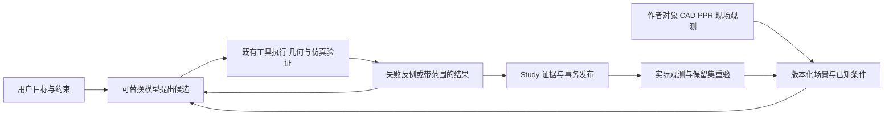

# 工业空间智能研究草案（已撤回优先建议）

2026-10-01 用户明确不赞成工业任务方向。本文保留为研究过程记录，不作为升级方案、优先级或实施依据；正式升级方案转向通用 AI 原生 3D 创作与可编程交互世界，见 [AI 升级方案](ai-native-3d-upgrade-plan-20261001.md)。下文的工业任务与 90 天实验建议均未采纳。

给 Deep Monkey Studio 的产品与引擎团队使用：让 AI 在具体工业场景中提出动作，计算后果，用反例修正，再通过真实数据检验预测。

日期：2026-10-01。状态：调研与实验方案，新增模型、数据集和产品能力尚未实现。J/C/I 继续优先；本文不新增或关闭现有 61 项，不把研究预算混入已授权实现估时。

## 判断

建议长期定位为**工业 AI 的空间执行与验证底座**，首个产品选“设备改造与维修空间可行性”。通用模型负责理解需求和提出候选；我们的工业对象、几何、约束、仿真和证据决定候选在声明范围内是否成立。

跨时代价值的可检验假设是：工程师可以提交目标和约束，系统自动寻找可执行方案、展示失败反例，并在现场变化后重新验证。需要证明它比熟练工程师的现有流程更快、更可靠；“革命性”不能作为验收结论。

自动建模、参数辨识、仿真数据生成、模型调用和带来源的报告都有现成竞品或仓内实现。差异化要落在它们的工业组合、实际误差和使用成本，不能只换名称。

## 现状核查

1. **源码与在途项**：检索 packages/apps 的 world、physics、simulation、agent、ONNX、transaction 和未跟踪文件；当前 C8/J3/I23 的在途叶保持各自所有权。已有物理编译、场景事务、工业代理与仿真，不重建。
2. **契约**：读取 contracts 的 industrialAi、industrialStudy、simulationEngine、workcellValidation，以及 scene-sdk/protocol 和 SceneMutationGateway。Study 已有输入/场景/模型指纹、PPR、谱系和复现；SceneCommand 已有属性修改，完整创建/删除作者链仍归 H-C7-P3。工业语义与作者对象是权威来源，RenderPacket 是投影。
3. **依赖**：API 已使用 onnxruntime-node，Native 已使用 wgpu/Rapier，Web 有现成 Three 桥接与深度引擎；不另建模型网关、物理世界或时钟。ONNX 网关存在不等于某个新世界模型已经能离线运行。
4. **消费方**：industrialAgentRuntime 消费 IndustrialAgentToolGateway；其工具目录已有 simulation.study、hypothesis、golden、workcell.audit、parametric.validate。compileSceneRuntimePackage 消费 compileScenePhysicsRuntime；PlantLiteSimulationEngine 有 validate→prepare→run→trace。新增任务应接入这些通道。
5. **测试与证据**：读取已有 SceneMutationGateway/工业网关/ONNX/物理编译测试入口、Plant Lite 校准 golden、轨迹约束实现，以及 09-25 仿真缺口报告。现有轨迹为 TCP 包围球与扩张 AABB 的保守广相位，不能证明工具、零件、连杆或电缆的网格级扫掠；golden 校准主要证明重复运行一致性，不能代替现场参数识别。本次只核查，不宣称重跑这些测试。
6. **规格**：按工业格式 09-16 权威计划、核心能力 09-27、AI 框架 09-30、剩余任务表及恢复文档去重。已有 H-C7 的 SDK/CLI/MCP/视觉反馈/Skill 与 20 题生成基准继续原范围；本方案在它们之后验证工业决策价值。

**已有（不重建）**：工业对象/PPR/Study、代理执行与账本、局部空间查询/轨迹、DES/What-if、物理运行时、ONNX 生命周期、作者持久化/事务、实际渲染与诊断。

**真实缺口**：完整零件/工具运动与精度预算的窄域验证、反例到候选修正的运行接线、跨场景的保留测试集、现场参数可辨识性/漂移检验、可重复迁移的工业任务包。未知几何、材料和工艺条件必须留为未知，生成的外观不补成工程事实。

## 外部发展与我们的选择

下表是截至本日的官方披露，能力描述限于这些来源；厂商演示和评测不是本仓验收。

| 方向 | 已核实的事实与可用状态 | 对路线的影响 |
|---|---|---|
| GPT/Codex | GPT-6.1 Sol 于 09-29 发布，Astra 于 09-03 发布；09-04 官方案例使用 Blender Python API 建可编辑房屋、看渲染修正，并尝试 UE5 漫游 | 用它们作为可替换的规划/编码客户端；3D 生成便利本身不足以成为壁垒。上述案例未证明毫米级工业验收。[API 变更](https://developers.openai.com/api/docs/changelog)、[建筑案例](https://developers.openai.com/blog/architectural-visualization-with-astra) |
| Claude | Sonnet 5.5 于 09-28、Opus 5.5 于 09-22 发布。07-09 机器人研究发现控制接口与空间工具显著影响表现，长程空间记忆和低层控制仍有不足；该研究测试的模型不能直接当作 5.5 结果 | 提供结构化坐标、对象与动作反馈，实测最新模型组合，不仅给截图或加长推理。[Sonnet](https://www.anthropic.com/claude-sonnet-5-5)、[Opus](https://www.anthropic.com/claude-opus-5-5)、[机器人研究](https://www.anthropic.com/research/claude-plays-robotics) |
| World Labs/AMD | Atlas 于 09-01 披露，原生处理文本、图像、视频与 3D，包含相机控制、重建及时空模拟；当前为指定合作伙伴 early access。AMD 09-28 签署约 82 亿美元收购协议，预计年底交割，截至本日尚未完成 | 跟踪可导出、可编辑空间与 Real-to-Sim；精确尺寸、工业语义和动作可行性要有独立实测。不能用生成画面的连贯性证明力学正确。[Atlas](https://www.worldlabs.ai/blog/atlas)、[AMD](https://ir.amd.com/news-events/press-releases/detail/1299/amd-to-acquire-world-labs-to-advance-the-future-of-ai-compute) |

Unity/Cocos、Genie 与 NVIDIA 的详细版本、可用性和工程限制见本日[同步调研](../handoffs/industrial-ai-innovation-research-20261001.md)。它们包含编辑器代理、生成、推理与仿真方向；最终对照以该报告的官方来源为准，不推断全栈功能都已公开可用。

## 三条递进路线

### A. 带反例的工业动作规划——先做

最小任务：“把这台设备的维修空间增加到声明的阈值，保留固定接口，给出拆卸/移动顺序。”首期只选刚体、静态障碍物、已知连接和确定的动作集合；装配力、柔性线缆、人体工效和真实控制器运动不在该实验范围。

系统读取已支持 profile 的真实 CAD/场景与工艺约束；模型提出候选；几何/规则检查返回阻碍物 ID、失败路径段、最小间距、假设与精度范围；模型根据这些反例修正。有效方案保存为作者事务和 Study，可撤销、重开、换模型复现。

当前 TCP/AABB 检查可先筛选明显无效方案。要宣称零件可拆出，需要补目标零件/工具的连续运动验证或有明确保守上界的碰撞方法；单看关键帧、中心线或低分辨率 SDF 不足。近阈值方案在输入误差覆盖内重新检验。

这是一项产品与算法假设：相比纯自然语言规划及既有检查工具，反例驱动是否显著提高最终可行率、减少人工修改？独立评测通过之前，不称独有技术。

### B. 能用现场数据修正的混合预测——通过 A 后做

选择单个可测子系统，例如搬运动作的耗时/失败概率或工位节拍。确定性几何、逻辑和已有 DES 处理已知部分；小模型仅拟合明确的残差或未知参数。输出适用范围与不确定性，不让模型覆盖硬约束。

先验证参数可辨识性：相同观测能否被多个参数组合解释？不能区分时，设计下一次信息量高的观测/实验，保持参数区间。场景/工艺 revision 变化或数据漂移后，旧结论失效并重验。

已有校准 golden、What-if 和 ONNX 都可复用。新贡献候选是窄域的主动取证、带范围的预测与真实干预后验证；仅在历史数据拟合得好不构成因果证据。现场结果未取得前只报告仿真域有效性。

### C. 可携带的工业任务与验证包——长期复利

把成功与失败轨迹沉淀为包含目标、适用对象/接口、参数范围、动作、观察、反例和独立验证器的版本化任务包。换设备或新场景先检验适用性，再局部重规划；模型升级后跑同一保留测试集。

第一版只做一个设备族，不建设商店或另一套脚本语言。复用 SDK、插件注册表、Study 与数字线程。以后外部模型/代理也能消费该包；模型变强可以提高候选质量，验证底座仍有独立价值。

可竞争资产是合法取得的真实失败数据、跨版本一致的对象/工艺绑定、可复现验证器和迁移成功记录。调用模型、接 MCP 或把 prompt 做成模板容易复制。

## 执行结构

这是现有执行路径的组合方案，不另起世界状态、时间循环、资源缓存或代理账本。精确几何、语义关系、传感器观测、模型推定应有独立来源和置信范围；尚无对应字段时在既有契约做最小增量设计。

工业导入、几何检查和基础运行坚持内置本地离线；外部模型是用户可选的规划客户端，不成为格式解析或验收前提。本地模型权重、许可证、版本、算子与执行提供者要逐模型核验，不能用“支持 ONNX”宣称支持所有大模型。

## 90 天研究实验建议

时间从独立实验小组和依赖实际就绪时起算，不代表现在 90 天内能完成全部 61 项。先跑无训练基线；只有明确误差来源和合法数据足够时才训练。

| 时间 | 最小交付 | 依赖与停止条件 |
|---|---|---|
| 1–15 天 | 固定一个设备族、20 个可复现任务与输入精度；冻结朴素代理/现有工具基线，登记解的独立判定方法 | H-C7 对象查询/真实修改/图像至少支持该切片；缺精确几何时缩范围，不能以外观生成替代 |
| 16–35 天 | 反例反馈、候选修正、撤销与保存重开；扩到 100 个保留任务，含不可行/缺数据/近阈值例 | 检查器与候选规划器不得共享同一错误 oracle；先人工复核边界和独立解析小场景 |
| 36–60 天 | 限定预算双模型对比与消融，完成两个新场景族的留出评估 | 只随机改变训练模板尺寸不算泛化；若核心成功率优势不成立，不扩通用世界模型 |
| 61–90 天 | 有真实观测则试单子系统残差/辨识；无真实数据则完成任务包迁移与离线成本测量 | 没有现场结果不验收“现场闭环”；主动辨识不能只与较弱的固定参数基线比较 |

建议配独立 3 人小组：几何/验证、工业数据/评测、产品/模型接线；算法之外的现场建模和工程复核必须排入工时。此为资源建议，未从 J/C/I 抽调实施人力。

初始数据目标是 20 个手工核验任务，随后 100 个保留任务及约 1,000–10,000 条受控候选/反例轨迹；这些均为计划规模，目前没有该新增数据集。真实客户数据只在授权本地验证，默认不入库、不外发。

本地实验先固定 CPU 检查与实际 GPU 执行预算；单机 16–24GB 显存仅作为候选硬件档位，能否部署由选定模型/精度/上下文实测决定，不保证任意模型可用。规划模型和渲染 GPU 可以分时运行，动作闭环不能依赖模型逐帧调用。

若考虑学习组件，先从小型残差/排序器开始，训练时长和显存先做 pilot 测量。不预订集群，也不把从头训练视频/空间基础模型列入首期。

## 评测门与失败判据

统一输入、资产、模型版本、预算与独立判定，比较：① 同模型普通工具代理；② 结构化工业上下文；③ 结构化上下文加反例反馈；④ 无 LLM 的既有规划/优化方法。新模型更新单独重跑，不横向比较不同预算的展示作品。

预登记研究目标（尚未达成）：保留集最终可行率相对最强基线提高至少 15 个百分点；有解任务中人工修改时间中位数减少至少 50%；完整保存/重开/复现通过率 100%。同时报告成功率置信区间、失败类别、总成本与 P95，不能只挑成功视频。

所有被接受的任务报告覆盖几何类型、运动模型、误差和未知条件；不确定/不可行也计入覆盖率，不能通过全部拒绝获取低错误率。盲审保留集上的严重错误接受必须为零，且报告样本量与剩余统计上界；零观测错误不等于数学证明或现场零风险。

碰撞和精度门依任务声明预先锁定；连续验证适用范围外只输出待核验。细网格、解析反例、输入单位/坐标/对象 revision 扰动用于检查验证器自身。AABB 通过不得变成完整工业可执行认证。

若反例方案只在原模板有效、相对既有规划器无优势、严重错误接受未修复，或者每次运行依赖人工手调，即收缩为明确的辅助检查工具。若现场校准不改善留出预测，则保持确定性模型和误差范围，不继续扩大模型。

## 与当前工程的关系

- **J/C/I** 提供可信材质、图像/诊断、恢复和稳定资源基础。C8/I23 的严格数值门继续原标准，不因 AI 研究降低。
- **H-C7** 提供作者 API、CLI/MCP、真实反馈与客户端接入，按原计划实施；新路线复用，不重复计工时。
- **Drei 对齐**改善作者 API 的组合、所有权、按需与多视口体验；精选能缩短真实工业任务的能力，不追导出数量。[对齐方案](drei-alignment-plan-20261001.md)
- **工业格式/工位/Plant Lite** 提供现实对象和检查能力；未支持 profile 保持 inspect/preview，现有保守近似保持原边界。

下一项具体研究交付是“同一设备的 20 个维修空间任务、独立参考答案与四组基线结果”。它通过后，再决定进入连续几何扩展、混合预测或跨设备任务包。
