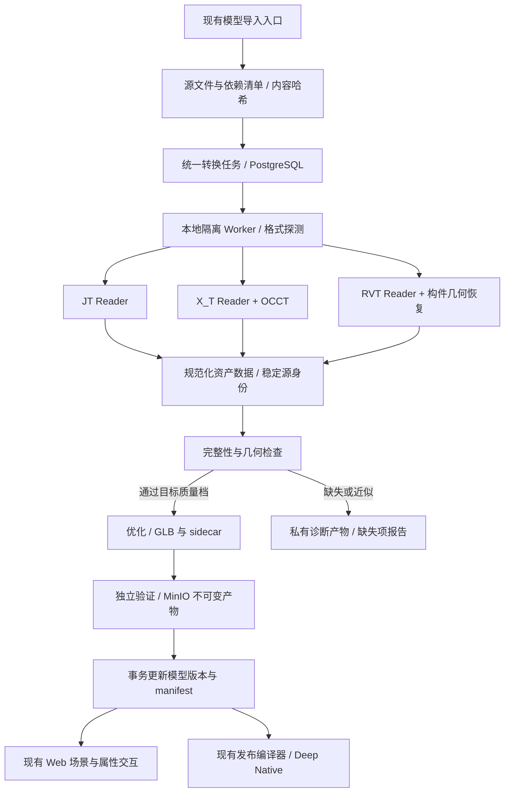

# 工业三维格式内置接入总方案：JT、X_T、RVT 与四类扩展

日期：2026-09-16。状态：**方案已编写，实现与格式验收待执行**。

面向 Deep Monkey Studio 的模型资源库、场景编辑器和离线交付：在不安装源 CAD/BIM 软件、不调用外部服务、不依赖商业 SDK 的条件下，逐步提高 JT、Parasolid `.x_t`、RVT 的几何、结构与属性保真度。

用户追加的四个方向——点云（E57/LAS/LAZ/COPC）、3D Tiles、Rhino 3DM、SolidWorks（SLDPRT/SLDASM）——均已纳入[四类扩展接入方案](./additional-four-formats-integration-plan-2026-09-16.md)。本文件定义共用基础及前三类格式；两份文档共同覆盖七个方向。

## 1. 决策摘要

- **JT**：扩展现有 Reader，优先完整提取源网格、装配、实例、材质与属性，再补精确曲面和 PMI。
- **X_T**：采用“版本化文本解析 → 拓扑与曲面 → 开源 OCCT 离散化”的路线，替换当前仅覆盖特定旋转件的扩展方式。
- **RVT**：以可审计的离线 Reader 为起点，自研补齐构件与几何解码；从单构件走向完整建筑，复杂族和机电系统单独验收。
- **系统**：复用现有转换任务接口和资产合同，统一上传队列、持久化执行、质量检查与发布；解析依赖留在本地 Worker。
- **目标**：支持范围内的文件达到可验证的高保真导入；范围之外明确报告缺失，持续扩大覆盖。“尽可能完美”不以一个未经测量的兼容率代替。

其他高价值格式的投资排序见[三维格式扩展建议](./high-value-3d-formats-2026-09-16.md)。

## 2. 约束与范围

### 2.1 不依赖外部的具体含义

| 项目 | 决策 |
| --- | --- |
| 云转换、遥测、联网授权、在线下载解码器 | 默认运行链禁止；断网安装包包含全部必要运行文件 |
| Revit、NX、SolidWorks、Rhino 等源软件 | 不作为本方案安装或转换前置条件 |
| ODA、HOOPS、Parasolid 商业内核 | 不作为本方案生产依赖或失败后的自动回退 |
| 开源解析器、OCCT、压缩库 | 允许固定版本随产品分发；核查源码、构建和运行时依赖 |
| 开发期参考模型 | 可用用户提供的源文件及配套 STEP/IFC/GLB、参考截图；参考软件不进入产品运行链 |
| 存储与平台 | 保持现有 PostgreSQL + MinIO 权威拓扑，Windows 优先，不引入第二套数据库 |

现有 Revit Worker 和商业适配器保留，避免历史项目退化；它们的结果不得计入“内置离线解析”的验收分数。新策略明确选择 `builtin-only`，不偷偷回退。

本文件的三类解析章节限定 `.jt/.x_t/.rvt`，其余四方向见扩展方案；公开 `.x_b` 入口不因底层库兼容而自动加入交付。源格式写回、参数化编辑、约束求解、完整 Revit 行为重建不属于导入目标。保留它们的已读数据与来源，不宣称能重建源软件工程。

用户本次明确要求重新规划三类格式，覆盖旧计划中该领域“不做新解码器”的排除安排；本轮交付仍是方案，未自动启动工程实现。其他引擎与 Deep2D 任务不因此扩张。

### 2.2 “支持”的五个独立维度

1. 几何：无漏件、错位、孔洞填死、镜像反转，曲面离散误差受控。
2. 结构：装配/楼层/构件、实例、父子关系、外部引用、可见状态正确。
3. 属性：原始 ID、名称、类别、类型、单位、材质和业务属性可追溯。
4. 交互：选择、隐藏、隔离、剖切、测量、定位、业务绑定、刷新恢复正确。
5. 交付：任务取消和恢复、模型复转、发布、离线读取及版本回滚可靠。

图纸、PMI、机电连接、阶段和设计选项按独立能力项报告，不能因为几何通过就标为全部通过。

## 3. 已有能力与实际缺口

本地基线：HEAD `e75d797`，工作树存在其他任务未提交改动；以下依据本轮读取的实际文件，不能只用 HEAD 复现整个工作树。

| 现有位置 | 已有能力 | 本方案补什么 |
| --- | --- | --- |
| [jt-reader](../../packages/jt-reader/src/index.ts) | JT 容器、LSG、网格、实例；9.5/10 小端部分编码 | 版本/编码矩阵、源法线/外观绑定、完整引用和几何覆盖检查 |
| [jtGlbConverter](../../apps/api/src/jtGlbConverter.ts) | LOD0 网格与实例写 GLB | 逐实例材质继承、源法线优先、规范坐标与跨层级身份验证 |
| [xtTextSubsetParser](../../apps/api/src/xtTextSubsetParser.ts) | 固定 V24.1 Schema，特定单体共轴旋转件 | 通用实体记录和拓扑解析，不再按样本形状继续堆正则 |
| [conversion.ts](../../apps/api/src/conversion.ts) | 上传后按格式调用 Provider，生成模型 manifest | 三类格式接入统一任务执行器，保留其他格式行为 |
| [conversionTasks](../../apps/api/src/conversionTasks.ts) | 插件目录、内存任务、取消、状态迁移 | PostgreSQL 持久化、租约、重试、资源执行约束、资产关联 |
| [externalConverterCatalog](../../apps/api/src/externalConverterCatalog.ts) | 当前注册表显式列出 Revit Provider | 新增三个内置 Provider，目录不能仅根据扩展名推导可用性 |
| [converterOutputAudit](../../apps/api/src/converterOutputAudit.ts) | GLB 三角网格与 JSON 对象检查 | 数值、索引、变换、ID/层级/属性关联、完整性和质量档检查 |
| [ModelManifest](../../packages/contracts/src/project.ts) | geometry/hierarchy/properties/inspection/PMI/LOD URL | 版本化质量证据、依赖闭包、坐标与稳定身份映射 |
| [格式能力目录](../../packages/contracts/src/modelFormatCatalog.ts) | 目标格式、保真维度及 planned/excluded 状态 | 复用目录和 production-ready 判定；profile/quality 不另造重复支持表 |
| [ModelImportInput](../../apps/web/src/components/ModelImportInput.tsx) | 原入口、批量选择、RVT 条件设置 | 内置策略、进度、缺失引用补齐、诊断详情，保持入口位置 |
| [glbOptimizer](../../apps/api/src/glbOptimizer.ts) | 去重、压缩和 LOD 生成 | 特征保留、误差约束、实例/构件映射不丢失 |

已有文档记录 JT 9.5、10.3 各一个真实样本，以及一个 X_T 旋转件样本；这是历史记录，本轮未重跑。见[当前格式支持](../converter-plugin-and-format-support.md)。RVT 现有生产链调用本地 Revit，不能计为独立解析能力。

当前两条执行链必须先归一：上传使用 `ConversionQueue`，插件 API 使用 `ConversionTaskService`。目录中能查到插件，不代表上传已调用它；上传成功也不等于有可恢复的任务记录。

## 4. 总体架构



设计要点：先完整转换、验证，再发布唯一权威模型。进度阶段可以看元数据与二维缩略图；不把粗糙源预览插入正式场景后再替换为另一套对象。部分几何只在独立诊断上下文出现。

### 4.1 运行形态

- 第一阶段采用现有 Node 宿主启动 Windows 本地 Worker：JT 先保留 TypeScript，X_T/RVT 使用固定原生二进制，避免重写成熟部分。
- X_T 的 OCCT 桥先允许独立、随包交付的最小 Python/OCP 环境验证；通过后选择保留该环境或实现 Rust/C++ C ABI 桥。不要求用户安装 Python，不在运行时 pip install。
- OCCT 桥是新增工作：现有 `occt-import-js` 的 STEP 接口不能直接接收任意自定义 X_T 拓扑，不能把该桥当作已有能力。
- Worker 与 API 通过版本化 JSON 请求和事件交换；大网格使用文件/二进制块，不走 JSON 数字数组或超大 stdout。
- 浏览器不下载三类完整原生内核。WASM 仅在后续证明体积、内存和覆盖相同后作为可选部署，不改变首期交付条件。

## 5. JT 解析路线

依据公开 JT 参考，优先解析显示网格与装配，其次才是精确 B-Rep（曲面边界表示）。JT 版本号、容器、几何编码和源软件导出选项必须组合判断，不能仅凭 `.jt` 扩展名放行。[Siemens JT v10 参考](https://www.plm.automation.siemens.com/en_us/Images/JT-v10-file-format-reference-rev-B_tcm1023-233786.pdf)

| 阶段 | 开发内容 | 通过条件 |
| --- | --- | --- |
| J1 保住已有能力 | 固定现有 9.5/10.3 样本；解析/GLB/层级/实例端到端 | 现有几何、实例、变换不退化 |
| J2 常见显示数据 | 按真实缺口补 Int32 编码、压缩、量化、法线、UV、颜色、面组与材质继承 | 每种新增编码有独立来源样本和反例 |
| J3 完整装配 | 多文件引用、共享零件、深层装配、镜像实例、可见性、多 LOD | 完整引用集可重建；缺文件精确定位到装配路径 |
| J4 版本扩展 | 以 8.x、9.x、10.x 为调研矩阵，细分实际 minor/schema | 只有通过的格子开放；未通过格子仍报告受限 |
| J5 工程深度 | 精确几何、PMI 文本/图形/语义关联、外观与属性完整映射 | 与独立参考逐项一致；无精确几何时保留网格精度说明 |

JT 无网格的路径：先识别几何段实际编码。仅在确认为受支持的 Parasolid 载荷时，接入对应二进制载荷 Reader；不能把该载荷当成 X_T 文本直接调用。其他 B-Rep 编码需要独立转换器模块，记录为 J5 研究项。

LOD 完整性按装配实例和源可见范围检查，不能只要求“至少一个 LOD0 网格”。源文件只有较粗网格时，可定义“源显示精度”能力档，但不能伪称精确几何或让粗 LOD 代替缺失构件。

## 6. X_T 解析与几何路线

### 6.1 候选选择

首选验证 `parasolid-kit/parasolid-core` 的已公开解析与 OCCT 桥，按固定提交审计后决定复用范围。它提供内置部分 Schema 配置与受限转换；完整源 B-Rep 映射不等于完整曲面求值或可发布网格。[上游支持矩阵](https://github.com/monozukuri-ai/parasolid-kit/blob/4607abf211edaf37435216919fed3fec416ae757/docs/format-support.md)

`xt-parser` 作为研究候选，不直接入库：本轮 GitHub 默认分支是 `master`，与上轮检索到的 `main` 内容不一致，且 API 未识别许可证。先核对实际分支、源码许可和生成 Schema 来源。不能用搜索摘要替代可构建源代码。

开源 OCCT 的角色是几何计算与离散化；官方成品 Parasolid 导入器属于单独组件。采用自有格式解析桥，不能宣称装了 OCCT 就有通用 X_T 导入。[OCCT 官方说明](https://github.com/Open-Cascade-SAS/OCCT/discussions/1157)

### 6.2 必须拆开的五层

1. **文本与版本层**：头部、内部 Schema key、字符集、数值、长度、实体边界、内嵌定义；未知字段有界处理。
2. **实体图层**：body/shell/face/loop/fin/edge/vertex、共享引用、方向、属性；校验引用闭包和环路。
3. **曲线曲面层**：解析曲线、解析曲面、NURBS、修剪、偏置、交线、周期与退化边。
4. **OCCT 映射层**：曲面及参数域、三维曲线与 pcurve、孔洞、缝合容差、面方向、实体有效性。
5. **离散与来源层**：按绝对误差和角误差三角化，保留面/边/实体来源；网格映射独立于优化顺序。

不得仅从边顶点推测一个曲面填满整个面；不得把内环当外环；不得用包围盒代替未知曲面。允许有界近似时，输出误差估计、来源和受影响实体，按质量档判定。

### 6.3 覆盖推进顺序

| 阶段 | 目标 | 特别检查 |
| --- | --- | --- |
| X1 | 现有旋转件 + 新解析器基础多面体 | 文本记录完整、单位、单实体/多实体、面来源 |
| X2 | 平面、圆柱、圆锥、球、圆环、直线/圆弧/椭圆 | 有孔修剪、方向、周期接缝、负方向、开壳与闭体 |
| X3 | 非有理及有理 NURBS、封闭/周期曲面、pcurve | 节点向量、权重、参数域、边面一致性、极点 |
| X4 | 偏置、交线、圆角/混合曲面和复杂修剪 | 不改变拓扑的容差策略、微小特征、曲面连续性 |
| X5 | 多版本、多生产软件、名称/颜色/属性 | Schema 按证据注册；不把相近版本静默当同版 |

X3/X4 是扩大工业零件覆盖的核心投入，不因基础实体演示成功而结束 X_T 研发。纯 X_T 只有它实际保存的数据；没有装配发生关系或历史特征时，不能从实体列表推造装配和参数化历史。

### 6.4 修复策略

先验证再修复，默认只允许不改变源拓扑的数值修复。每次修复记录前后面积、体积、边数、面数与最大移动量。自动补洞、删除小孔、重建未知曲面默认关闭；闭体错误不能通过全局双面材质掩盖。无法满足当前质量档时，保留原始数据与失败定位，不输出假成功。

## 7. RVT 独立读取路线

### 7.1 技术起点与限制

优先审计 `rvt-rs` 的容器、版本、Schema、元素索引与已有解码器。上游明确区分容器/Schema 成功和真实项目几何恢复；通用构件提取仍有限，部分形体使用重建或包围盒。[rvt-rs 固定版本说明](https://github.com/DrunkOnJava/rvt-rs/blob/45134ecff49b438331cdfe938d2b7948175461fd/README.md)

Reviter 作为实验结果和失败模式的参考，其建筑级证据集中于有限项目；本轮未确认完整分发许可证。许可证和依赖来源确认前，不复制实现、不随产品分发，也不设为主链依赖。[Reviter 固定版本说明](https://github.com/ahzs645/reviter/blob/0cb371255087d80922fce6493f4a617d0a22dbc5/README.md)

**完整 RVT 支持是长期解码工程。** 工程队列、WASM 外壳、GLB 导出都不能替代构件数据解码；本方案不以现有开源项目已经解决该问题为前提。

### 7.2 从文件到实际构件

```text
OLE/CFB → 有界解压 → BasicFileInfo / Schema / 元素索引
        → 分区与版本化记录 → 构件身份和引用关系
        → 持久几何 / 受支持参数形体重建 / 类型与实例变换
        → 可见范围解析 → 元素级几何 + 属性 + 关系 + 缺失项
```

几何恢复分三路：优先读取已确认语义的持久几何；其次使用已完整解码的轮廓/拉伸/旋转/扫掠参数重建；最后的包围盒只作诊断。不能假设任意 RVT 都保存了完整、最新、可直接提取的显示网格。

### 7.3 解码里程碑

| 阶段 | 目标 | 必须有的独立验证 |
| --- | --- | --- |
| R1 | 文件版本、缩略图、Schema、元素索引、分区关系 | 多版本真实文件；损坏/截断文件；元数据逐字段比对 |
| R2 | 标高、位置、类型与实例；墙、楼板、柱梁基础几何 | 墙厚、楼板孔、斜构件、连接处与世界位置，至少第二栋独立建筑 |
| R3 | 门窗、幕墙、屋顶、楼梯、栏杆；宿主与开洞 | 门窗不能仅有立方体；曲墙、斜屋面、洞口、嵌套实例逐项比对 |
| R4 | 可加载族、嵌套族、家具设备、共享类型 | 族局部坐标、镜像/旋转、实例覆盖、类型材质与实例参数 |
| R5 | 管道/风管/桥架、配件、保温、设备、连接器 | 弯头/三通、系统归属、连接关系、直径与截面单位 |
| R6 | 链接模型、阶段、设计选项、工作集、可见性、材质纹理 | 输入依赖齐全；过滤规则及坐标一致，不同时显示互斥方案 |
| R7 | 多版本回归、属性完整性、图形注释与可读工程信息 | 逐能力矩阵，不以单一建筑或单一版本通过作为总验收 |

首批以可取得成对证据的 2023–2026 文件建立版本矩阵；旧版和新版本按样本补齐，年份仅为调研范围，不是当前支持声明。

### 7.4 RVT 特有处理

- 身份以源文档命名空间 + 已解码 UniqueId 为优先，ElementId 为备选；同一 ID 出现在不同链接中必须区分实例路径。
- 几何默认导入已定义三维范围；阶段、选项、隐藏类别和链接选择写入转换配方。不能把“源范围外”记作解码成功，也不能悄悄从分母删除未知对象。
- 自定义属性保留原始标识、类型、值、单位与显示名；字段未解出时标记 unknown，不能用 0、空串或类别默认值冒充源值。
- 链接 RVT 缺失、嵌套引用循环、坐标未知分别诊断；构件几何与机电关系分别计覆盖率。
- 历史 Revit Worker 仍可用于用户已有工作流；其导出可作为开发期参考证据，不能成为内置方案隐含依赖。

## 8. 规范化数据与质量合同

### 8.1 复用现有资产体系

沿用[资产迁移规格](./deep-engine-asset-compatibility-migration-2026-09-12.md)的 Scene/Mesh/Material/Metadata/PMI 分层与[场景坐标规格](./scene-local-coordinates-2026-09-15.md)。这些规格中仍未实现的部分不能当现成 API；第一阶段只增加转换所需字段和适配层，避免阻塞在重建完整资产平台上。

新增合同应拆入专用文件，由 `packages/contracts` 导出，不继续扩大 `project.ts` 或总入口文件。质量档映射既有 `ModelFormatCapability` 必需保真维度；新增的单文件质量报告与目录级验证证据分层保存，不能用单次转换成功覆盖整个格式的生产状态。

| 合同对象（拟新增） | 必需内容 |
| --- | --- |
| `SourceBundle` | 入口文件、相对依赖路径、各文件 SHA-256、字节数、缺失引用 |
| `ImportRecipe` | Provider/构建版本、格式 profile、选项、范围、精度、单位来源、依赖哈希、优化器版本 |
| `SourceIdentity` | 文档身份、源实体 ID、实例路径、源版本、跨复转匹配证据 |
| `CoordinateFrame` | 源单位/轴向/手性、源到规范矩阵、世界原点、局部原点、校验状态 |
| `ConversionQualityReport` | 目标质量档、各维度状态、源/输出计数、漏项、近似项、误差、证据引用 |
| `EntitySourceMap` | 源实体 → 输出实例/网格/面组/边，优化和 LOD 后仍可定位 |

几何来源必须细分 `source-tessellation`、`tessellated-brep`、`reconstructed-parameters`、`proxy-bounds`、`missing`；材质和属性分别记录 source/derived/unknown。每个字段的来源与几何质量无关，禁止用一个总 confidence 覆盖全部。

### 8.2 质量档与发布规则

| 档位 | 用途 | 正式模型 `ready` |
| --- | --- | --- |
| `inspect` | 版本、缩略图、结构检查 | 否；任务可成功产出检查报告 |
| `preview` | 部分或近似几何诊断 | 否；只在私有诊断预览使用 |
| `visual-complete` | 选定范围内完整可视模型、稳定构件身份、正确坐标和已声明属性 | 通过所有必需项后允许 |
| `engineering-verified` | 增加精确几何来源、严格误差、所需 PMI/属性/工程关系 | 对支持 profile 单独开放 |

`visual-complete` 的“完整”必须由验证过的 source profile、输入引用闭包与运行期覆盖检查共同支持。源构件总数无法建立时，完整率是 unknown，不能写成 100%。`engineering-verified` 也不等于可在源 CAD 中编辑。

分维度计数：源中已知应显示构件、实际恢复构件、遗漏构件、未知可见范围、已声明排除项；同时统计原型与实例。几何覆盖报告数量比与面积/包围范围辅助指标；面积仅在可信参考存在时使用，不用面积占比掩盖小零件缺失。

### 8.3 坐标、单位与稳定 ID

- 新规范化输出采用右手、Y-up、米；所有适配器显式保存源到规范转换。GLB 顶点和矩阵都必须满足该约定。
- 当前 X_T 子集声明输出毫米，JT 路径直接传递源数据；实施前增加单位样本验证与桥接，不能仅改标签，也不能直接重解释历史模型。
- 转换计算采用双精度；渲染局部坐标采用已有坐标帧机制。毫米零件与大坐标建筑分别测误差。
- 区分实体定义 ID 与实例 ID；跨复转优先源身份，文件哈希只用于版本/缓存，不能让一次重新保存导致所有业务绑定丢失。
- 无稳定源身份时记录匹配算法、歧义和映射建议；不按输出数组索引悄悄重绑已有告警、属性和标注。

## 9. 轻量化与运行时

先产出通过检查的高质量主模型，再生成派生物。任何优化都不能改变原始源文件和已签署主版本。

1. 保留实例：原型共享、实例矩阵、实例级外观覆盖分开；合批不能消灭构件边界。
2. 重用现有网格优化：去重、顶点重排、压缩按能力启用；小孔、薄壁、硬边、材质边界和源面映射设保留约束。
3. LOD 以误差控制，不仅按三角面比例；保留高精度主级。屏幕误差仅用于显示，测量使用高精度网格/曲面及明确误差。
4. 大模型按空间与装配分块，禁止直接做一个超大 GLB；分块清单和按需调度为后续独立合同扩展，现有 `lods` 不等同于完整流式分块能力。
5. 纹理去重、mipmap、可选 KTX2，材质颜色空间一致。贴图缺失单独报告，不能全部换工业灰后称外观保真。
6. BVH/拾取索引独立派生，绑定源构件 ID；Native meshlet/LOD 沿用现有编译路径，先核查已有能力再扩展。

首期以 GLB + sidecar 接入已有查看器；Deep Native 的源类型不是新增 RVT/JT Loader，而是已有发布编译器消费规范资产。若当前发布器不能表达某材质或属性，则报告目标能力缺口，不绕开发布审计。

## 10. 接入现有系统

### 10.1 Provider 与任务归一

拟注册 `bim.jt-builtin`、`bim.xt-builtin`、`bim.rvt-builtin`。每个插件声明格式 profile、可实现质量档、构建指纹和资源限制。健康探测检查实际二进制及已打包组件，不用“命令存在”代替版本与功能探测。

保留以下路由：

```text
GET  /api/converters
POST /api/projects/:projectId/conversion-tasks
GET  /api/projects/:projectId/conversion-tasks
GET  /api/projects/:projectId/conversion-tasks/:taskId
POST /api/projects/:projectId/conversion-tasks/:taskId/cancel
```

上传链在保存源文件后调用同一任务服务，传入 modelId/sourceVersion；MCP、SDK 与界面共用同一目录、状态和质量结果。三类格式完成迁移后，旧 `ConversionQueue` 对它们只保留兼容调度入口，不再独立跑 Provider；其他格式分批迁移，不做无关重构。

任务状态沿用 queued/running/cancelling/cancelled/succeeded/failed/waiting_converter；新增独立 resultKind、qualityProfile、qualityStatus 与 reasonCode，不让 `succeeded` 自动等于模型 `ready`。

| 结果 | 任务 | 模型/界面映射 |
| --- | --- | --- |
| 插件未安装 | waiting_converter | 等待内置组件安装/修复，不提示购买外部 SDK |
| inspect 请求完成 | succeeded + inspection | 保留 inspection，未就绪；当前 ModelRecord 用 failed + 明确原因码表示未生成目标模型 |
| 完整导入遇到不支持数据 | failed + unsupported/partial | 未就绪，保留私有诊断；显示“部分解析/当前不支持”，而非“文件损坏” |
| 用户取消 | cancelled | 首次导入未就绪并显示取消；已有 ready 版本保持 |
| 满足目标质量档 | succeeded + complete | 对象已存储并通过审计后，提交新模型版本为 ready |

首期不扩大 `ConversionStatus` 枚举；页面按任务与结果码呈现精确状态。若以后增加模型级 partial/cancelled 等状态，必须升级合同与全部消费者，不把新枚举塞给旧客户端。

新增字段优先向后兼容；不能兼容的产物类型/语义使用显式合同 v2 与能力协商。旧端不能理解新质量规则时，服务器也必须阻止不合格资产进入正式发布。历史已发布快照保持不可变，新导入/复转执行新规则；历史无证据资产不能自动补写“验证通过”。

### 10.2 持久化与原子可见性

- PostgreSQL 新增任务/尝试/产物关联存储，经现有 MetadataStore 抽象接入；数据库迁移可回滚。源文件和派生产物仍在 MinIO。
- 任务抢占采用租约与 fencing token，重启回收过期租约；同一任务多个 Worker 只有当前 token 可提交。
- 缓存键包含项目权限域、源文件与全部依赖哈希、profile、质量、坐标选项、Reader/几何内核/优化器版本。不同项目不得通过缓存探测未授权模型。
- 产物写入不可变 attempt 目录，哈希和引用完整性通过后，再在数据库事务中提交任务结果和模型活动版本指针；禁止先写 ready 再上传。
- MinIO 与 PostgreSQL 没有跨系统事务：对象成功而数据库失败时允许孤儿产物，后台按保留期回收；数据库不得引用未完成产物。使用幂等提交与恢复扫描处理崩溃窗口。
- 复转、取消、失败不覆盖旧 ready 版本。任务重试创建新 attempt，确定性格式错误不自动无限重试。

### 10.3 多文件导入

JT 装配和 RVT 链接必须支持“入口文件 + 依赖文件”的一次提交；保留逻辑相对路径。当前 ZIP 属于机器人专用入口，不直接改成通用模型 ZIP。

新增受控 `SourceBundle` 提交适配器；目录选择/多文件组包经现有鉴权与对象存储。后续若支持 ZIP，须独立判断 bundle 类型、入口歧义、重复路径和展开预算，不能靠某一个文件扩展名猜全部文件用途。首期缺引用提示补齐文件，不自动访问源文件写入的磁盘路径或网络地址。

### 10.4 UI 与业务接线

导入入口只保留目标质量和必要范围选择；默认“高保真”。格式版本自动探测。RVT 原有 Revit 年份设置仅在用户明确使用旧 Worker 时出现，内置路径不能要求 Revit 安装。

任务进度分解为检查、解析、几何、优化、验证；提供取消、失败重试与缺失项定位。成功后接现有对象树、属性、测量、隔离、数据绑定和发布。细节放诊断面板，避免在主界面堆 Schema、SDK、WASM 名称。

## 11. 安全、稳定性与离线安装

- 进程隔离不等于权限隔离：Windows 使用受限账户/令牌、只读输入、任务专属输出目录、Job Object 约束进程树和内存，并以实际网络限制验证禁网。
- 解压有总量、单段大小、压缩比、嵌套深度、实体数、引用深度、CPU 时间和磁盘预算；路径归一后验证仍在任务目录，拒绝绝对路径、越界和重解析点逃逸。
- 重量级库崩溃只终止当前 attempt；取消先通知，超出宽限期结束整个进程树。用户界面立即响应，不能等待原生算法返回。
- 输入、进度消息和 sidecar 都视为不可信数据；限制长度、JSON 深度、索引范围和非有限数字，不执行模型脚本或宏。
- 离线安装包包含 Reader、几何库、压缩库、必要字体/材质资源、许可证说明和组件哈希；干净 Windows 断网机实装验证。不能依赖开发机 PATH、Python、CAD 目录或缓存中的 Schema。
- 上游更新锁定提交、依赖锁文件和构建工具链；经新旧版本差分后发布。允许回滚旧 Reader 与旧配方，不覆盖历史产物。

## 12. 验收：覆盖、几何与性能

### 12.1 真实语料库

以“格式版本 × 生产软件 × 几何特征 × 规模 × 依赖结构”为矩阵。每个文件保存哈希、授权来源、预期对象清单、可见范围、单位、参考导出与固定视角。公开 CI 只放允许再分发的样本，客户文件进入私有验收环境。

首批建议目标：JT 30 份、X_T 40 份、RVT 20 份，至少三个独立来源；这是建库预算，不是现有数据或兼容率。RVT 必须包含建筑、结构、机电与链接组合，不能用一栋楼的多个版本冒充多个独立项目。

训练/调试集与保留测试集按项目隔离；保留测试集建议不少于 30%。每个新增支持格子必须有至少一个独立来源正例和相关失败反例；样本不足的格子不进入正式矩阵。合成样本用于单个特征与故障，不能替代真实模型验收。

### 12.2 几何门槛

以下为拟定验收预算，S0 用参考工具的可用精度核查后冻结；不根据解码结果反向放宽。

| 指标 | 目标与解释 |
| --- | --- |
| 构件/实例完整性 | 选定且已验证范围内不得有未披露漏件或代理替代；源清单不可建立时拒绝完整性声明 |
| 单位/坐标/镜像 | 已知基准尺寸、变换链和镜像方向一致；大坐标精度按独立坐标合同验证 |
| X_T/JT 曲面离散 | 默认可视曲面弦差预算 0.1 mm、法线角预算 5°；工程档建议 0.01 mm、1°，按真实源精度确定能否开放 |
| RVT 可视几何 | 对重要面和轮廓建议 1 mm 预算；不以整楼包围盒相近代替局部孔洞和薄壁检查 |
| 源显示网格 | 比对源解码坐标/法线/拓扑；不得声称优于源 LOD 的精度 |
| 几何比较 | 固定采样距离 + 局部最大误差 + 解析特征检查；采样距离不作为严格全局 Hausdorff 证明 |
| 面积/体积 | 只对有可信闭合实体参考的模型比较；预算建议相对误差 0.1%，微小体积采用明确绝对阈值 |
| 属性与身份 | 必需字段及实例映射逐项一致；未知、缺失与源中不存在分开统计 |
| 视觉 | 固定相机/环境对比轮廓、孔洞、透明材质、法线和选择映射；美观截图不能替代几何检查 |

曲面离散、坐标转换、压缩、LOD 的误差预算累计分配，不能每层都用满同一总预算。来源未声明精度时明确“源精度未知”，不输出比证据更精确的工程结论。

### 12.3 性能与资源预算

首期先测冷启动/热启动、文件读取/解压/解析/离散/写出各阶段，记录输入体积、解压体积、唯一网格数、实例数、三角数、峰值 RSS、临时磁盘与最终资产大小。

建议建立 10 万、100 万、1000 万三角形及 1 千、1 万、10 万实例的分别分层测试，不将两个最大值强制组合。转换时限初始配置 10 分钟、输入上限 2 GiB、Worker 内存上限 8 GiB；这是可调整部署预算，不是保证所有 2 GiB 文件都能完成。达到预算返回明确原因和已保存诊断，不降低质量重试。

界面输入反馈 ≤100 ms，取消立即反馈；冷转换不设没有证据的秒级承诺。加载后在固定硬件/分辨率/场景上建立帧时与内存基线，新版本 P95 帧时建议不得退化超过 5%。大模型分别衡量首次可交互与全量最高精度完成，不把粗 LOD 首帧算成完整加载。

## 13. 系统与视觉门禁

必测端到端：上传 → 重启 API/Worker → 恢复任务 → 模型 ready → 选择/属性/隔离/测量 → 绑定数据 → 保存 → 刷新恢复 → 发布 → 断网读取同一版本 → 失败复转保留旧版本。

故障矩阵包含空文件、损坏段、未知 Schema、丢失引用、重复提交、两个 Worker 抢同任务、取消与提交竞态、磁盘满、内存超限、Worker 崩溃、对象存储失败、数据库提交失败、401/403/5xx、旧客户端、压缩炸弹和错误单位。

UI/3D 实现采用 `design-taste-digitaltwin`：工业信息表达对标西门子，构件钻取对标 ThingJS，渲染质量对标 Unity；页面令牌唯一来源为 `apps/web/src/styles/base.css`。源材质保真审计使用固定中性环境，产品氛围测试与几何比对分开。

实现阶段必须执行 Design Read → 令牌核查 → 实现 → 至少两轮浏览器截图修复 → 十维评分 → 同族排查。双主题及 1920/1280/980 等相关尺寸，任何维度低于 9/10 必须修复。完整页面移动端涉及 800/480 时补测。截图、版本、视角和评分写入验收报告。

十维：布局构图、令牌一致性、排版、交互状态、动效、3D 渲染、信息设计、即时反馈、响应式/主题、语义文案。**本方案为文档交付，未执行产品视觉验收，不填写推测评分。**

## 14. 实施批次与工作量

人周是规划估算，不是兼容率承诺；从 S0 样本验证后重估。解析/几何、平台、QA 三类职责均须有人负责，不能把 QA 放到最后一天。

| 批次 | 任务与交付 | 依赖 | 估算 |
| --- | --- | --- | --- |
| S0 技术验证 | 固定依赖/许可、真实样本、三个独立 CLI 小实验、干净机断网执行、覆盖报告 | 无 | 2–3 人周 |
| S1 系统基础 | 统一任务服务、持久化/租约/幂等、质量合同、不可变产物、上传接线 | S0 合同结论 | 3–5 人周 |
| S2 JT 实用覆盖 | J1–J3、真实装配、材质/法线/单位、完整性报告 | S1；可提前做解析验证 | 3–6 人周 |
| S3 X_T 常见实体 | X1–X2、OCCT 桥、真实零件矩阵、逐面误差与身份 | S0/S1 | 5–9 人周 |
| S4 RVT 基础建筑 | R1–R3，第二/第三来源建筑、系统导入与诊断 | S0/S1；解码突破 | 8–16 人周，置信度低 |
| S5 高保真扩大 | J4–J5、X3–X5、R4–R7、更多 profile | 前述阶段的保留集证据 | X_T/JT 按缺口重估；RVT 按季度研发计划评审 |
| S6 产品交付 | 跨格式混合场景、性能、故障、视觉、离线安装与发布回滚 | 已完成 profile | 3–5 人周，回归从 S1 持续运行 |

S2/S3 是近期可形成稳定产品能力的重点。S4 的时间只对应受支持基础建筑试点；任意 RVT 高保真支持可能需要多个季度，不能把基础试点估算当完整格式交付日期。

研究决策点：S0 若候选库无法在独立样本输出真实几何，则仅复用可验证底层并列出自研成本；RVT 每完成一类构件必须证明在未调参的第二项目有效。若连续两个研发迭代未增加独立样本覆盖，则缩小该批次目标、公开记录阻塞原因，安排新的解码研究；不把包围盒数量增长记为进展。

## 15. 可直接执行的任务清单

| ID | 内容 | 验收产物 |
| --- | --- | --- |
| FMT-01 | 三类源文件/依赖哈希清单、授权与参考语料 | corpus manifest + 私有/公开分层 |
| FMT-02 | 固定候选源码、许可、Schema 来源与可复现构建 | dependency decision + 锁定版本 |
| FMT-03 | JT、X_T、RVT 各一个真实 CLI 纵向实验 | 三份逐维度报告，保留失败项 |
| FMT-04 | 质量/坐标/身份/SourceBundle 合同 | Schema、迁移说明、兼容性测试 |
| FMT-05 | 任务持久化与统一调度 | 重启/租约/取消/幂等测试 |
| FMT-06 | 三个内置 Provider 与上传/MCP/SDK 接线 | 同一任务 ID 的完整调用链 |
| FMT-07 | JT J1–J3 | 装配独立语料通过、源几何覆盖报告 |
| FMT-08 | X_T X1–X2 与 OCCT 桥 | 曲面/拓扑/单位/错误分支报告 |
| FMT-09 | RVT R1–R3 | 跨项目构件、开洞、位置与属性证据 |
| FMT-10 | 优化后构件身份、LOD 与测量精度 | 源/主模型/LOD 差分报告 |
| FMT-11 | 原入口 UI、诊断、补齐引用与复转恢复 | 双主题交互与两轮视觉报告 |
| FMT-12 | MinIO/数据库提交、资产发布与 Native 兼容 | 崩溃窗口、断网交付、旧版本保留 |
| FMT-13 | Windows 全离线安装、进程与资源限制 | 无 CAD/无开发环境机器验证 |
| FMT-14 | J4–J5 / X3–X5 / R4–R7 持续覆盖 | 每 profile 可执行支持矩阵 |
| FMT-15 | 文档、CHANGELOG、第三方说明及最终门禁 | 实际支持范围、证据入口和回滚指引 |

实现按功能切片维护文件体量；测试应验证真实行为和失败路径。禁止把解析、队列、文件存储、界面状态写入一个大控制器。

## 16. 交付定义与参考

每个格式独立交付：固定支持矩阵、真实保留集、几何与属性差分、系统 E2E、双主题截图、断网安装、依赖清单与失败文件原因。格式发布说明必须同时列通过版本/生产软件/特征，以及未支持项。

候选仓库核验记录（2026-09-16，GitHub API 默认分支）：

| 候选 | 提交 | 采用决策 |
| --- | --- | --- |
| parasolid-kit | `4607abf211edaf37435216919fed3fec416ae757` | 首选实验；上游声明原实现 MIT，部分 Reader Apache-2.0；OCCT/OCP 另行审计 |
| rvt-rs | `45134ecff49b438331cdfe938d2b7948175461fd` | 首选底层实验；Apache-2.0；不推断完整模型支持 |
| Reviter | `0cb371255087d80922fce6493f4a617d0a22dbc5` | 研究参考；API 未识别许可证，完整分发授权待核查 |
| xt-parser | `eced07bacc0ef7486690092d35816e8118486854`（master） | 研究参考；检索分支差异和许可未解决 |

GitHub 未识别许可证只表示本轮未确认，不等于最终法律结论；入库前逐文件核查。包版本、主分支和本方案引用提交可能不同，实施只能依据锁定源码与独立测试。

本轮验证范围：项目导入合同、两条队列、Provider 注册、输出审计和候选公开资料；没有运行新 Reader，也没有新增产品依赖。实现启动后以本文件 FMT-01～15 为任务入口，旧[格式决策](../rvt-xt-jt-format-integration-decision-2026-08-30.md)保留历史实际能力记录。
