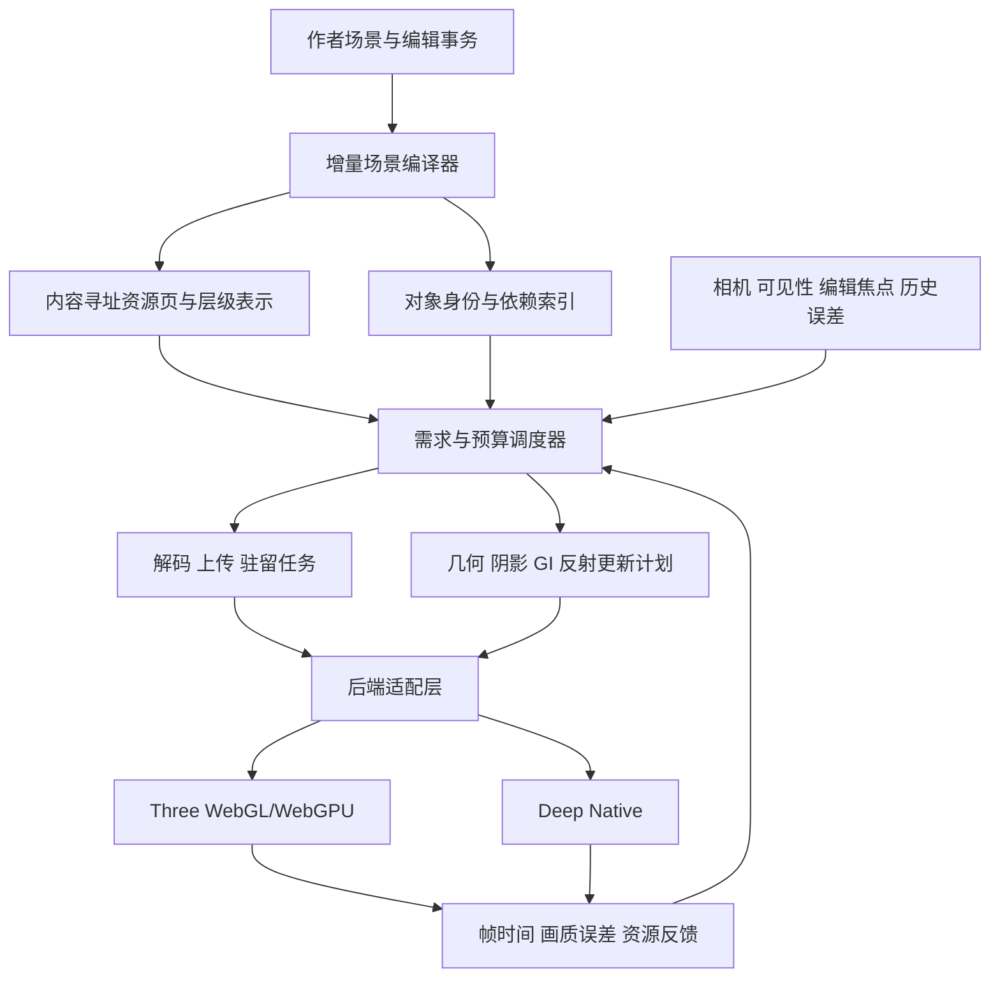

# 性能与画质跃升：从场景对象驱动改为增量、可见性与误差预算驱动

这份设计补充[产品升级总方案](product-engine-ai-upgrade-2026-09-21.md)。核心目标：在同一设备上承载更大的世界、减少操作卡顿，并把省下来的计算用于稳定的阴影、间接光和反射。以下是架构提案与实验门槛，不是已经实现的性能成绩。

## 1. 推荐的主架构

### 用户追加验收要求（2026-09-21）

性能阶段作为一次完整的系统优化与验收推进，覆盖加载、解码、编译、CPU/GPU 帧成本、内存/显存、交互延迟及正式发布产物；不以个别函数提速结束该阶段。画面效果同时改善，Web 作者场景的元素与键鼠语义保持一致。禁止通过降分辨率、减少可见内容、关闭原有效果或放宽对等门槛换取性能成绩。

冻结同硬件、驱动、资产、相机、分辨率和质量基线，记录冷/热加载、首个可交互画面、P50/P95/P99 帧耗时、长任务、输入响应、峰值内存/显存、资源上传与重复工作；截图与交互回归同时验收。按实测主瓶颈迭代，再测下一瓶颈，直到已识别的高收益优化均实现并验证，或留下具体实验结果与取舍理由。局部基准与整场景收益分开报告；“极致”是持续消除已知瓶颈的工程目标，不能由单次跑分宣称。

不要让业务对象数决定每帧成本。把作者数据、可执行场景和设备驻留分开，三端共享内容身份、变更语义和质量要求，各后端采用自己的最佳执行方式。

优雅之处在于共享五种稳定合同：资源身份、变更集、表示误差、资源租约、帧提交。不要再给 GI、阴影、纹理、几何分别建立互不知情的无限缓存和独立优先级。

已有 `renderGraph`、`renderGraphPlan`、`ResidencyStreamScheduler`、`gpuResidencyExecutor`、`worldStreamingBridge`、`TemporalValidityProvider` 可以承接。不能把新图画出来就称为新架构落地：必须补齐正式调用方与可测成本。Web 与 Native 不要求共享 GPU 命令，也不默认 wgpu 已提供硬件光追。

### 默认即最佳：零配置质量导演

最终产品不把渲染管线参数交给普通用户。编辑器保存作者意图（材质、灯光、阴影、反射、后处理和精确测量要求），运行时由一个质量导演根据设备能力、当前场景和最近帧证据生成执行计划。用户默认无需选择分辨率比例、阴影级联、probe 数量、mip、合批、剔除或缓存策略；这些只在诊断页解释，不成为使用前提。

质量导演必须遵守以下固定顺序，防止“自动优化”等于偷偷降画质：

1. 先消除重复工作：静止按需渲染、内容寻址复用、增量更新、重复实例共享、无效果 pass 跳过、资源池复用。
2. 再消除不可见工作：视锥/遮挡/meshlet 筛选、间接绘制、阴影投射物与反射贡献者的独立可见性。
3. 再调度精度到有贡献区域：几何 HLOD、纹理 mip、阴影页和 probe brick 使用同一预算仲裁，交互焦点与测量区域有最低质量保护。
4. 最后才允许时域重建或内部像素调整；UI、文字、图表、轮廓与测量覆盖层保持输出分辨率，动态画面误差不合格时自动退出该路径。

默认计划使用三种内部状态而不是三个用户预设：`converging` 在加载、相机快速移动和编辑期间保证输入响应并渐进补齐；`stable` 在静止后把预算投入阴影、GI、反射和抗锯齿收敛；`recovering` 在设备丢失、内存压力或候选提交失败时继续显示最后有效版本并有界恢复。状态切换依赖 P95/P99 帧耗时、上传/驻留预算、历史有效性和画面误差，带滞回与冷却时间，禁止逐帧抖动。

第一批默认自动开启仅包含已经证明零画质损失的能力：需求渲染、增量场景更新、重复资源共享、异步拾取加速、内容寻址缓存、无消费者 pass 跳过和保守的后台准备。遮挡剔除、visibility buffer、纹理数组、动态分辨率、时域超分、probe 降级等必须经过对应场景 A/B 后按能力 profile 自动启用；单一夹具收益不能升级为全局默认。

### 超越 Unity 的具体胜负手

“超越”限定在冻结设备、分辨率、资产、相机、效果和输入轨迹后的工业/BIM 负载，不宣称所有游戏负载全面领先。目标由五条可验证优势组成：

- **编辑增量**：十万对象只修改一百个变换时，不遍历、重编译或重传整场景；变化同步 CPU、最长主线程阻塞和上传字节至少下降 70%。
- **重复工业资产**：稳定对象身份、共享几何、实例材质行与 GPU 间接计划把 CPU 提交随“可见批次”增长，而不是随业务对象数增长；材质数组只有在同画面 A/B 获益时启用。
- **静态世界复用**：静态阴影、方向性间接光和反射探针跨帧复用，灯光、门窗、设备和材质变化只使依赖区域失效；静止镜头把节省的 GPU 时间用于更稳定的接触阴影、GI 和反射。
- **发布前计算**：Web 作者场景在发布时完成校验、分区、LOD/meshlet、纹理派生、shader/pipeline 预编译和内容页去重，正式客户端避免运行时导入器和 shader 抖动。
- **三端同一语义**：Web、Deep Web 与 Deep Native 共用作者合同、资源哈希、对象身份和交互回放；各后端使用最佳 GPU 实现。这里的优势是工业编辑到交付的完整链路，而不是堆叠更多通用游戏功能。

最终门禁同时比较冷/热启动、可交互时间、CPU/GPU P50/P95/P99、输入到显示延迟、峰值内存/显存、上传与重复驻留、动态画面误差和正式产物大小。任一方案若只提高平均 FPS，却增加尾延迟、显存或动态伪影，不能进入默认路径。

按当前代码审计，后续实现价值和顺序如下；“已有基础”不能计作完成，必须有正式消费者和整场景证据：

| 优先级 | 默认自动能力 | 当前可复用基础 | 进入默认路径的证据 |
|---|---|---|---|
| P0 | 无贡献 pass/附件零成本 | render graph、效果开关、对象 outline mask | 关闭效果时 attachment、全屏 pass、驻留均消失，像素与旧基线一致 |
| P0 | 增量 GPU scene 与上传合并 | packet diff、稳定 slot、材质/变换 revision | 10 万对象改 100 个，CPU/上传下降至少 70%，撤销和选中身份一致 |
| P0 | GPU 可见性与间接提交 | cluster LOD、meshlet、HiZ、occlusion、visibility buffer | 高遮挡和高实例场景 P95/P99 改善；透明/骨骼/custom shader 自动走正确后备 |
| P0 | 内容页/mip 统一驻留 | world streaming、residency scheduler、lease、内容哈希 | 30 分钟轨迹无缺块，消除 >100ms 上传尖峰，重复上传和峰值驻留下降 |
| P1 | 静态阴影/间接光缓存与局部失效 | shadow fingerprint、probe clipmap、bake region | 静态帧 GPU 成本下降；开门、变灯、移动设备无漏光、拖尾或整图重算 |
| P1 | 材质与纹理自动编译 | PBR 合同、texture array、压缩/mip 元数据 | 同画面减少绑定、上传和重复驻留；高光闪烁、法线方向和色彩空间正确 |
| P1 | 原生分辨率时域稳定 | motion/history/temporal validity 基础 | 细线、植被、镜面和快速运动视频无明显拖影，静止画面收敛优于现状 |
| P1 | 自动曝光、白平衡与色调映射 | HDR/ACES/后处理参数 | 室内外穿越无曝光泵动，高光不剪切、暗部有层次，Web/Native 色卡一致 |
| P2 | 有证据的时域超分/内部缩放 | Web 自适应 scale 原语 | 仅像素瓶颈设备启用；UI/文字保持原分辨率，净 GPU 收益且动态误差过门禁 |

现有 Web 自适应渲染比例只能最多降低 10% 内部像素，且没有完整时域重建证据，因此不能作为“默认画质不降”的核心方案。它继续作为明确开启的压力保护，直到 reactive mask、运动向量、历史失效和动态视频门禁完整。

### 通用引擎、强 GUI 与专业配置必须共用一条生产链

产品不以 BIM 特例取代通用引擎能力。核心运行时应提供版本化 scene/entity/component、资源、渲染、2D/GUI、动画、物理、输入、音视频、脚本/插件、网络数据与发布 API；BIM、工业仿真和数字孪生是使用这些公共能力的产品包。任何只在编辑器 React 组件中成立、无法冻结进 Runtime Package 或无法由 Deep Web/Native 消费的功能，都不算引擎能力。

GUI 使用统一的 Deep 2D 场景图与布局/输入合同，至少覆盖容器、图片、文字、富文本、按钮、输入框、文本域、复选/单选、下拉/组合框、列表/树/表格、滚动、弹层、视频、图表和自定义绘制。布局需支持约束、flex/grid、锚点、最小/最大尺寸、裁剪、DPI、RTL、本地化和虚拟化；输入需覆盖鼠标、滚轮、触控、键盘导航、焦点、快捷键、剪贴板、拖放、IME、撤销和无障碍语义。Web 作者、Deep Web 和 Deep Native 共用节点身份、状态机、事件传播、样式令牌和回放轨迹，平台只实现绘制与系统桥。

零配置与高度可配不建立两套代码。所有自动决策都生成一个可检查的 `EffectiveQualityPlan`，并记录来源、理由、设备证据、预算与回退。配置按以下稳定层级合并，越靠后优先级越高：

1. 引擎安全默认值；
2. 设备能力 profile 与实测预算；
3. 项目质量策略；
4. 场景/相机/视口设置；
5. 灯光、材质、对象和 GUI 节点覆盖；
6. 发布目标覆盖；
7. 当前会话的诊断性临时覆盖。

每个字段必须支持 `auto`、显式值和恢复继承；面板同时显示最终生效值、来源和自动选择理由。批量编辑保留混合值，预设只是对同一合同的一组命名 patch，可比较、导入、导出和版本迁移。未知字段失败关闭，候选配置先校验并预览，成功后原子发布；失败继续使用最后有效计划。命令行、编辑器、AI 助手和插件都调用同一配置 API，不能各自维护隐藏开关。

专业模式开放但不限于：渲染路径、目标帧预算、分辨率/时域策略、LOD/meshlet 阈值、纹理与显存预算、阴影级联/缓存、GI probe 密度与更新预算、反射路径、曝光/白平衡/色调映射、透明/OIT、抗锯齿、后处理顺序、流送半径、物理步长、音视频缓冲、GUI 字体/布局/动画和诊断捕获。危险组合由能力矩阵明确拒绝或给出可见回退，不能静默忽略。

相对 Unity 的验收因此分成两组同时通过：默认模式比较首次启动、导入后首帧、稳定帧、长时间 P99、画面和交互；专业模式比较可编辑参数覆盖、作用域、继承、撤销、持久化、发布一致性、运行时热更新、脚本/插件 API 和诊断透明度。默认更快但无法精确控制，或参数很多但三端不一致，都不能称为更优秀。

## 2. 六项最值得投入的架构工程

### A. 增量场景编译：把工作从每帧移到变更时

**问题**：对象树遍历、状态同步、材质分类、包生成如果跟场景总量增长，GPU 再快也会被 CPU 和加载过程拖住。

**做法**：作者对象保留稳定 ID；渲染数据采用紧凑数组与稳定槽位。编译器输出按空间和材质分类的 render packets，以及 geometry/material/transform/semantic 四类版本。编辑事务只发布变化范围：移动更新 transform 和 bounds；改颜色更新 material；改拓扑才重建 meshlet/BVH。撤销也是一笔增量，不重新加载整场景。

资源键包含输入内容哈希、编译器版本、编译参数和目标能力 profile。发布冻结一个 manifest，资源页不可变；三个目标复用源资源和语义索引，设备格式单独派生。首次先加载布局代理与交互索引，再补精细表示。精度测量等待权威几何到达，不能用代理值冒充精确测量。

**关键实现边界**：渲染槽位不等于业务 ID；删除采用 generation 防止旧异步任务回写复用槽；完整版本准备成功后原子切换，失败继续显示上一版本。Worker 传输优先转移 ArrayBuffer 所有权，避免多份复制；SharedArrayBuffer 仅在宿主满足条件时启用。

**收益来源**：由每帧处理 N 个对象，转为处理 k 个变化对象，加上可见集合。不是承诺所有算法都变成 O(k)：空间索引更新、可见性遍历、绘制依然有独立成本。

**实验门槛**：10 万对象场景中修改 100 个变换，测编译 CPU 时间、主线程最长阻塞、上传字节和拾取一致性；与全量重建基线比较。目标是变化同步耗时下降至少 70%，不足则先定位剩余全量扫描，不增加线程掩盖问题。

### B. 可见性统一调度：只让有贡献的内容竞争预算

**问题**：几何流送看距离，阴影看灯光，纹理看材质，GI 看探针，各自合理却一起超显存、抢上传和制造卡顿。

**做法**：世界分区负责粗粒度需求，GPU/CPU 可见性负责局部筛选。统一调度器接收几何页、纹理 mip、阴影页、probe brick 的候选工作，依据屏幕贡献、预估误差下降、等待时间和成本分配预算。选择对象、告警定位、测量附近设置最低质量保护，而非无限高优先级。

建议启发式为 `priority = benefit / estimatedCost + boundedAgeBonus`；benefit 由屏幕面积、当前误差、交互重要度计算。这个比值用于排序，不宣称是全局最优解。分别限制 CPU 毫秒、GPU 毫秒、上传字节、驻留字节；不能把不同单位直接相加。增加最小配额和过期时限，防止后台任务饿死。

保留父级粗表示，子页全部就绪后再替换；设置进出阈值滞回和短期保留，避免相机在单元边界反复解码上传。可见性反馈异步延后一帧使用，采用保守包围体和相机突变保护，不能同步 readback 卡住每帧。视锥外阴影投射物和屏外反射贡献者走独立需求，不能简单裁掉。

**承接位置**：`worldStreamingBridge` 负责世界需求翻译，`ResidencyStreamScheduler` 保持取消与 latest-wins 语义，`gpuResidentLease` 保护在用资源；在它们上方增加预算仲裁，不再另造第二套驻留执行器。

**实验门槛**：固定相机轨迹穿越大世界，预算内运行 30 分钟；比较 P95/P99、上传峰值、重复上传比例、代理暴露时间和驻留峰值。目标先消除 >100ms 流送尖峰；不得用漏画或长期模糊换取通过。

### C. 几何与材质解耦：减少对象提交和重复着色

**做法**：静态不透明对象按 meshlet/cluster 形成 GPU 可筛选集合，用间接绘制减少 CPU 提交；已有 visibility buffer 路线按像素记录几何身份，再执行材质求值。小三角形软光栅与硬件光栅按实测交叉点选择，不默认软光栅更快。透明、骨骼和特殊材质保留明确的 forward 路径。

比单纯合批更进一步：几何层级与材质细节独立。远处轮廓需要的几何可能很少，材质可用低 mip 和简化变体；近处工业铭牌保持纹理精度，重复设备共享几何与材质表，只保留实例差异。围栏、树木、道路生成器输出相同资源合同，实例编辑与 GPU 表示分离。

**代价**：visibility resolve 的随机读取、透明混合、导数/mip 选择、MSAA 和复杂材质可能抵消收益。必须与现有 forward 路径逐场景 A/B。已有 cluster LOD DAG 和 visibilityBuffer 是基础，不以增加同名模块重复建设。

**实验门槛**：高实例数、高遮挡、高材质数、透明植被四类负载分别测试；同时报告 CPU 提交、GPU 各 pass、显存与画面差异。只有受益负载启用，能力 profile 固化选择。

### D. 静态世界缓存 + 动态差量光照：让好画质不必每帧重算

**做法**：将光照分成稳定背景、动态变化和近场细节。静态几何的间接光可离线烘焙或渐进生成，运行时以世界空间 irradiance/probe brick 读取；动态物体与变灯区域局部更新已有 probe clipmap；接触阴影和屏幕反射负责近场细节。门窗变化、遮挡变化和材质变化沿依赖索引触发脏区域，而非整世界重算。

阴影同样分层：静态投射物缓存，动态投射物更新；相机移动只补新增可见范围，灯光变化使对应缓存失效。太阳方向连续变化可能使大面积缓存失效，此时转为受预算限制的更新与较粗层级，不能承诺始终节省。

反射按表面特征分配：粗糙表面优先环境探针/辐照度，重要平面可选平面反射，屏幕可见信息走 SSR，少量重点区域再使用软件射线。它们是受统一能量与有效性规则约束的替代估计，不能重复相加造成过亮。玻璃、镜面与多次反射单独列兼容矩阵。

**效果提升来源**：把预算用于稳定的间接光、接触关系、正确反射和较高近场阴影分辨率，而不是简单增加 Bloom。慢更新区域通过置信度与时间限制管理；灯光突变立即丢弃失效历史，宁可短暂噪声，不保留错误亮度。

**实验门槛**：开门、开关灯、移动设备、昼夜切换、快速进出室内，测更新延迟、漏光、阴影拖尾和 GPU 时间；静态镜头目标显著减少更新成本，同时保持与完整更新参考图的误差范围。动态占比高的场景单独验收。

### D1. 烘焙与光照的一线质量验收（2026-09-21 用户补充）

用户已明确将光照、烘焙、材质、色彩的一线引擎对标增强纳入本轮正式交付范围；不是本轮外候选。先复用现有实现，按依赖完善作者入口、渲染消费、持久化与正式发布。图层和 AI 的既定优先级保持。

目标覆盖工业园区、建筑室内和设备展示；性能对标 Unity、Babylon 时冻结版本、渲染管线、硬件、视口、内容与画质配置。分别比较静态、移动设备、开关灯和昼夜变化，不以单个静态场景结果宣称全场景超越。

- 静态表面：方向性间接光、多次反弹、自适应采样、降噪、UV 重叠诊断和图集接缝修复。几何资源 bake 不计作光照烘焙完成。
- 动态设备：复用现有 probe clipmap、relocation 与更新调度，补足密度、遮挡和薄墙漏光处理；要求穿越室内外的连续光照证据。
- 阴影与反射：静态缓存与动态投射物分离；接触阴影、粗糙度正确的局部反射、探针视差修正。避免多条反射路径重复累加能量。
- 材质：审计现有 PBR 与导入映射，统一金属度/粗糙度、法线切线空间、纹理通道及单位；增强玻璃透射、清漆和工业涂层，按真实支持矩阵交付。检查法线与粗糙度过滤、远处高光闪烁、透明排序及环境反射，防止单张静态截图掩盖运动缺陷。Web 与 Native 共享作者参数语义和资源版本。
- 色彩：明确颜色纹理 sRGB 解码与数据纹理线性读取，统一线性 HDR 工作流程、曝光、白平衡、色调映射及输出转换。色调映射与调色顺序固定，避免重复转换；场景保存作者设置，设备质量档位不得擅自改变色彩风格。用灰阶、色卡、高亮细节、暗部层次和饱和色检查两端输出，UI/文字与场景后处理分离。
- 增量生成：几何、材质、灯光、天空和烘焙配置共同构成内容版本；记录跨分区依赖，多次反弹传播需要继续失效邻区，不能假设影响仅限对象包围盒。任务可取消，未完成结果不得覆盖最后有效版本。
- 制作入口：场景编辑器提供预览/标准/精细、进度、取消、过期区域及按需诊断；全局设置管理设备预算和可重建缓存。发布冻结光照资源与消费版本，Deep Web/Native 消费同一作者语义。

验收场景必须包含薄墙、窗洞、金属与玻璃、密集设备、移动物体和灯光突变。对照高质量参考图检查漏光、接缝、能量偏差、时域闪烁和历史残影；记录烘焙耗时、增量重算范围、包体、峰值内存及运行 P95/P99。先记录基线再冻结量化阈值，不能以降画质换取性能达标。

对标依据：[Unity GPU 烘焙与自适应探针](https://unity.com/blog/engine-platform/new-ways-of-applying-global-illumination-in-unity-6)、[UE Lumen 动态间接光与反射](https://dev.epicgames.com/documentation/unreal-engine/lumen-global-illumination-and-reflections-in-unreal-engine)。本节是本轮待办与验收要求，不代表这些能力已经交付。

### E. 统一时域重建：同样预算获得更稳定、更细的画面

**做法**：统一 motion vector、深度、法线、对象 ID、材质版本、曝光和 reactive mask，供 TAA、反射、体积效果与降噪消费。扩展已有 `TemporalValidityProvider`，从整帧版本失效逐步细化到对象/区域有效性；提交失败不得推进历史版本。

先完成高质量原生分辨率 TAA，再试时域超分。分辨率按 GPU 瓶颈缓慢调整：只降低 3D 内部渲染尺寸，文字、图表、选择轮廓与标注维持输出分辨率；恢复时加入滞回，防止画面呼吸。运动期间保证交互，停止后以有限帧渐进收敛，提高截图与审阅质量。

**可计算收益边界**：内部宽高均为输出的 0.67 时，像素数约为 45%；这只减少随内部像素数增长的工作，并不意味着整体帧率提高 2.2 倍。若像素相关工作占总 GPU 时间 60%，忽略重建开销时，上限约为 `1 / (0.4 + 0.6 × 0.67²) = 1.49` 倍；实际还要扣掉重建成本。

**风险**：细线、透明植被、快速运动、遮挡显露、镜面与闪烁灯具会暴露历史错误。必须测动态视频与拖影距离，静态 SSIM 不够。参考 AMD 的时域超分输入要求，不能把已有 TAA 文件存在等同于高质量超分已经完成。[AMD 集成文档](https://gpuopen.com/manuals/fsr_sdk/techniques/super-resolution-temporal/)

### F. 帧图驱动的资源复用和任务流水：降低峰值与抖动

**做法**：扩展现有渲染图资源生命周期分析，池化兼容的临时纹理和缓冲，按实际最后消费者回收；Native 在后端明确支持时进一步做物理内存别名，WebGPU 以对象池/生命周期复用为主。两者不能混称为同等显存别名能力。

CPU 把变换准备、解码、剔除准备和命令构建拆成有界任务图；以任务粒度和成本门槛决定是否并行，合并微小任务。GPU async compute 只有后端/队列真正支持并且实测可重叠时才用；Promise.all 不等于 GPU 并行。渲染最多保留有限在途帧，资源按提交完成信号退休。

**代价与验收**：纹理重建过多、同步栅栏、线程调度和多帧排队会增加延迟。验收不仅看 FPS，还看峰值显存、分配次数、P99 与输入到显示延迟；此前小夹具多线程只有 0.74–0.81 倍的证据说明必须设置串行交叉点。

## 3. 进一步提高上限的两项研究，设独立退出条件

**海量动态灯光采样**：先做 clustered light culling 和重要灯光预算，之后再试 ReSTIR 式时空样本复用。它有希望以较少新样本处理复杂灯光，但需要可靠的可见性查询、历史验证和降噪。若软件 BVH 射线成本已超预算，先不接入默认路径；硬件 RT 必须先完成真实后端能力验证。论文中的加速不能直接移植为本项目成绩。[原论文](https://research.nvidia.com/publication/2020-07_spatiotemporal-reservoir-resampling-real-time-ray-tracing-dynamic-direct)

**超大世界的多表示内容**：远景 HLOD/impostor、近景 meshlet、植被实例、局部高精度碰撞与语义索引各有独立驻留。照片/扫描可探索 splat 表示，但不替代可编辑工程几何；遮挡、透明排序、尺寸精度和发布一致性达不到要求就限定为背景。先使用已具备的 HLOD/分区管线，不直接引入新表示。

## 4. 六项工程如何协同，而不是把收益相乘

以大厂区或开放世界为例：A 避免移动一个设备重编整个世界；B 只调度可见与即将需要的内容；C 减少 CPU 提交和无效着色；D 复用稳定光照；E 用跨帧信息恢复细节；F 控制资源峰值与任务抖动。它们有重叠收益，不能把各项倍率相乘。

真正值得优先实现的是 **A+B+D**：它们利用场景的稳定性、空间局部性和变化稀疏性，在现有设备上也可能受益。C 提高复杂几何上限，E 改善像素受限负载，F 负责稳定性；GPU 像素已经是明确瓶颈时，可以把 E 提前。

## 5. 产品体验也由同一架构改善

- 编辑器：先响应选中与变换，重任务提交为可取消作业；显示“代理 / 精细资源到达 / 画质收敛”状态，精确测量只用权威几何。
- 围栏道路：作者编辑路径和参数，生成器只重建受影响段；共享实例资源、端点约束与单事务撤销，长围栏不变成大量独立重资产。
- AI：输出受约束的编辑事务和预算建议，预估受影响对象与重建成本；调用既有编译和命令系统，避免 AI 另写一套场景状态。
- 设置：用户选择性能目标与设备预算；场景保存作者效果；发布冻结交付策略。高级调度细节放诊断页，不让用户手工协调十几种缓存。
- 缓存：同一内容键复用；配额、在用租约、引用关系与版本淘汰共同决定可清范围，清理后按需重建。发布不可变资源和作者原文件不属于普通缓存。

## 6. 实施顺序与否决条件

| 阶段 | 最小可交付切片 | 验收 | 不通过时 |
|---|---|---|---|
| 基线 | 正式包、同设备同镜头、CPU/GPU 分段计时 | 三端身份准确；冷/热启动与帧时间分开 | 不发布性能排名 |
| 1 | 增量变换/材质更新 + 资源身份 | 大场景小修改不全量重建，撤销/发布一致 | 修剩余全量扫描 |
| 2 | 几何/纹理统一预算 + 父级保底 | 相机漫游无缺块、无预算失控，P99 改善 | 调整粒度和滞回 |
| 3 | 静态阴影复用 + probe 局部失效 | 动态变化正确，静态成本下降 | 回退对应缓存层 |
| 4 | GPU-driven/visibility 正式负载 A/B | 复杂场景获益，特殊材质路径明确 | 保留 forward 默认 |
| 5 | 原生 TAA → 超分、帧图资源复用 | 动态画质和延迟合格，净收益为正 | 关闭超分，保留基础修复 |
| 研究 | ReSTIR / 新远景表示 | 超过现有路线的等画质净收益 | 停止进入生产，不堆 feature flag |

每个切片至少包括一个真实消费者、一份可回放场景、一条失败恢复路径和一个性能对照。基准场景覆盖重复设备、复杂不重复几何、室内多灯、透明植被、长距离漫游；报告 P50/P95/P99、CPU/GPU、上传/驻留、输入延迟与动态画质。改善目标在记录基线后冻结，不用“平均 FPS 高了”掩盖卡顿。

## 7. 四个正式测试对手与架构参考

正式测试、排名和能力分母只包含 Three、Babylon、Unity、Bevy 0.19。Three/Babylon 是 Web 功能、资源兼容与交互基线；Unity 是内容生产、渲染稳定性、复杂负载与工具链基线；Bevy 是 Rust/wgpu 原生执行基线。本项目集中争取同一份作者内容的三端交付、可追溯对象身份、大模型增量编辑、离线编译复用和可诊断质量预算。能否胜出只由冻结条件下的实测决定。

Bevy 0.19 纳入最终正式性能对手，重点比较 Rust/wgpu 原生路径、GPU driven 批处理、动态实体更新、渲染世界提取开销和 GUI 输入。Deep 必须在相同设备、后端、内容、分辨率、画质、可见性和交互功能下比较 CPU/GPU P50/P95/P99、显存、加载、输入响应及长稳；单独赢某个微基准不能写成超过 Bevy。对手版本、Cargo.lock、feature、release profile、场景生成器和截图哈希必须随证据冻结。

UE 与 Godot 已按 2026-09-22 用户指令退出测试基准，不下载安装、不运行，也不参与排名或能力分母。UE 的 Nanite 等资料仅用于研究虚拟几何方向，不能形成对 UE 的性能结论。[Nanite 官方文档](https://dev.epicgames.com/documentation/unreal-engine/nanite-in-unreal-engine)
